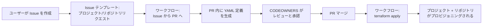

# ターゲットアーキテクチャ仕様（ドラフト）

[English](./Target-Architecture-Spec.md) | [日本語](./Target-Architecture-Spec.ja.md)

> **ステータス:** Draft v0.5.10 — セルフホストランナー（ACA）と GitHub ホストランナー + Azure プライベートネットワーキング（APES / VNet インジェクション）の比較議論を §5.5 として追加した。並列比較テーブルと、セルフホスト ACA を選択するアーキテクチャ上の根拠（デュアル GitHub/ADO パリティ、プランロックインなし、完全なイメージ制御、固定エグレス IP、リージョン柔軟性）を含む。v0.5.9 — §8.0.1 / §8.0.4 / §8.0.5 における「どの Private Endpoint がプロジェクトランナーのデータ経路上にあるか」についての誤りを修正した。ブートストラップ Storage Account とブートストラップ Key Vault の PE は **プラットフォーム管理者の apply コンテキスト**（`_bootstrap` / `devops/lz` / `project_github` プロビジョニング）のみで使用され、プロジェクトチームのランナーは読み書きしない。プロジェクトチームのランナーは (a) ランナーイメージ用の組織共有 **ACR** PE（ルール #2 — BYO ↔ Platform LZ ピアリングが必要）と、(b) プロジェクト **固有** の Layer 2 tfstate Storage Account およびプロジェクト Key Vault（ルール #3 — 両方ともプロジェクト所有でプロジェクトのランナーネットワークコンテキスト内にデプロイされるため、プラットフォームピアリングは不要）を使用する。§8.0.1 のルールを再番号付け・書き換え（ルール #1 DNS 解決、#2 ACR 到達性、#3 Layer 2 SA + プロジェクト KV 到達性）、§8.0.4 の「ブートストラップ SA/KV PE」行をプラットフォーム管理者経路の用途として再フレーム、§8.0.5.1 主要特性と §8.0.5.2 所有権テーブルを更新、§1 表 C にプロジェクト Key Vault を追加した。v0.5.8 — `network_mode = "platform"` と `network_mode = "byo"` 両モードの詳細ネットワーク図を §8.0.5 として追加した。platform モード図は共有 Platform LZ VNet 内のプロジェクト専用ランナーサブネット配置（ピアリング不要、プロジェクト毎の DNS リンク不要、単一共有 NAT エグレス）を具体的な CIDR 例と DNS ゾーンリンク点とともに示す。BYO モード図はエンタープライズスポークのサブネット単位レイアウト（delegate された ACA サブネット、PE サブネット、任意の DevBox サブネット）、組織共有 ACR PE 到達に必要な BYO ↔ Platform LZ ピアリングと DNS リンク経路、各リソース/接続を `devops/lz` / プロジェクトモジュール / エンタープライズネットワークチームに対応付けた所有権テーブルを伴って詳細化されている。v0.5.7 — `platform` モードにおいて、ランナー VNet が **Platform LZ（組織）レイヤー** で作成され、プロジェクトレイヤーで作成されない理由を §8.0.4 として追加した。仮想的な「`platform` モードでプロジェクトが自前 VNet を作成する」案との包括的比較（DNS ゾーン singleton、ACR / NAT エグレス IP の経済性、アドレス空間ガバナンス、ピアリング / DNS リンクのファンアウトコスト、ACA サブネット委任コスト）を含む。v0.5.6 では `network_mode = "platform"` がバックワード互換のための残置ではなく、第一級の設計選択肢である理由（低摩擦のデフォルトオンボーディング、ネットワーク運用の集約、7 つの BYO 整合性ルールの自動充足、BYO への移行ランプ）を §8.0.3 として明示的に追加し、§8.2 の文言とセクション 1 の Goal 9 を、`platform` モードと `byo` モードを意図的かつ補完的な 2 つのモードとして提示するように更新した。v0.5.5 ではセクション 1 のアーキテクチャ図直後に、レイヤー別（root bootstrap、組織全体の Platform LZ、プロジェクト別）リソース一覧テーブルを追加し、各リソースの正体と用途を所属レイヤーで明示した。v0.5.4 では 3 層 VNet の表現を整理し、`platform` モードではプロジェクトのランナーネットワークが共有 Platform LZ VNet 内のプロジェクト専用サブネットスライスであること（独立した VNet ではない）を明確化した。v0.5.3 ではセクション 1 末尾に 3 つのターゲットアーキテクチャ図（Org-Project-Repo-Env 階層 + 2 層状態、3 層 VNet モデル + BYO 整合性、プロジェクトモジュール構成）を追加した。
>
> **主目的:** DevOps Landing Zone の正しい **Organization → Project → Repository → Environment（Org-Project-Repo-Env）** リソース階層を定義し精緻化する。本ドキュメントのすべてのギャップ、目標、設計決定は、この階層を Azure リソース、VCS プラットフォーム（GitHub / Azure DevOps）、および Terraform 状態管理に正しくマッピングするために存在する。
>
> **スコープ:** Org-Project-Repo-Env 階層に基づき、DevOps Landing Zone を再設計する。各レイヤーでリソースを正しくスコープする — 組織レベルの共有インフラ、プロジェクトレベルの分離、リポジトリレベルの CI/CD ワークフロー、環境レベルの ID とデプロイターゲット。
>
> **読み方ガイド:** セクション 1〜5 は現在のアーキテクチャ、ギャップ分析、組織レベルリソースの評価を記述します。セクション 6〜11 に加え、**§5.4**（ACA Environment のリファクタリング、ガバナンス出力）および **§8.0**（3 層 VNet モデルと BYO / プラットフォームの整合性ルール）のターゲットアーキテクチャ サブセクションを含めて、**ターゲットアーキテクチャ**を記述します。現状実装と異なる項目にはインラインで注記を付しています。セクション 12 は移行パス、セクション 14 は残課題を管理します。

---

## 目次

1. [動機と課題の概要](#1-動機と課題の概要)
2. [ターゲット階層と用語](#2-ターゲット階層と用語)
3. [ブートストラップと状態管理（2 層モデル）](#3-ブートストラップと状態管理2-層モデル)
4. [モジュールとディレクトリ構造（ターゲット）](#4-モジュールとディレクトリ構造ターゲット)
5. [組織レベルのランディングゾーン (`devops/lz`)](#5-組織レベルのランディングゾーン-devopslz)
6. [プロジェクト定義とマルチリポジトリモデル](#6-プロジェクト定義とマルチリポジトリモデル)
7. [GitHub と Azure DevOps — 構造的差異と抽象化](#7-github-と-azure-devops--構造的差異と抽象化)
8. [Bring Your Own VNet (BYO VNet)](#8-bring-your-own-vnet-byo-vnet)
9. [組織レベルのガバナンス（GitHub & Azure DevOps）](#9-組織レベルのガバナンスgithub--azure-devops)
10. [GitOps 駆動のプロジェクト・リポジトリ オンボーディング](#10-gitops-駆動のプロジェクトリポジトリ-オンボーディング)
11. [命名規則・状態管理・衝突耐性](#11-命名規則状態管理衝突耐性)
12. [現行設計からの移行パス](#12-現行設計からの移行パス)
13. [決定ログ（解決済みの質問）](#13-決定ログ解決済みの質問)
14. [残課題とフォローアップ](#14-残課題とフォローアップ)

---

## 1. 動機と課題の概要

### 主目的: Org-Project-Repo-Env 階層の定義

本ドキュメントの主目的は、DevOps Landing Zone の正しい **Organization → Project → Repository → Environment（Org-Project-Repo-Env）リソース階層を定義し精緻化する** ことである。この階層の各レイヤーには明確な責務がある:

| レイヤー         | 責務                                                                                               | Terraform スコープ           |
| ---------------- | -------------------------------------------------------------------------------------------------- | ---------------------------- |
| **組織**         | すべてのプロジェクトで使用する共有インフラとガバナンス（ACR、Dev Center、VNet、DNS、ルールセット） | `devops/lz` (Tier 1)         |
| **プロジェクト** | リポジトリ、ID、ランナー、ネットワークコンテキストの論理グループ化（1 つの製品/ワークロード向け）  | `project_github` 等 (Tier 2) |
| **リポジトリ**   | プロファイル駆動の CI/CD ワークフローとオプションのリポジトリ別 ID を持つ個別の Git リポジトリ     | プロジェクトモジュール内     |
| **環境**         | Azure サブスクリプション、UAMI、GitHub/ADO 環境と 1:1 でマッピングされるデプロイターゲット         | プロジェクトモジュール内     |

以降で特定されるすべてのギャップ、すべてのゴール、すべての設計決定は、リソースがこの階層の **正しいレイヤーにスコープされる** ことを確実にするために存在する。

### 現状とギャップ（階層レイヤー別分析）

| 階層レイヤー     | 領域                            | 現在の状態                                                                                                           | ギャップ（階層違反または不足する機能）                                                                                                                                                                                                                                                                                                                                     |
| ---------------- | ------------------------------- | -------------------------------------------------------------------------------------------------------------------- | -------------------------------------------------------------------------------------------------------------------------------------------------------------------------------------------------------------------------------------------------------------------------------------------------------------------------------------------------------------------------- |
| **組織**         | 組織ガバナンス                  | GitHub 組織名が文字列として渡されるのみで、ガバナンス境界がない                                                      | 組織レベルのルールセット、ランナーグループ、リポジトリデフォルトが未定義。ガバナンスはプロジェクトレベルで個別管理されている。                                                                                                                                                                                                                                             |
| **組織**         | ACA Environment スコープ        | ACA Environment がプラットフォーム LZ で作成され、プラットフォーム VNet にバインド                                   | **組織レベルに不正にスコープされている。** セルフホステッドランナーは適切なリソースデプロイのためにプロジェクトの VNet で実行する必要がある。ACA Environment はプロジェクトスコープにすべき。セクション 5.2 参照。                                                                                                                                                         |
| **組織**         | ID リソースグループ             | プラットフォーム LZ で空の RG が作成される                                                                           | RG のみのデプロイは妥当 — プロジェクト UAMI の共有コンテナーとして機能する。正しいことを確認済み。セクション 5.2 参照。                                                                                                                                                                                                                                                    |
| **組織**         | 共有エージェントリソース        | ACR、Log Analytics、コンテナー実行 UAMI がプラットフォームレベルに配置                                               | 正しくスコープされている。すべてのプロジェクトで利用される。                                                                                                                                                                                                                                                                                                               |
| **組織**         | Dev Center                      | Dev Center と定義がプラットフォームレベルに配置                                                                      | 正しくスコープされている。DevBox プロジェクトプールは組織レベルの Dev Center を参照してプロジェクトごとに作成される。                                                                                                                                                                                                                                                      |
| **プロジェクト** | プロジェクトモデル              | 1 プロジェクト = 1 メインリポ + オプションのテンプレートリポ                                                         | 実際のプロジェクトでは複数のリポジトリ（infra、app、data、ops、共有ライブラリ）が必要。マルチリポジトリ未サポート。                                                                                                                                                                                                                                                        |
| **プロジェクト** | ネットワーク / VNet             | プラットフォームが常にアドレスプレフィックスから新しい VNet を作成                                                   | プロジェクトレベルで既存の（企業提供の）VNet に接続するオプションがない。セルフホステッドランナーはプロジェクトの VNet に配置する必要がある。                                                                                                                                                                                                                              |
| **プロジェクト** | Layer 2 状態ストレージ          | プロジェクトが Layer 1 Storage Account 内に Blob コンテナーを作成                                                    | **プロジェクト別の独立した Storage Account（Layer 2）が存在しない。** 現行コード（`blob.container.tf`）はブートストラップ SA 内にコンテナーを作成しており、真の Layer 2 分離になっていない。                                                                                                                                                                               |
| **プロジェクト** | Azure DevOps モジュール         | コードベースに `project_azuredevops` ルートモジュールが存在しない                                                    | `project_github` のみ存在。`project_azuredevops` はドキュメントで参照されているが未実装。                                                                                                                                                                                                                                                                                  |
| **リポジトリ**   | リポ → ワークフロー対応         | 単一リポジトリが固定のワークフローセットを取得                                                                       | リポジトリプロファイルの概念がない。目的（infra vs app vs library）に関係なくすべてのリポに同じ CI/CD 形状が適用される。                                                                                                                                                                                                                                                   |
| **リポジトリ**   | リポジトリ別 ID                 | 1 セットの UAMI がプロジェクト単位（リポ間で共有）                                                                   | リポジトリ別の UAMI による細粒度 RBAC のオプションがない（例: infra リポは Contributor、app リポは AcrPush のみ）。                                                                                                                                                                                                                                                        |
| **環境**         | 環境 → サブスクリプション対応   | サブスクリプション変数は柔軟（`default = {}`）; サブスクリプションレベルのロール割り当ては `lookup()` による条件付き | GitHub 環境、UAMI、ブランチ、フェデレーション資格情報は、提供されたサブスクリプションに関係なく、常にハードコードされた 4 ティア（features、development、staging、production）すべてに対して作成される。サブスクリプションレベルのロール割り当てのみが欠落エントリに対してスキップされる。真のサブセット環境サポート（`subscriptions` に存在する環境のみを作成）は未実装。 |
| **環境**         | ID 戦略                         | UAMI が環境 × ジョブタイプごとに作成される                                                                           | 戦略は §6.5 で明確にドキュメント化された（UAMI はプロジェクトスコープで、組織レベルの Identity RG 内に Tier 2 で作成される。LZ にはグローバルなサブスクリプションレジストリは存在しない）。リポジトリ別 UAMI 分離はターゲット（上記リポジトリ行を参照）。                                                                                                                  |
| **横断**         | ブートストラップ状態            | 単一のブートストラップが tfstate 用の Storage Account と Key Vault を作成                                            | 2 層モデル（Layer 1 プラットフォームストレージ、Layer 2 プロジェクト別ストレージ）が明示的でなく、実装されていない。                                                                                                                                                                                                                                                       |
| **横断**         | GitHub vs Azure DevOps          | 個別のコードパスで統一的な抽象化がない                                                                               | GitHub には Azure DevOps のような「プロジェクト」概念がなく、両者で一貫したガバナンスモデルがない。                                                                                                                                                                                                                                                                        |
| **横断**         | ポートフォリオ オンボーディング | 各プロジェクトが個別の `terraform apply` でプロビジョニング                                                          | セルフサービスや GitOps 駆動のオンボーディングパターンがない。                                                                                                                                                                                                                                                                                                             |
| **横断**         | ドキュメント                    | パスが `infra/terraform/…` を参照しているが、コードは `infra/…` 配下にある                                           | 導入者にとって混乱を招く。                                                                                                                                                                                                                                                                                                                                                 |

### ゴール（正しい Org-Project-Repo-Env 階層を達成するために）

1. **組織 → プラットフォーム LZ → プロジェクト → リポジトリセット → 環境** の明確な階層を定義し、各リソースをその階層の正しいレイヤーにスコープする。
2. **2 層状態管理** モデルを導入する: Layer 1 はプラットフォーム/DevOps LZ 状態用、Layer 2 はプロジェクトごとのアプリケーション IaC 状態用（プロジェクトプロビジョニング時に独立した Storage Account として作成）。
3. プロジェクトが異なるプロファイルを持つ **複数のリポジトリ** を所有できるようにし、単一リポジトリも有効なオプションとして維持する。
4. GitHub（プロジェクト概念なし）と Azure DevOps（Org → Project → Repos）の両方に対応する **統一抽象化レイヤー** を設計する。
5. プロジェクトレベルで **「Bring Your Own VNet」** をサポートし、セルフホステッドランナーをプロジェクトの VNet に配置する。
6. **ACA Environment** を組織レベルからプロジェクトレベルに移動し、ランナーコンピュートが正しいネットワークコンテキストで動作するようにする。
7. プラットフォーム非依存のガバナンス変数で GitHub と Azure DevOps の両方の **組織レベルガバナンス** を強化する。
8. **GitOps 駆動のプロジェクト/リポジトリ オンボーディング** パターン（Issue → PR → プロビジョニング）を提供する。
9. **ID とサブスクリプションマッピング** 戦略を明確にする — UAMI はプロジェクトスコープ、サブスクリプションはプロジェクトごとに宣言、オプションでリポジトリ別 ID 分離。
10. `project_github` とのパリティを達成するために `project_azuredevops` ルートモジュールを実装する。
11. V1 ユーザーが再設計された V2 アーキテクチャを採用するための簡単な移行ガイドを提供する。

### アーキテクチャゴール（ターゲット全体像）

> **このサブセクションの目的。** ドキュメントの残りが現状（as-is）、ギャップ、目指す姿（to-be）、各ギャップの解消方法を詳述する前に、本サブセクションでは**到達点**を要約し、ターゲットアーキテクチャを念頭に置いて読み進められるようにします。各項目は括弧内で参照するセクションで実現されます。ここで新しい設計判断を導入するものではありません。

**1. 4 層のリソース階層 — Organization → Project → Repository → Environment**（§2）

- **Organization（Platform LZ, `devops/lz`）** — 組織全体で共有されるインフラ: ブートストラップ Storage Account（Layer 1 状態）、ACR、Log Analytics、container-run UAMI、Platform VNet、Private DNS ゾーン、Dev Center、コンテナイメージビルドタスク。
- **Project（`project_github` / `project_azuredevops`）** — チーム所有と課金分離の単位。プロジェクト固有の UAMI、OIDC 認証情報、Layer 2 状態 Storage Account、ACA Environment、Project DevOps ネットワークコンテキスト（`platform` モードでは共有 Platform LZ VNet 内のプロジェクト専用サブネット、`byo` モードでは BYO VNet）、DevBox プールを所有。
- **Repository** — プロジェクトごとに 1 つ以上のリポジトリ。各リポジトリは CI/CD プロファイル（例: `terraform-env`、`container-image`）に従う。
- **Environment** — GitHub/ADO 環境と Azure サブスクリプション + plan/apply UAMI ペアとの 1:1 対応。環境は宣言的で、{features, development, staging, production} のサブセットを許可。

**2. 2 層状態管理**（§3.2）

- **Layer 1 — プラットフォーム状態**（`_bootstrap` で作成される単一 Storage Account）: bootstrap、Platform LZ、プロジェクトプロビジョニング（`project_github` / `project_azuredevops`）の tfstate を保存。
- **Layer 2 — プロジェクトごとのアプリケーション状態**（プロジェクトプロビジョニング時に作成されるプロジェクトごとの Storage Account）: プロジェクトチーム自身のアプリ IaC（ワークロード VNet、AKS、アプリリソース等）の tfstate を保存。Layer 2 はプロジェクトが完全所有し、Project DevOps ネットワークコンテキストからプライベートエンドポイント経由で到達。

**3. 3 層 VNet モデル**（§8.0）

- **Platform LZ VNet**（組織スコープ、`devops/lz`）— ブートストラップ SA/KV のプライベートエンドポイント、NAT エグレス、共有 DNS ゾーン。
- **Project DevOps ネットワークコンテキスト**（プロジェクトスコープ: `platform` モードでは共有 Platform LZ VNet 内のプロジェクト専用サブネット、`byo` モードでは BYO VNet）— ランナー ACA Environment、Layer 2 tfstate プライベートエンドポイント、DevBox プールをホスト。
- **Application / Workload VNet**（環境ごと、プロジェクトチーム自身の IaC が所有）— 実際のアプリワークロードのデプロイ先。プロジェクトの DevOps ネットワークコンテキストと Application VNet 間のピアリングはエンタープライズ hub-and-spoke の関心事であり、**LZ では作成しない**。

**4. セルフホステッドランナー向けのプロジェクトスコープ ACA Environment**（§5.4.1）

- ACA Environment は**プロジェクトモジュール**により作成され、プロジェクトの DevOps ネットワークコンテキストのサブネットにバインドされる。ACA Environment は厳密に 1 つの VNet にバインドされるため、BYO VNet プロジェクトを共有プラットフォーム側から提供することは構造上不可能。
- Platform LZ は引き続き共有前提リソース（ACR、Log Analytics、container-run UAMI、コンテナイメージビルドタスク、Private DNS ゾーン）を提供。

**5. ID とサブスクリプションマッピング**（§6.5、§5.2）

- 各プロジェクトはプロジェクト作成時に **7 つの UAMI** を取得: `feat-plan`、`dev-plan`、`stg-plan`、`prod-plan`、`dev-apply`、`stg-apply`、`prod-apply`。全 UAMI は組織レベルの Identity RG（中央集約された RBAC と発見性）に置かれるが、命名とライフサイクルはプロジェクトスコープ。
- サブスクリプションはプロジェクトごとに宣言。サブスクリプションに対するロール割当はサブスクリプション存在時の条件付きのため、プロジェクトは環境のサブセットを選択可能。
- OIDC フェデレーション認証情報が各 UAMI を対応する GitHub 環境 / ADO サービス接続に紐付ける。

**6. GitHub / Azure DevOps の統一抽象化**（§7）

- DevOps LZ "Project" はプラットフォーム非依存の概念。GitHub では Project は命名プレフィックス + リポジトリセット + 7 UAMI。Azure DevOps では Project は `azuredevops_project` に 1:1 対応。ガバナンス変数（ルールセット、ランナーグループ、リポジトリデフォルト）は一度定義し、各プラットフォームで正しいプリミティブに適用。

**7. 組織レベルのガバナンス**（§9）

- プラットフォーム非依存のガバナンス入力が GitHub ルールセット + ランナーグループ + リポジトリデフォルト、および Azure DevOps ブランチポリシー + エージェントプール + プロジェクト設定を駆動し、両プラットフォームが同一の宣言的ソースからガバナンスパリティに到達。

**8. GitOps 駆動のプロジェクト / リポジトリ オンボーディング**（§10）

- 新規プロジェクトおよびリポジトリはガバナンスリポジトリ経由で要求される（Issue → YAML PR → 自動 `project_*` apply）。これにより Platform LZ とプロジェクトチームの相互作用は監査可能かつレビュー可能になる。

**9. 意図的な 2 つのネットワークモード — `platform` と `byo` — および整合性ルール**（§8.0.1、§8.0.3）

- `network_mode = "platform"` は、まだエンタープライズスポーク VNet を所有していないプロジェクト向けの**低摩擦のデフォルト**である。Platform LZ が組織プロビジョニング時に VNet、NAT 送信、Private DNS ゾーン、ブートストラップ Private Endpoint を一度だけ事前配置し、プロジェクトは LZ 出力を介してプロジェクト専用のサブネットスライスを消費する。7 つの BYO 整合性ルールはすべて構造上自動的に満たされ、プロジェクトチームのピアリング作業や DNS リンク作業は不要である。
- `network_mode = "byo"` は、事前にプロビジョニングされたハブ＆スポークのスポーク（企業ファイアウォール、DNS 転送、アドレス計画ガバナンス）に配置する必要があるプロジェクト向けの**エンタープライズ統合モード**である。プロジェクトは既存の VNet/サブネット ID を提供し、Platform LZ VNet との 7 つの整合性ルール（Private DNS ゾーンリンク、ピアリング経由でのブートストラップ SA/KV 到達性、ACR pull 経路、ACA サブネット委任、アドレス空間非重複、split-horizon DNS 分離、環境間 VNet 一貫性）を満たす必要がある。
- 両モードは第一級かつ補完的である — `platform` モードは**バックワード互換のために残されているのではない**（理由は §8.0.3 を参照）。プロジェクトは `platform` モードで開始し、後にプロジェクトモジュール契約を変更せずに `byo` へ移行することもできる。

**10. `project_github` とパリティの `project_azuredevops`**（§6、§7）

- Azure DevOps ルートモジュールは、`project_github` と同じ Project → Repo → Environment 契約、同じ 7-UAMI ID モデル、同じ Layer 2 状態ストレージ、同じ ACA Environment バインドを実装する。

> **ドキュメントの残りの読み方。** これら 10 のゴールを念頭に: §2–§3 で階層と状態レイヤを定義; §4 でターゲットのモジュール構成; §5 で Platform LZ リソーススコープ（§5.4.1 のプロジェクトスコープ ACA Environment を含む）をレビュー; §6–§7 で Project と GitHub/ADO 抽象化を定義; §8 で VNet アーキテクチャと BYO VNet; §9 でガバナンス; §10 で GitOps オンボーディング; §11–§14 で命名、移行、意思決定、残課題。

### アーキテクチャ図（ターゲット全体像）

> **このサブセクションの目的。** 以下の 3 つの図は、上記のアーキテクチャゴールを可視化し、as-is / ギャップ / to-be の議論に入る前に行き先を一目で示すためのものである。これらは**ターゲット**状態を示しており、現在のコードではない — 現状とターゲットの差分は §5、§8、§14 で追跡される。

#### 図 1 — Org-Project-Repo-Env 階層 + 2 層状態管理（ゴール 1, 2, 5, 6, 7）

4 層リソース階層と、どのレイヤがどの tfstate を所有するか（Layer 1 プラットフォーム vs. Layer 2 プロジェクト別）、および GitHub と Azure DevOps を横断するプラットフォーム非依存の Project 抽象を示す。

```text
┌─────────────────────────────────────────────────────────────────────────────┐
│ ORGANIZATION  (GitHub Org │ Azure DevOps Org)                              │
│                                                                             │
│  ┌─ Bootstrap (infra/_bootstrap) ────────────────────────────────────────┐ │
│  │  Layer 1 Storage Account  ◄── tfstate: bootstrap, LZ, project_*       │ │
│  │  Bootstrap Key Vault       (VCS PATs)                                 │ │
│  └───────────────────────────────────────────────────────────────────────┘ │
│                                  │                                          │
│  ┌─ Platform LZ (devops/lz) ─────▼───────────────────────────────────────┐ │
│  │  ACR  •  Log Analytics  •  container-run UAMI                         │ │
│  │  Identity RG (org container for project UAMIs)                        │ │
│  │  Platform VNet  •  Private DNS zones  •  NAT  •  Dev Center           │ │
│  │  Org-level governance (rulesets / runner groups / agent pools — §9)   │ │
│  └───────────────────────────────────────────────────────────────────────┘ │
│                                  │ remote_state outputs                     │
│        ┌─────────────────────────┴────────────────────────┐                 │
│        ▼                                                  ▼                 │
│  ┌─ PROJECT A (project_github) ──────┐   ┌─ PROJECT B (project_azuredevops)┐│
│  │  7 UAMIs  (feat-plan, dev/stg/prod│   │  7 UAMIs (same shape)           ││
│  │           plan+apply)              │   │  ADO Project = boundary         ││
│  │  Layer 2 Storage Account ◄── app  │   │  Layer 2 SA ◄── app tfstate     ││
│  │  ACA Environment (project runner  │   │  ACA Environment (project runner││
│  │  network context)                 │   │  network context)               ││
│  │  Subscriptions: { dev, stg, prod }│   │  Subscriptions: { dev, prod }   ││
│  │  ┌─ REPOSITORIES ────────────────┐│   │  ┌─ REPOSITORIES ──────────────┐││
│  │  │  repo-infra  (profile=infra)  ││   │  │  repo-infra (profile=infra) │││
│  │  │  repo-app    (profile=app)    ││   │  └─────────────────────────────┘││
│  │  └───────────────────────────────┘│   │  ┌─ ENVIRONMENTS ──────────────┐││
│  │  ┌─ ENVIRONMENTS ────────────────┐│   │  │  dev → sub-dev  (UAMIs)     │││
│  │  │  features → sub-feat (UAMI)   ││   │  │  prod → sub-prod (UAMIs)    │││
│  │  │  dev / staging / prod → subs  ││   │  └─────────────────────────────┘││
│  │  └───────────────────────────────┘│   └─────────────────────────────────┘│
│  └────────────────────────────────────┘                                     │
└─────────────────────────────────────────────────────────────────────────────┘
```

#### 図 2 — 3 層 VNet モデル + BYO 整合性ルール（ゴール 3, 9）

3 つの VNet 層、それぞれの所有者、および BYO プロジェクト VNet が Platform LZ VNet に対して満たすべき整合性契約を示す。

```text
┌─────────────────────────────────────────────────────────────────────────────┐
│ TIER 1 — Platform LZ VNet  (組織スコープ, devops/lz)                        │
│  • Private endpoints: bootstrap SA, bootstrap KV                           │
│  • Private DNS zones (linked to project VNets)                             │
│  • NAT egress                                                              │
└──────────────────────────────────┬──────────────────────────────────────────┘
                                   │ peering + DNS-zone link
                                   │ (7 つの整合性ルール — §8.0.1)
        ┌──────────────────────────┴───────────────────────────┐
        ▼                                                      ▼
┌─ TIER 2 — Project DevOps network context ┐   ┌─ TIER 2 — Project DevOps network ┐
│  Mode: platform (project subnet slice in │   │  context                         │
│  shared Platform LZ VNet)                │   │  Mode: byo (project-supplied)   │
│  • ACA Environment subnet (delegated)   │   │  • ACA Environment subnet     │
│    └─ self-hosted runner Jobs           │   │    (delegated, BYO-validated) │
│  • Layer 2 SA private endpoint subnet   │   │  • Layer 2 SA private endpoint│
│  • DevBox network connection            │   │  • DevBox network connection  │
└────────────────────┬────────────────────┘   └─────────────┬─────────────────┘
                     │ hub-and-spoke ピアリング (LZ では作成しない — §8.0.2)
                     ▼                                      ▼
┌─ TIER 3 — Application / Workload VNet (環境ごと、プロジェクトの IaC が所有)─┐
│  • プロジェクト独自の Layer 2 Terraform で所有・デプロイされる              │
│  • AKS / App Service / VM / DB / アプリの private endpoint をホスト         │
└─────────────────────────────────────────────────────────────────────────────┘
```

#### 図 3 — プロジェクトモジュール構成（ゴール 4, 5, 8, 10）

単一のプロジェクトモジュールが apply 時にデプロイするリソース、Platform LZ 出力の消費方法、および GitOps オンボーディングリポジトリがプロビジョニングを駆動する流れを示す。これは、プロジェクトスコープ ACA Environment ゴール（§5.4.1）のプロジェクト視点である。

```text
                ┌──────────────────────────────────┐
                │ GitOps オンボーディングリポ (§10) │
                │  issue → YAML PR → CI apply      │
                └───────────────┬──────────────────┘
                                │ project YAML
                                ▼
┌── PROJECT MODULE  (project_github | project_azuredevops) ──────────────────┐
│                                                                             │
│  Inputs ─────────────────────────────────────────────────────────────────┐  │
│  • remote_state(devops/lz) → ACR id, Log Analytics id, container-run     │  │
│    UAMI id, Identity RG id, Platform VNet/subnet ids, DNS zone ids       │  │
│  • project YAML: name, repos[], subscriptions{}, network_mode, byo_vnet  │  │
│  └──────────────────────────────────────────────────────────────────────┘   │
│                                                                             │
│  プロジェクトスコープの Azure リソース ─────────────────────────────────┐   │
│  ┌─────────────────────────┐  ┌──────────────────────────────────────┐ │   │
│  │ Identity (org RG 内)    │  │ Layer 2 Storage Account              │ │   │
│  │  7 UAMIs:               │  │  • app-tfstate container             │ │   │
│  │   feat-plan             │  │  • ランナーネットワークコンテキスト内 │ │   │
│  │   dev/stg/prod plan     │  │    の private endpoint               │ │   │
│  │   dev/stg/prod apply    │  │  • platform DNS zone へのリンク      │ │   │
│  └─────────────────────────┘  └──────────────────────────────────────┘ │   │
│  ┌─────────────────────────┐  ┌──────────────────────────────────────┐ │   │
│  │  + OIDC fed creds       │  │ ACA Environment (プロジェクトスコープ)│ │   │
│  └─────────────────────────┘  │  • プロジェクトのランナーネットワーク │ │   │
│  ┌─────────────────────────┐  │    コンテキストにバインド            │ │   │
│  │ サブスクリプション RBAC │  │  • 共有 ACR イメージから Jobs を実行 │ │   │
│  │  env 別（条件付き）     │  │  • ログ → 共有 Log Analytics         │ │   │
│  └─────────────────────────┘  └──────────────────────────────────────┘ │   │
│  └──────────────────────────────────────────────────────────────────────┘   │
│                                                                             │
│  VCS スコープのリソース（プラットフォーム別）──────────────────────────┐   │
│  • Repositories（profile 駆動のワークフローファイル付き）               │   │
│  • Environments × {features, dev, staging, prod} ↔ サブスクリプション   │   │
│  • UAMI への OIDC 信頼  • プロジェクト別 runner / agent group 参照      │   │
│  └──────────────────────────────────────────────────────────────────────┘   │
└─────────────────────────────────────────────────────────────────────────────┘
```

### レイヤー別リソース一覧（ターゲットアーキテクチャ）

以下のテーブルは、DevOps Landing Zone がプロビジョニングする Azure / VCS リソースを、所有するレイヤーごとに列挙したものです。各テーブルは「**そのリソースは何で、何のためか**」を明示します。これはセクション 1 のアーキテクチャゴールが参照し、セクション 3〜10 で詳細化される、リソース単位の確定的な定義です。_(target — コード変更未対応)_ と注記した項目はターゲットアーキテクチャの一部であり §14 で追跡されます。

#### テーブル A — ルートブートストラップ層 (`infra/_bootstrap` → `modules/bootstrap`)

DevOps プラットフォーム自体の管理に必要なリソース（Layer 1 tfstate バックエンドとその保護）のみをプロビジョニングします。組織ごとに 1 回、Platform LZ の前に実行します。状態は最初オペレーターのワークステーションに保存され、その後生成された Platform Storage Account に移行されます。

| リソース                                             | 何か                                                            | 何のため                                                                                                        |
| ---------------------------------------------------- | --------------------------------------------------------------- | --------------------------------------------------------------------------------------------------------------- |
| Bootstrap Resource Group                             | すべての bootstrap リソースを格納する Azure リソースグループ    | Layer 1 backend Storage Account、Key Vault、CMK identity の格納先。tfstate バックエンドのライフサイクルアンカー |
| Layer 1 Storage Account (tfbackend)                  | Blob バージョニング + 不変性付き Azure Storage Account          | `_bootstrap`, `devops/lz`, `project_github` / `project_azuredevops` の **Layer 1** tfstate を保存               |
| `tfstate` Blob コンテナ（消費者ごとに 1 つ）         | Layer 1 SA 内の Blob コンテナ                                   | モジュール別 tfstate コンテナ (bootstrap, lz, project\_\*)                                                      |
| Bootstrap Key Vault                                  | Azure Key Vault（パージ保護、RBAC）                             | Layer 1 Storage Account の保存時暗号化に用いる Customer-Managed Key (CMK) を保持                                |
| `tfbackend_cmk` キー                                 | Bootstrap Key Vault 内の RSA キー                               | Layer 1 Storage Account を暗号化する CMK（tfstate の多層防御）                                                  |
| Bootstrap UAMI                                       | User-Assigned Managed Identity                                  | Storage Account に対し CMK アクセスを付与する ID（`Storage Account → Key Vault` 暗号化チェーン）                |
| `azurerm.tfbackend` 設定ファイル (`local_file` 出力) | オペレーターのディスク上に生成される Terraform バックエンド設定 | `_bootstrap`, `devops/lz`, プロジェクトモジュールを Layer 1 SA / コンテナへ手動編集なしで接続                   |

#### テーブル B — 組織全体の Platform Landing Zone (`infra/devops/lz`)

組織内の **すべての** プロジェクトが消費する共有インフラをプロビジョニングします。組織ごとに 1 回デプロイ。出力はすべてのプロジェクトモジュールから `terraform_remote_state` 経由で参照されます。

| カテゴリ        | リソース                                                | 何か                                                                                        | 何のため                                                                                                                                                                                                                              |
| --------------- | ------------------------------------------------------- | ------------------------------------------------------------------------------------------- | ------------------------------------------------------------------------------------------------------------------------------------------------------------------------------------------------------------------------------------- |
| RG              | Agents RG                                               | リソースグループ                                                                            | 共有エージェント / runner インフラ（ACR、Log Analytics、container-run UAMI、現状コードでは ACA Environment、§5.4.1 参照）の格納先                                                                                                     |
| RG              | Identity RG                                             | リソースグループ（LZ 時点では空）                                                           | プロジェクトモジュールが Tier 2 で 7 個のプロジェクト UAMI を投入する組織レベルコンテナ（中央集約 RBAC と発見性 — §5.2 参照）                                                                                                         |
| RG              | Network RG                                              | リソースグループ                                                                            | Platform LZ VNet、サブネット、NAT、Private DNS Zone、Private Endpoint の格納先                                                                                                                                                        |
| RG              | DevBox RG                                               | リソースグループ                                                                            | 組織レベルの Dev Center と Dev Box 定義の格納先                                                                                                                                                                                       |
| Agents          | Azure Container Registry (ACR)                          | Premium ACR + Private Endpoint                                                              | すべてのプロジェクトの ACA Job が使用する self-hosted runner コンテナイメージを格納（共有イメージ × プロジェクト別ランナー）                                                                                                          |
| Agents          | ACR ビルドタスク                                        | `azurerm_container_registry_task`                                                           | プラットフォーム内で runner コンテナイメージをビルド・更新（外部 CI 不要）                                                                                                                                                            |
| Agents          | Log Analytics ワークスペース                            | 共有 LA ワークスペース                                                                      | すべてのプロジェクトの runner ACA Environment / Job に対する集中ログ・メトリクス                                                                                                                                                      |
| Agents          | Container-Run UAMI                                      | ACA Job に割り当てる UAMI                                                                   | runner コンテナが ACR からプル / Log Analytics へログ書き込みするための ID（プロジェクト横断で共有）                                                                                                                                  |
| Agents          | ACA Environment _(現状 — §5.4.1 で移動予定)_            | プラットフォーム VNet の runner サブネットにバインドされた Azure Container Apps Environment | 現状: LZ スコープで self-hosted runner Job をホスト。ターゲット: プロジェクトモジュールへ移動し、**プロジェクトのランナーネットワークコンテキスト**（`platform` モードではプロジェクト専用サブネット、`byo` では BYO VNet）にバインド |
| Network         | Platform LZ VNet                                        | Azure Virtual Network                                                                       | プラットフォームのハブ VNet。Bootstrap SA / KV の Private Endpoint、runner サブネット（`platform` モードでプロジェクトスコープ ACA が使用）、DevBox サブネット、Private DNS Zone リンクをホスト                                       |
| Network         | サブネット（runner / devbox / private-endpoint 等）     | 必要な delegation 付きの VNet サブネット                                                    | プロジェクト専用アドレス スライス（`platform` モード）およびプラットフォーム共有サービス スライスを提供                                                                                                                               |
| Network         | NAT Gateway _(構成時)_                                  | Azure NAT Gateway                                                                           | runner Job に決定論的なエグレスを提供（顧客側ファイアウォール / Private Endpoint で IP 許可リスト化可能）                                                                                                                             |
| Network         | Private DNS Zone                                        | `blob`, `vault`, `azurecr.io`, `containerapps` 等の Azure Private DNS Zone                  | プラットフォームの Private Endpoint を Platform VNet および BYO プロジェクト VNet（このゾーンにリンクしたもの、§8.0.1）から名前解決                                                                                                   |
| Network         | Private Endpoint（Layer 1 SA、KV）                      | Platform VNet 内の Private Endpoint                                                         | Bootstrap Storage Account / Key Vault をプライベート接続経由のみで到達可能にする                                                                                                                                                      |
| KV シークレット | VCS PAT シークレット（GitHub / Azure DevOps）           | Bootstrap Key Vault 内のシークレット                                                        | プロジェクトモジュール（`project_github` / `project_azuredevops`）に Key Vault データソース経由で VCS PAT を安全に提供（tfvars に保存しない）                                                                                         |
| Dev Center      | Azure Dev Center                                        | Microsoft Dev Box サービスのルート                                                          | プロジェクト横断で利用される開発者 Dev Box の組織全体コントロールプレーン                                                                                                                                                             |
| Dev Center      | Dev Box 定義                                            | イメージ / SKU 別の Dev Box 定義                                                            | プロジェクトチームが自プロジェクトに関連付け可能な Dev Box イメージのカタログ                                                                                                                                                         |
| Dev Center      | Dev Center ネットワーク接続                             | Platform LZ VNet にバインドされたネットワーク接続                                           | Dev Box プールをプラットフォームネットワーキングに紐付け、Dev Box が runner と同じプライベート DNS / エグレス姿勢を共有                                                                                                               |
| ガバナンス      | 組織レベルの ruleset / runner group _(target — §5.4.2)_ | GitHub 組織 ruleset、Azure DevOps エージェントプール / グループ（計画中）                   | ブランチ保護、必須ワークフロー、プロジェクト別 runner 隔離を組織レベルで強制（両 VCS プラットフォーム間でパリティ）                                                                                                                   |

#### テーブル C — プロジェクト別 (`infra/devops/project_github`、将来の `infra/devops/project_azuredevops`)

1 プロジェクト分の Azure リソース、ID、VCS 側構成をプロビジョニングします。プロジェクトごとに 1 回実行。`terraform_remote_state` 経由で Platform LZ 出力（テーブル B）を消費します。`project_azuredevops`（target — §14 #8）も同等のリソースセットを生成し、GitHub と Azure DevOps プロジェクトを機能的に等価にします。

| カテゴリ      | リソース                                                      | 何か                                                                              | 何のため                                                                                                                                                                                                   |
| ------------- | ------------------------------------------------------------- | --------------------------------------------------------------------------------- | ---------------------------------------------------------------------------------------------------------------------------------------------------------------------------------------------------------- |
| ID            | 7 個のプロジェクト UAMI                                       | 組織レベル Identity RG（テーブル B）に作成される UAMI                             | 環境別 × ジョブ種別の ID: `feat-plan`, `dev-plan`, `stg-plan`, `prod-plan`, `dev-apply`, `stg-apply`, `prod-apply` — 最小権限ワークフロー用に (env × job) ごとに 1 ID（§6.5）                              |
| ID            | OIDC フェデレーテッドクレデンシャル                           | UAMI ごとの `azurerm_federated_identity_credential`                               | プロジェクトの GitHub リポ / Azure DevOps サービス接続を信頼し、(env × job) ごとに client secret なしで Azure トークンを発行                                                                               |
| ID            | サブスクリプション ロール割当 _(条件付き、env 別)_            | env サブスクリプション上の組み込み / カスタム RBAC ロール割当                     | env にマップされたサブスクリプションに対し、`*-plan` UAMI に読み取り専用、`*-apply` UAMI にデプロイ時スコープを付与（env にサブスクリプションが指定された場合のみ）                                        |
| State         | Layer 2 Storage Account _(target — §14 #7)_                   | プロジェクト別 Storage Account（計画中）                                          | プロジェクトチーム自身のアプリ IaC の **Layer 2** tfstate を保存（現状はプロジェクトの Blob コンテナが Layer 1 SA に存在）                                                                                 |
| Secrets       | プロジェクト Key Vault _(target — §14 #7 / §8.0.1 ルール #3)_ | プロジェクト別 Key Vault（計画中、プロジェクトのランナー VNet 内にデプロイ）      | プロジェクトチーム自身のシークレットとキー（アプリ設定、DB パスワード、署名キー等）を保存。組織レベルのブートストラップ Key Vault（プロビジョニング時の VCS PAT のみ保持）とは別物。                       |
| State         | Layer 2 Private Endpoint + DNS リンク _(target — §14 #7)_     | プロジェクトのランナーネットワークコンテキスト内の Layer 2 SA 用 Private Endpoint | アプリ tfstate アクセスをプロジェクト runner と同じプライベートネットワーク上に保つ                                                                                                                        |
| State         | プロジェクト別 tfstate Blob コンテナ（現状）                  | Layer 1 SA 内の Blob コンテナ                                                     | Layer 2 が実装されるまでの現行のプロジェクト別 tfstate 配置（§14 #7）                                                                                                                                      |
| Compute       | ACA Environment _(target — §5.4.1, §14 #6)_                   | プロジェクトスコープの Azure Container Apps Environment                           | プロジェクトの self-hosted runner Job を実行。プロジェクトのランナーネットワークコンテキスト（`platform` モードでは Platform LZ VNet 内のプロジェクト専用サブネット、`byo` モードでは BYO VNet）にバインド |
| Compute       | ACA Job / ACI Job                                             | self-hosted runner ジョブ定義                                                     | 共有 ACR から runner イメージをプルし、プロジェクトのリポジトリの CI ワークフローを実行                                                                                                                    |
| Dev Box       | Dev Center Project + Pool                                     | 組織 Dev Center にバインドされた Dev Center Project とプール                      | 組織カタログ（テーブル B）からプロジェクト開発者が Dev Box をプロビジョン（このプロジェクトにスコープ）                                                                                                    |
| Dev Box       | Dev Box ロール割当                                            | Dev Center Project 上の Dev Box admin / user RBAC                                 | プロジェクトチームに Dev Box プロビジョン / 管理に適切なアクセスを付与                                                                                                                                     |
| カスタム RBAC | カスタムロール（例: blob container reader）                   | プロジェクトスコープのカスタム RBAC ロール定義 / 割当                             | runner UAMI からプロジェクト tfstate コンテナ等への細粒度アクセス                                                                                                                                          |
| VCS — GitHub  | リポジトリ（プロファイル別 1 個）                             | モジュールがプロビジョニングする GitHub リポジトリ                                | ワークフローテンプレートが想定する標準ブランチ / ファイル レイアウトを持つプロジェクトのソースリポジトリ                                                                                                   |
| VCS — GitHub  | GitHub Environments × {features, dev, staging, prod}          | リポジトリ別の GitHub デプロイメント環境                                          | 各 (env × job) を OIDC + 保護ルール（レビュアー、ブランチポリシー）で対応する UAMI にバインド                                                                                                              |
| VCS — GitHub  | ワークフローファイル（プロファイル駆動）                      | `github_workflows` モジュールから生成される YAML ワークフロー                     | 7 個の (env × job) 組み合わせとプロジェクトの runner ACA Environment を対象とする標準化された plan/apply パイプライン                                                                                      |
| VCS — GitHub  | プロジェクト別 runner 参照                                    | プロジェクト ACA runner を参照する GitHub runner group / labels                   | プロジェクトの CI ジョブを自プロジェクトの runner にルーティング（プロジェクト横断の runner 共有なし）                                                                                                     |
| VCS — ADO     | Azure DevOps Project + repos + pipelines _(target — §14 #8)_  | Azure DevOps Project + Git リポジトリ + YAML パイプライン                         | 上記 GitHub スタックの機能的等価物。§7 の抽象化をエンドツーエンドで成立させる                                                                                                                              |

---

## 2. ターゲット階層と用語

```text
┌────────────────────────────────────────────────────────────────────┐
│  Organization (GitHub Org / Azure DevOps Org)                     │
│                                                                    │
│  ┌──────────────────────────────────────────────────────────────┐  │
│  │  Bootstrap  (infra/_bootstrap)                              │  │
│  │  • Storage Account (Layer 1: プラットフォーム tfstate コンテナー) │  │
│  │  • Key Vault (VCS PAT などのシークレット)                   │  │
│  │  • Terraform state: ローカルファイル → azurerm に移行        │  │
│  └──────────────────────────────────────────────────────────────┘  │
│                                        ▼ (tfstate → azurerm)       │
│  ┌──────────────────────────────────────────────────────────────┐  │
│  │  Platform Landing Zone  (devops/lz)                         │  │
│  │  • プラットフォームブートストラップ: 組織用 Azure リソースの作成 │  │
│  │    – 共有 ID RG (UAMI)                                      │  │
│  │    – 共有エージェント RG (ACR, Log Analytics, コンテナー実行 UAMI) │  │
│  │    – ネットワーク RG (プラットフォーム管理 VNet またはハブ)   │  │
│  │    – DevBox Dev Center                                      │  │
│  │    – Bootstrap KV シークレット (VCS PAT)                     │  │
│  │  • VCS ガバナンス（提案 — 未実装）:                          │  │
│  │    – GitHub: 組織レベルのルールセット、ランナーグループ       │  │
│  │    – Azure DevOps: 組織レベルのエージェントプール             │  │
│  │  * ACA Environment はプロジェクトレベルのリソース — §5.4.1   │  │
│  │    （コード上は現在 LZ にあり、リファクタリングは §14 #6 で追跡） │  │
│  │  • Tfstate キー: "devops-lz.terraform.tfstate"               │  │
│  └──────────────────────────────────────────────────────────────┘  │
│                                        ▼ (remote_state)            │
│  ┌── Project A (GitHub) ─────────────────────────────────────────┐ │
│  │  DevOps LZ "プロジェクト" = 論理的なグルーピング               │ │
│  │  (GitHub: フラットな org 内のリポジトリ │ ADO: ADO Project 内) │ │
│  │  repositories = [                                             │ │
│  │    { name="project-a-infra",  profile="infra"  },             │ │
│  │    { name="project-a-app",    profile="app"    },             │ │
│  │  ]                                                            │ │
│  │  network_mode = "platform"                                    │ │
│  │  subscriptions = { features, dev, staging, prod }             │ │
│  │  identities (環境 × ジョブごとの UAMI — プロジェクト時に作成) │ │
│  │  runners (ACA ジョブまたは ACI)                               │ │
│  │  DevBox プロジェクトプール                                     │ │
│  │  Tfstate キー: "projects/project-a.terraform.tfstate"          │ │
│  └───────────────────────────────────────────────────────────────┘ │
│                                                                    │
│  ┌── Project B (Azure DevOps) ───────────────────────────────────┐ │
│  │  DevOps LZ "プロジェクト" = Azure DevOps Project の境界       │ │
│  │  project_name = "project-b"                                   │ │
│  │  repositories = [                                             │ │
│  │    { name="project-b-infra", profile="infra" },               │ │
│  │  ]                                                            │ │
│  │  network_mode = "byo"                                         │ │
│  │  byo_vnet = { vnet_id, private_endpoint_subnet_id, ... }      │ │
│  │  subscriptions = { dev, prod }                                │ │
│  └───────────────────────────────────────────────────────────────┘ │
└────────────────────────────────────────────────────────────────────┘
```

### 主要用語

| 用語                                    | 定義                                                                                                                                                                                                                                                                                                                                                                                                                                                                                                                                                                                                                                                                                                                                                       |
| --------------------------------------- | ---------------------------------------------------------------------------------------------------------------------------------------------------------------------------------------------------------------------------------------------------------------------------------------------------------------------------------------------------------------------------------------------------------------------------------------------------------------------------------------------------------------------------------------------------------------------------------------------------------------------------------------------------------------------------------------------------------------------------------------------------------- |
| **組織 (Organization)**                 | 最上位のガバナンス境界 — GitHub Organization または Azure DevOps Organization にマッピングされる。共有インフラストラクチャとポリシーを所有する。                                                                                                                                                                                                                                                                                                                                                                                                                                                                                                                                                                                                           |
| **ブートストラップ**                    | Storage Account（tfstate 用）と Key Vault（シークレット用）を作成する基盤レイヤー `_bootstrap`。一度実行され、後続のすべてのレイヤーが使用する `bootstrap.config.json` を出力する。                                                                                                                                                                                                                                                                                                                                                                                                                                                                                                                                                                        |
| **プラットフォーム ランディングゾーン** | 組織ごとに一度プロビジョニングされる共有インフラストラクチャレイヤー (`devops/lz`)。Azure リソースグループ（ID、エージェント、ネットワーク、DevBox）と共有コンピューティング/レジストリリソースを作成する。組織スコープリソースに**現在実装されている**ものは: ACR、Log Analytics、コンテナー実行 UAMI、ACA Environment、Dev Center、プラットフォーム VNet、プライベート DNS ゾーン。VCS ガバナンスリソース（組織レベルのルールセット、ランナーグループ）はセクション 9 で**提案**されているが未実装。ACA Environment は**現在**プラットフォームレベルで作成されているが、ターゲットアーキテクチャ（§5.4.1）ではプロジェクトレベルに移動する — コードのリファクタリングは §14#6 で追跡。自身の tfstate はブートストラップの Storage Account に格納される。 |
| **プロジェクト**                        | リポジトリ、環境、ID、ランナージョブを論理的にグループ化したもので、1 つの製品やワークロードを提供する。GitHub ではフラットな org 内で命名規則ベースのリポジトリグルーピングとなる。Azure DevOps では実際の Azure DevOps Project コンテナーにマッピングされる。                                                                                                                                                                                                                                                                                                                                                                                                                                                                                            |
| **リポジトリセット**                    | プロジェクトに属する Git リポジトリの順序付きリスト。各リポジトリは CI/CD ワークフローの形状を決定する **プロファイル** を持つ。                                                                                                                                                                                                                                                                                                                                                                                                                                                                                                                                                                                                                           |
| **リポジトリプロファイル**              | ブランチ戦略、ワークフローファイル、環境、ID 要件をリポジトリのクラス（例: `infra`、`app`、`library`）ごとに定義するテンプレート。プロファイルは **推奨事項** であり、ユーザーは好みに応じて infra と app のコードを単一リポジトリに配置できる。                                                                                                                                                                                                                                                                                                                                                                                                                                                                                                           |
| **環境 (Environment)**                  | デプロイターゲット — Azure サブスクリプションおよび OIDC フェデレーション UAMI を持つ GitHub Actions Environment（または Azure DevOps Environment）と 1:1 でマッピングされる。                                                                                                                                                                                                                                                                                                                                                                                                                                                                                                                                                                             |
| **ネットワークモード**                  | プロジェクトが Azure ネットワークにどのように接続するかを決定する: `platform`（LZ 管理の VNet を使用）または `byo`（Bring Your Own VNet）。                                                                                                                                                                                                                                                                                                                                                                                                                                                                                                                                                                                                                |

---

## 3. ブートストラップと状態管理（2 層モデル）

### 3.1 課題

現在の `_bootstrap` レイヤーは、Terraform 状態ファイルを管理するための Storage Account と Key Vault を作成する。このストレージ（Layer 1）は、ブートストラップ自体、プラットフォーム ランディングゾーン、およびプロジェクトプロビジョニングモジュール（`project_github`、`project_azuredevops`）の状態を保持する。

しかし、DevOps Landing Zone を通じてプロビジョニングされたプロジェクトは、独自のアプリケーションインフラストラクチャにも Terraform を使用する場合がある（例: アプリ用の Azure リソースのデプロイ）。これらのプロジェクトレベルの IaC 状態は、プラットフォームの Layer 1 ストレージに格納すべき **ではなく** — プロジェクトごとの独自の状態ストレージ（Layer 2）が必要であり、これはプロジェクトプロビジョニング時に作成される。

現在、この 2 層の関係は明示的にされていない。

### 3.2 2 層状態管理モデル

```text
┌─────────────────────────────────────────────────────────────────┐
│ Layer 1: プラットフォーム状態ストレージ                           │
│ (_bootstrap が作成 — 組織用の単一 Storage Account)                │
│                                                                 │
│  以下の tfstate を格納:                                          │
│    • ブートストラップ自体    ("bootstrap.terraform.tfstate")      │
│    • プラットフォーム LZ     ("devops-lz.terraform.tfstate")      │
│    • プロジェクトプロビジョニング ("projects/<name>.terraform.tfstate") │
│                                                                 │
│  その他の内容:                                                   │
│    • Key Vault (LZ とプロジェクトプロビジョニング用の PAT とシークレット) │
├─────────────────────────────────────────────────────────────────┤
│ Layer 2: プロジェクトごとの状態ストレージ（プロジェクトごとに 1 つ）│
│ (プロジェクトプロビジョニング時に作成 — project_github /           │
│  project_azuredevops モジュール)                                  │
│                                                                 │
│  以下の tfstate を格納:                                          │
│    • プロジェクト独自のアプリケーション IaC（例: プロジェクト       │
│      チームが Terraform でデプロイする Azure リソース）             │
│                                                                 │
│  各プロジェクトが Layer 2 用の独自の Storage Account を取得し、    │
│  プロジェクトの DevOps LZ リソースの一部としてプロビジョニングされる。│
└─────────────────────────────────────────────────────────────────┘
```

### 3.3 Layer 1 内の運用ティア

Layer 1 内には、Terraform 操作の順序と状態の依存関係を決定する 3 つの運用ティアがある:

```text
┌─────────────────────────────────────────────────────────────────┐
│ Tier 0: Tfstate ブートストラップ  (infra/_bootstrap)             │
│                                                                 │
│  terraform apply (ローカル状態 → azurerm に移行)                 │
│  作成するもの:                                                   │
│    • ブートストラップ用リソースグループ                           │
│    • Storage Account + "tfstate" コンテナー (= Layer 1 ストレージ) │
│    • Key Vault (PAT とシークレット用)                            │
│  出力:                                                           │
│    • bootstrap.config.json (storage_account_name 等)             │
│    • devops.azurerm.tfbackend (バックエンド設定テンプレート)      │
│                                                                 │
│  状態キー: "bootstrap.terraform.tfstate" (Layer 1 内)            │
├─────────────────────────────────────────────────────────────────┤
│ Tier 1: プラットフォーム ランディングゾーン  (devops/lz)          │
│                                                                 │
│  terraform init -backend-config=devops.azurerm.tfbackend        │
│  terraform apply                                                │
│  作成するもの:                                                   │
│    • ID RG + コンテナー実行用 UAMI                               │
│    • エージェント RG + ACR + Log Analytics + ACA Environment      │
│    • ネットワーク RG + VNet + サブネット + DNS ゾーン + NAT GW    │
│    • DevBox Dev Center + 定義                                    │
│    • Bootstrap KV シークレット (VCS PAT)                         │
│    • （提案）VCS ガバナンス — 未実装                              │
│  出力:                                                           │
│    • devops_agents, devops_identity, devops_network,            │
│      devops_devbox, container_specs, options                    │
│                                                                 │
│  状態キー: "devops-lz.terraform.tfstate" (Layer 1 内)            │
│  読み取り: Tier 0 の bootstrap.config.json                       │
├─────────────────────────────────────────────────────────────────┤
│ Tier 2: プロジェクト (devops/project_github or project_azuredevops) │
│                                                                 │
│  terraform init -backend-config=...                             │
│  terraform apply                                                │
│  読み取り: Tier 1 (devops/lz) の remote_state                    │
│  作成（現状）:                                                   │
│    • VCS リソース（リポジトリ、ワークフロー、環境等）             │
│    • UAMI + フェデレーション ID 資格情報                          │
│    • ランナー（LZ の ACA Env を使用した ACA ジョブまたは ACI）    │
│    • Layer 1 SA 内の Blob コンテナー（プロジェクト tfstate + ログ）│
│    • DevBox プロジェクトプール                                     │
│  作成（ターゲット — コード変更待ち、§5.4.1 / §14#6 参照）:        │
│    • ACA Environment（プロジェクトごと、LZ から移動）             │
│    • Layer 2 Storage Account（プロジェクトごとの独立した SA）     │
│                                                                 │
│  状態キー: "projects/<project_name>.terraform.tfstate" (Layer 1) │
│  Layer 2 ストレージ: アプリ IaC 状態用にプロジェクトごとにプロビジョニング │
└─────────────────────────────────────────────────────────────────┘
```

### 3.4 変わらない点

- `_bootstrap` モジュール (`infra/_bootstrap`) は変更なし。既に Layer 1 に必要なリソースを正確に作成している。
- LZ (`devops/lz`) は既に `bootstrap.config.json` を読み取り、Layer 1 の Storage Account に状態を格納している。
- プロジェクトは既に `terraform_remote_state` を通じて LZ の出力を読み取っている。

### 3.5 変更点

**概念的なドキュメント** で 2 層ストレージモデルを明示的にする:

1. **Layer 1** = プラットフォーム状態ストレージ — `_bootstrap` が作成する単一の Storage Account で、以下の tfstate を保持する:
   - ブートストラップ自体 (`bootstrap.terraform.tfstate`)
   - プラットフォーム LZ (`devops-lz.terraform.tfstate`)
   - プロジェクトプロビジョニング (`projects/<project_name>.terraform.tfstate`)

2. **Layer 2** = プロジェクトごとの状態ストレージ — プロジェクトごとに個別の Storage Account（`project_github` / `project_azuredevops` によるプロジェクトプロビジョニング時に作成）で、以下を保持する:
   - プロジェクトチーム独自のアプリケーション IaC 状態（例: プロジェクトがデプロイする Azure リソースの Terraform 状態）

Layer 1 は DevOps LZ プラットフォームチームが管理する。Layer 2 はプロジェクトチームが独自のインフラストラクチャ・アズ・コード ワークフローで使用する。

> **注記:** Layer 1 内の運用ティア（Tier 0 → Tier 1 → Tier 2）は `terraform apply` 操作の順序と状態の依存関係を決定する。Tier 0 は非常にまれにしか適用されない（基本的に 1 回）、Tier 1 は組織のプラットフォーム構成が変更された際に適用される、Tier 2 は新しいプロジェクトがオンボーディングまたは変更された際に適用される。3 つのティアすべてが **同じ** Layer 1 Storage Account に状態を格納する。Layer 2 は Tier 2 プロビジョニング中にプロジェクトごとに作成される別の Storage Account であり、プロジェクトチーム独自の利用を目的としている。

---

## 4. モジュールとディレクトリ構造（ターゲット）

```text
infra/
├── _bootstrap/                         # Tier 0: Layer 1 状態ストレージ + Key Vault
├── _setup_subscriptions/               # (変更なし) リソースプロバイダーの登録
├── devops/
│   ├── lz/                             # Tier 1: 組織レベルのプラットフォーム LZ
│   │   ├── _variables.tf
│   │   ├── _variables.network.tf
│   │   ├── _variables.vcs.github.tf
│   │   ├── _variables.vcs.azuredevops.tf
│   │   ├── _variables.governance.tf    # ← 新規: 組織レベルのポリシーとルールセット (GitHub + ADO)
│   │   ├── _outputs.tf
│   │   ├── network.vnet.tf             # プラットフォーム管理の VNet (変更なし)
│   │   ├── governance.github.tf        # ← 新規: GitHub 組織レベルのルールセット、ランナーグループ
│   │   ├── governance.azuredevops.tf   # ← 新規: Azure DevOps 組織レベルのポリシー
│   │   └── ...
│   │
│   ├── project_github/                 # Tier 2: プロジェクトごとのリソース (GitHub)
│   │   ├── _variables.tf               # 変更: repositories リスト、network_mode を追加
│   │   ├── _variables.network.tf       # ← 新規: BYO VNet 入力
│   │   ├── _variables.repositories.tf  # ← 新規: マルチリポジトリ定義
│   │   ├── github.tf                   # 変更: repositories をイテレーション
│   │   ├── github.workflow.tf          # 変更: リポジトリごとのワークフロー生成
│   │   ├── uami.tf                     # 変更: リポジトリ × 環境ごとの ID
│   │   ├── uami.federation.tf
│   │   ├── network.tf                  # ← 新規: BYO VNet データ参照と検証
│   │   └── ...
│   │
│   └── project_azuredevops/            # Tier 2: プロジェクトごとのリソース (Azure DevOps)
│       ├── _variables.tf               # 変更: repositories リスト、network_mode を追加
│       ├── _variables.repositories.tf  # ← 新規: マルチリポジトリ定義
│       └── ...                         # (該当部分は project_github と同様)
│
└── modules/
    ├── github/                         # 変更: リポジトリのリストを受け入れ
    │   ├── repo.tf                     # (for_each でリポジトリをイテレーション)
    │   ├── repo.templates.tf           # (変更なし; プロジェクトごとに 1 テンプレートリポジトリ)
    │   └── ...
    ├── azure_devops/                   # 変更: リポジトリのリストを受け入れ
    │   ├── repo.main.tf                # 変更: for_each でリポジトリをイテレーション
    │   └── ...
    ├── github_workflows/               # 変更: プロファイルごとのワークフローを生成
    │   ├── _variables.tf               # repository_profiles 入力を追加
    │   └── ...
    ├── vnet/                           # (変更なし)
    └── ...                             # (その他のモジュールは変更なし)
```

さらに、**GitOps ガバナンスリポジトリ**（Issue 駆動のプロジェクト/リポジトリ オンボーディング用）は、GitOps ガバナンス組織内の **独立したリポジトリ** として存在し、**テンプレートリポジトリ** として独立して設定される（Terraform 経由でプロビジョニングされない）。このリポジトリには、プロジェクト定義（YAML）**および** それらをプロビジョニングするために必要な IaC モジュール（`project_github`、`project_azuredevops`）の **両方** が含まれる。これにより、GitOps リポジトリは自己完結型となり — apply 時に DevOps Landing Zone リポジトリのクローンに依存しない。

```text
<org>/<gitops-governance-repo>/         # GitOps オンボーディング用の独立リポジトリ
├── .github/
│   ├── CODEOWNERS                      # プロジェクト領域ごとの承認チームを定義
│   ├── ISSUE_TEMPLATE/
│   │   └── project-request.yaml        # 新規プロジェクトリクエスト用の Issue テンプレート
│   └── workflows/
│       ├── project-request-to-pr.yaml  # Issue を PR（YAML 定義付き）に変換
│       └── project-create.yaml         # PR マージ時: terraform apply を実行
│
├── projects/                           # プロジェクト定義（信頼できる情報源）
│   ├── contoso-ecommerce.yaml          # プロジェクト定義（リポジトリ、サブスクリプション、ネットワーク等）
│   ├── contoso-payments.yaml
│   └── ...
│
├── infra/                              # プロジェクトプロビジョニング用 IaC モジュール
│   ├── project_github/                 # GitHub プロジェクト用 Terraform ルートモジュール
│   │   ├── _variables.tf
│   │   ├── _variables.repositories.tf
│   │   ├── _variables.network.tf
│   │   ├── github.tf
│   │   ├── uami.tf
│   │   └── ...
│   ├── project_azuredevops/            # Azure DevOps プロジェクト用 Terraform ルートモジュール
│   │   ├── _variables.tf
│   │   ├── _variables.repositories.tf
│   │   └── ...
│   └── modules/                        # 共有 Terraform モジュール
│       ├── github/
│       ├── azure_devops/
│       ├── github_workflows/
│       └── ...
│
└── README.md
```

> **注記:** GitOps ガバナンスリポジトリ内の `infra/` ディレクトリには、DevOps Landing Zone リポジトリと **同じ** `project_github`、`project_azuredevops`、および共有モジュールが含まれる。組織は以下の方法で同期を維持できる:
>
> - **Git サブモジュール**: DevOps Landing Zone リポジトリを `infra/` 配下のサブモジュールとして参照する。
> - **Terraform モジュールレジストリ**: モジュールをプライベートレジストリに公開し、バージョン指定で参照する。
> - **直接コピーとバージョン固定**: モジュールをコピーし、`VERSION` ファイルでアップストリームバージョンを追跡する。
>
> 推奨されるアプローチは、トレーサビリティのために **Git サブモジュール** または **Terraform モジュールレジストリ** である。

---

## 5. 組織レベルのランディングゾーン (`devops/lz`)

### 5.1 役割: プラットフォーム ブートストラップ（Layer 1 内の Tier 1）

ランディングゾーンは **組織プラットフォーム ブートストラップ** として機能する。Tier 0 (`_bootstrap`) の後に適用される最初の Terraform レイヤーであり、プロジェクトが依存するすべての共有 Azure リソースと VCS リソースを作成する。

運用上:

- **Tier 0** (`_bootstrap`) は一度適用され、ほとんど更新されない。Layer 1 Storage Account を作成する。
- **Tier 1** (`devops/lz`) は、組織のプラットフォーム構成が変更された際に適用される（例: 新しいサブネット、新しい DevBox 定義、ガバナンスポリシーの変更）。
- 両ティアとも、異なる状態キーの下で同じ Layer 1 Storage Account に状態を格納する。

### 5.2 プラットフォーム LZ リソースレビュー — 組織スコープ vs. プロジェクトスコープ

プラットフォーム LZ が作成する各リソースを、組織レベル（全プロジェクトで共有）に属するべきか、プロジェクトレベル（プロジェクトごとに作成）に移すべきかの観点で評価する必要がある。以下の表はレビュー結果の要約である:

| リソース                                           | 現在のスコープ   | 正しいスコープ          | 判定と根拠                                                                                                                                                                                                                                                                                                                                                                                                                                                                                                                                                                                                                                                                                                                                                                                                                                                                                                                                              |
| -------------------------------------------------- | ---------------- | ----------------------- | ------------------------------------------------------------------------------------------------------------------------------------------------------------------------------------------------------------------------------------------------------------------------------------------------------------------------------------------------------------------------------------------------------------------------------------------------------------------------------------------------------------------------------------------------------------------------------------------------------------------------------------------------------------------------------------------------------------------------------------------------------------------------------------------------------------------------------------------------------------------------------------------------------------------------------------------------------- |
| **ID リソースグループ**                            | プラットフォーム | **プラットフォーム** ✅ | ID RG は共有リソースコンテナー。ID 自体は作成しない — UAMI はプロジェクトデプロイ時（Tier 2）にこの RG 内に作成される。組織レベルの共有 RG はすべてのプロジェクト UAMI の予測可能で一元管理された配置場所を提供し、RBAC を簡素化し、プロジェクトごとの RG の乱立を防ぐ。                                                                                                                                                                                                                                                                                                                                                                                                                                                                                                                                                                                                                                                                                |
| **エージェント RG**                                | プラットフォーム | **分割が必要** ⚠️       | エージェント RG は現在 ACR、ACA Environment、Log Analytics、コンテナー実行 UAMI をホストしている。ACR と Log Analytics は正しく組織スコープ。しかし ACA Environment（ランナーコンピューティング）はプロジェクトスコープにすべき — 下記参照。                                                                                                                                                                                                                                                                                                                                                                                                                                                                                                                                                                                                                                                                                                            |
| **ACR（コンテナーレジストリ）**                    | プラットフォーム | **プラットフォーム** ✅ | ランナーイメージ用の共有コンテナーイメージレジストリ。全プロジェクトが同じ ACR からイメージをプルする。組織レベルのスコープで正しい。                                                                                                                                                                                                                                                                                                                                                                                                                                                                                                                                                                                                                                                                                                                                                                                                                   |
| **Log Analytics ワークスペース**                   | プラットフォーム | **プラットフォーム** ✅ | エージェント/ランナー運用のための一元ログ管理。組織レベルのスコープで正しい。                                                                                                                                                                                                                                                                                                                                                                                                                                                                                                                                                                                                                                                                                                                                                                                                                                                                           |
| **コンテナー実行 UAMI**                            | プラットフォーム | **プラットフォーム** ✅ | ACR からのイメージプルと Key Vault シークレットの読み取りに使用される共有 ID。組織レベルリソース（ACR、Key Vault）にアクセスするため、組織スコープで正しい。                                                                                                                                                                                                                                                                                                                                                                                                                                                                                                                                                                                                                                                                                                                                                                                            |
| **ACA Environment**                                | プラットフォーム | **プロジェクト** ❌     | **問題:** ACA Environment は現在プラットフォームレベルで作成され、プラットフォーム VNet にバインドされている。これはアーキテクチャ的に不正確である。理由は (a) ACA Environment はただ 1 つの VNet にバインドされるため、BYO VNet を持つプロジェクトを一元的に扱えない、(b) セルフホステッドランナーは、デプロイ対象のリソース（プライベートエンドポイント、ピアリングされたアプリケーション VNet、オンプレミス経路）にネットワーク疎通を持つ必要があり、そのためには**プロジェクトの DevOps VNet** 内で動作する必要がある。**ターゲット:** ACA Environment は**プロジェクトレベル**のリソースとする（§5.4.1）。Platform LZ は ACR、Log Analytics、コンテナー実行 UAMI、プライベート DNS ゾーンなど、プロジェクトレベルの ACA Environment が共有利用するインフラのみを提供する。`network_mode = "platform"` の場合はプラットフォーム VNet の ACA サブネットに、`network_mode = "byo"` の場合は BYO VNet の ACA サブネットに ACA Environment を作成する。 |
| **ネットワーク RG + プラットフォーム VNet**        | プラットフォーム | **プラットフォーム** ✅ | 組織スコープで正しい。`network_mode = "platform"` のプロジェクトに共有ネットワークインフラを提供。                                                                                                                                                                                                                                                                                                                                                                                                                                                                                                                                                                                                                                                                                                                                                                                                                                                      |
| **プライベート DNS ゾーン**                        | プラットフォーム | **プラットフォーム** ✅ | プライベートエンドポイント解決用の共有 DNS ゾーン。組織スコープで正しい。                                                                                                                                                                                                                                                                                                                                                                                                                                                                                                                                                                                                                                                                                                                                                                                                                                                                               |
| **プライベートエンドポイント（ブートストラップ）** | プラットフォーム | **プラットフォーム** ✅ | ブートストラップ Storage Account と Key Vault へのプライベートエンドポイント。組織スコープで正しい。                                                                                                                                                                                                                                                                                                                                                                                                                                                                                                                                                                                                                                                                                                                                                                                                                                                    |
| **Dev Center**                                     | プラットフォーム | **プラットフォーム** ✅ | 組織レベルのシングルトンリソース。DevBox 定義は全プロジェクトで共有。DevBox プロジェクトプールはプロジェクトレベルで作成。組織スコープで正しい。                                                                                                                                                                                                                                                                                                                                                                                                                                                                                                                                                                                                                                                                                                                                                                                                        |
| **コンテナーイメージ ビルドタスク**                | プラットフォーム | **プラットフォーム** ✅ | ランナーコンテナーイメージの ACR タスク。全プロジェクトで共有。組織スコープで正しい。                                                                                                                                                                                                                                                                                                                                                                                                                                                                                                                                                                                                                                                                                                                                                                                                                                                                   |
| **VCS ガバナンスリソース**                         | プラットフォーム | **プラットフォーム** ⚠️ | 組織レベルのルールセット（GitHub）とエージェントプール（Azure DevOps）はプラットフォームレベルに属するが、**`devops/lz` にガバナンスリソースは現在実装されていない**。ルールセット、ランナーグループ、エージェントプールは現在作成されない。ガバナンスの実装はセクション 9 で提案されているが、依然としてギャップである。                                                                                                                                                                                                                                                                                                                                                                                                                                                                                                                                                                                                                               |

#### 主要な発見: ACA Environment はプロジェクトスコープにすべき

最も重要な発見は、**ACA Environment**（セルフホステッドランナー用の Azure Container Apps Environment）を**プラットフォーム LZ からプロジェクトモジュールに移動**すべきという点である:

1. **ネットワーク分離の要件:** セルフホステッドランナーはプロジェクトのネットワークコンテキストで動作する必要がある。BYO VNet プロジェクトの場合、ランナーの ACA Environment はプロジェクトの VNet 内（`Microsoft.App/environments` サブネット委任付き）に配置する必要がある。プラットフォーム VNet の ACA Environment は共有できない — ACA Environment は単一の VNet にバインドされるため。

2. **現在の矛盾:** セクション 8（BYO VNet）では BYO VNet プロジェクトが独自の ACA Environment を作成すると記載（決定事項 #6）しているが、セクション 5.2 では ACA Environment を共有プラットフォームリソースとして列挙している。これは矛盾している。

3. **推奨される設計:**
   - **プラットフォーム LZ** が提供: ACR、Log Analytics、コンテナー実行 UAMI、コンテナーイメージ ビルドタスク — すべてのランナー環境が利用する*共有インフラ*。
   - **プロジェクトモジュール** が作成: ACA Environment（プロジェクトの VNet またはプラットフォーム VNet サブネット内）、ACA ランナージョブ — _プロジェクトごとのランナーコンピューティング_。

```text
プラットフォーム LZ (Tier 1)              プロジェクト (Tier 2)
┌───────────────────────────┐           ┌──────────────────────────────────┐
│ 提供するもの（共有）:      │           │ 作成するもの（プロジェクトごと）: │
│ • ACR（ランナーイメージ）  │──────────►│ • ACA Environment               │
│ • Log Analytics            │           │   (プラットフォーム VNet or BYO) │
│ • コンテナー実行 UAMI      │           │ • ACA ランナージョブ             │
│ • コンテナーイメージタスク  │           │ • ACI ランナーインスタンス (ACI時)│
│ • プラットフォーム VNet     │           │                                  │
│                            │           │ LZ から利用するもの:              │
│ 作成しなくなるもの:         │           │ • ACR ログインサーバー            │
│ • ACA Environment ← 移動  │           │ • Log Analytics ワークスペース ID │
│                            │           │ • コンテナー実行 UAMI ID         │
│                            │           │ • サブネット ID (platform or BYO) │
└───────────────────────────┘           └──────────────────────────────────┘
```

#### ID リソースグループの根拠

ID RG のパターン（空の組織レベル RG をプロジェクト時に UAMI で充填）は以下の理由で有効かつ有用:

- **一元化された RBAC:** 単一の ID RG により、プラットフォーム管理者がすべての UAMI に一貫したアクセスポリシーを一箇所で設定可能。
- **発見容易性:** すべてのプロジェクト UAMI が同一場所に配置され、監査とライフサイクル管理が容易。
- **プロジェクトごとの RG オーバーヘッドなし:** プロジェクトごとに個別の ID RG を作成する必要がなく、管理対象が増えない。
- **実行時には RG は空ではない** — プロジェクトがプロビジョニングされた後、すべてのプロジェクト UAMI が格納される。

### 5.3 変わらない点（改訂版）

- ブートストラップリソース（Storage Account、Key Vault）
- ID リソースグループ（プロジェクト UAMI の共有コンテナー）
- 組織スコープリソース用のエージェント リソースグループ（ACR、Log Analytics、コンテナー実行 UAMI） — セクション 5.4.1 により ACA Environment はこの RG からプロジェクトレベルへ移動する
- ネットワーク リソースグループとプラットフォーム管理 VNet の作成
- Dev Center と DevBox の定義
- コンテナーイメージのビルドタスク

> **注記:** 「変わらない点」は組織レベルに留まるリソースを指す。上記の項目は既に LZ コードに存在する。VCS ガバナンスリソース（組織レベルのルールセット、ランナーグループ、エージェントプール）は組織レベルとして**提案**されている（セクション 9）が、`devops/lz` にはまだ実装されていない。

### 5.4 変更点（ターゲットアーキテクチャ）

> **注記:** 以下のサブセクションは**ターゲットアーキテクチャ**を記述する。§5.4.1 は ACA Environment リファクタリングの正式なターゲット（v0.5）。§5.4.2 および §5.4.3 は引き続き提案段階である。いずれもコードベースにはまだ実装されていない。各項目の実装状況についてはセクション 14（残課題）を参照。

#### 5.4.1 ACA Environment のプロジェクトレベルへの移動（ターゲットアーキテクチャ）

**ターゲット設計。** ACA Environment（ランナーのコンピュート プレーン）は**プロジェクトレベル**のリソースとする。プロジェクトモジュール（`project_github` / `project_azuredevops`）が、**プロジェクトの DevOps VNet** 内に ACA Environment を作成する（`network_mode = "platform"` ではプラットフォーム VNet、`network_mode = "byo"` では BYO VNet）。Platform LZ は ACA Environment を作成しない。

**このアーキテクチャが正しい理由:**

1. Azure Container Apps Environment は作成時に**ただ 1 つの VNet** にバインドされる。組織レベルの単一 ACA Environment では、プラットフォーム VNet と接続しない BYO VNet を持つプロジェクトを扱えない。ACA Environment をプロジェクトスコープにすることで、この構造的な衝突が解消される。
2. プロジェクトのターゲットサブスクリプションに対して Terraform を実行するセルフホステッドランナーは、デプロイ対象の Azure リソース（Storage / Key Vault / SQL / プライベートリンク PaaS のプライベートエンドポイント、ピアリングされたアプリケーション VNet）にネットワーク疎通を持つ必要がある。この経路は**プロジェクトの DevOps VNet** で定義されるため、ランナーコンピュートは同じ VNet に配置しなければならない。
3. プロジェクト間のコンピュート分離: あるプロジェクトの ACA Environment で発生した障害・スケール上限・設定ミスは、他のプロジェクトに波及しない。

**責務分担（ターゲット）:**

| レイヤー             | 提供するリソース                                                                                                                                                                                                              |
| -------------------- | ----------------------------------------------------------------------------------------------------------------------------------------------------------------------------------------------------------------------------- |
| Platform LZ          | ACR（ランナーイメージ）、Log Analytics Workspace（ログシンク）、コンテナー実行 UAMI（イメージ Pull + KV シークレットアクセス）、コンテナーイメージビルドタスク、プラットフォーム VNet + サブネット、プライベート DNS ゾーン   |
| Project（LZ 消費側） | ACA Environment（プロジェクト DevOps VNet 内）、ACA Job / ACI ランナーリソース、ランナーグループ / エージェントプール登録、プロジェクトレベルのプライベートエンドポイント、プロジェクト IaC 用の Layer 2 ストレージアカウント |

**サブネット解決（ターゲット）:**

```text
network_mode = "platform"                network_mode = "byo"
─────────────────────────                ────────────────────
ACA Environment サブネット:              ACA Environment サブネット:
  devops_network.aca_subnet_id             byo_vnet.container_app_subnet_id
  （LZ remote state から取得）              （ユーザー入力。必ず
                                            Microsoft.App/environments の
                                            委任が必要）
```

**必要となる LZ 出力の変更:**

- **削除:** `devops_agents` 出力から `container_app_environment_id`（および関連 ACA Environment フィールド）を削除する。
- **追加（または維持）:** `devops_network` 出力に `aca_subnet_id` を含め、`platform` モードのプロジェクトが自身の ACA Environment を正しいサブネットに配置できるようにする。
- **維持:** `acr_login_server`、Log Analytics Workspace ID、コンテナー実行 UAMI のプリンシパル ID / クライアント ID。これらはプロジェクトレベルの ACA Environment がバインドする共有依存である。

**移行上の注意:** 既存デプロイに対しては**破壊的な変更**である。ACA Environment のリソース ID は LZ の state ファイルから各プロジェクトの state ファイルへ移動する。移行ステップ:

1. LZ の state から `terraform state rm` で ACA Environment リソースを削除する。
2. Azure 側の組織レベル ACA Environment を削除する（またはすべてのプロジェクト移行完了後に廃棄する）。
3. プロジェクトモジュールを apply し、プロジェクトの DevOps VNet 内に新しい ACA Environment を作成、ランナーを再登録する。
4. ランナー登録トークン（PAT / OIDC）を再発行する。ランナー ID は新しい Environment に再バインドされるため。

実装はセクション 14 項目 #6 で追跡される。リファクタリングがマージされるまでは、現行のコードパス（ACA Environment は LZ にあり `container_app_environment_id` 経由で参照）が `network_mode = "platform"` プロジェクトに対してはそのまま動作する。BYO VNet プロジェクトはこの項目に依存しており、完了するまでは利用できない。

#### 5.4.2 ガバナンス出力（提案）

LZ は、プロジェクトが継承する組織ガバナンス設定を公開する:

```hcl
# 新規ファイル: devops/lz/_variables.governance.tf

variable "org_default_branch_rules" {
  description = "すべてのプロジェクトリポジトリに適用されるデフォルトのブランチ保護ルール"
  type = object({
    require_pull_request   = optional(bool, true)
    required_review_count  = optional(number, 1)
    require_status_checks  = optional(bool, true)
    dismiss_stale_reviews  = optional(bool, true)
    require_code_owners    = optional(bool, false)
  })
  default = {}
}

variable "org_runner_group_defaults" {
  description = "組織のデフォルトランナーグループ設定"
  type = object({
    visibility             = optional(string, "selected")
    allows_public_repos    = optional(bool, false)
  })
  default = {}
}

variable "org_repository_defaults" {
  description = "組織内のすべてのリポジトリのデフォルト設定"
  type = object({
    default_visibility            = optional(string, "private")
    delete_branch_on_merge        = optional(bool, true)
    allow_squash_merge            = optional(bool, true)
    allow_merge_commit            = optional(bool, true)
    allow_rebase_merge            = optional(bool, false)
    vulnerability_alerts_enabled  = optional(bool, true)
  })
  default = {}
}
```

#### 5.4.3 提案：プロジェクト利用のための新しい出力

> **注記:** 以下の出力は**提案された追加**である。現在の `devops/lz/_outputs.tf` は `devops_agents`、`devops_identity`、`devops_network`、`devops_devbox`、`container_specs`、`options` をエクスポートしている。以下に示す `org_governance` および `network_mode_info` 出力はまだ存在しない。

```hcl
# devops/lz/_outputs.tf への提案追加

output "org_governance" {
  value = {
    default_branch_rules    = var.org_default_branch_rules
    runner_group_defaults   = var.org_runner_group_defaults
    repository_defaults     = var.org_repository_defaults
  }
  description = "プロジェクトが継承する組織レベルのガバナンスデフォルト"
}

output "network_mode_info" {
  value = {
    platform_vnet_id                = length(module.vnet) > 0 ? module.vnet[0].output.vnet_id : null
    platform_vnet_name              = length(module.vnet) > 0 ? local.vnet_name : null
    platform_vnet_resource_group    = local.enable_network_resources ? local.network_resource_group_name : null
    private_endpoint_subnet_id  = local.private_endpoint_subnet_id
    aca_subnet_id               = local.container_app_subnet_id
    aci_subnet_id               = local.container_instance_subnet_id
    devbox_subnet_id            = local.devbox_subnet_id
    private_dns_zone_ids            = { for index, z in azurerm_private_dns_zone.this : index => z.id }
  }
  description = "platform または BYO ネットワークを使用するプロジェクト向けのネットワーク情報"
}
```

### 5.5 ランナーコンピュートモデル：セルフホスト（ACA）vs. GitHub ホストランナー + Azure プライベートネットワーキング

> **背景.** Azure VNet 内のプライベートリソースにアクセスする CI/CD ジョブを実行するために、アーキテクチャ的に異なる 2 つのアプローチが存在する。本セクションでは両者を比較し、この Landing Zone がセルフホストランナー（Azure Container Apps / ACA）を採用する理由を説明する。

#### 5.5.1 オプション A — コンテナプラットフォーム上のセルフホストランナー（ACA / ACI）

プロジェクトモジュールがプロジェクトの DevOps VNet 内に **ACA Environment** を作成し（§5.4.1）、エフェメラルな **ACA Jobs** をセルフホストランナーとして登録する。Platform LZ は共有ランナーコンテナイメージ（組織レベル ACR でビルド・保存）、Log Analytics シンク、および container-run UAMI を提供する。

| 特性                            | 詳細                                                                                                                                                                   |
| ------------------------------- | ---------------------------------------------------------------------------------------------------------------------------------------------------------------------- |
| **VCS プラットフォーム対応**    | GitHub Actions **および** Azure DevOps Pipelines（同じ ACA コンピュート上で、エージェント/ランナーの登録方法のみ異なる）                                               |
| **GitHub プラン要件**           | 任意のプラン（Free, Team, Enterprise）— セルフホストランナーは全プランで利用可能                                                                                       |
| **Azure リージョン対応**        | ACA が利用可能な全 Azure リージョン                                                                                                                                    |
| **ランナーイメージ制御**        | 完全制御 — カスタム Dockerfile、事前インストールツール、キャッシュレイヤー、固定 OS バージョン。イメージは組織レベル ACR タスクでビルド                                |
| **ネットワーク統合**            | ACA Environment は作成時にプロジェクトの VNet にバインド（サブネット委任: `Microsoft.App/environments`）; ランナーはプロジェクトサブネット内のプライベート IP を取得   |
| **固定・予測可能なエグレス IP** | あり — Platform LZ NAT Gateway（platform モード）またはエンタープライズスポークの NAT/ファイアウォール（BYO モード）により安定した SaaS 許可リスト用エグレス IP を提供 |
| **コンピュートコストモデル**    | Azure 従量課金（ACA vCPU 秒 + メモリ秒）; GitHub ランナー分課金なし                                                                                                    |
| **管理オーバーヘッド**          | プラットフォームチームがランナーイメージ（Dockerfile、OS パッチ、ツール更新）、ACA Environment スケーリング、ランナー登録トークンを管理                                |

#### 5.5.2 オプション B — GitHub ホストランナー + Azure プライベートネットワーキング（APES / VNet インジェクション）

GitHub の **Azure Private Networking** 機能（APES — Actions Private Endpoint Service とも呼ばれる）は、GitHub 管理のランナー VM の Network Interface Card（NIC）をジョブ開始時に顧客所有の Azure サブネットにインジェクションする。ランナーは顧客 VNet 内のプライベート IP を取得し、ジョブ完了後に破棄される。

| 特性                            | 詳細                                                                                                                                       |
| ------------------------------- | ------------------------------------------------------------------------------------------------------------------------------------------ |
| **VCS プラットフォーム対応**    | **GitHub Actions のみ** — Azure DevOps には Microsoft ホストエージェントの VNet インジェクション機能は存在しない                           |
| **GitHub プラン要件**           | **Team または Enterprise Cloud** — Free プランは非対応                                                                                     |
| **Azure リージョン対応**        | 限定的 — 特定の Azure リージョンのみ有効; 全リージョン対応ではない                                                                         |
| **ランナーイメージ制御**        | 限定的 — GitHub 管理の標準イメージ（Ubuntu, Windows）; カスタム Dockerfile や事前インストールツール制御は不可                              |
| **ネットワーク統合**            | サブネット委任: `GitHub.Network/networkSettings`; GitHub がジョブ開始時にランナー NIC をインジェクション; ジョブ後に NIC 削除              |
| **固定・予測可能なエグレス IP** | **なし** — ランナーはサブネットから動的 IP を受信; NAT Gateway バインドは APES で非対応（静的 IP 非サポート）                              |
| **コンピュートコストモデル**    | GitHub ホストランナー分課金（Enterprise/Team ライセンスに加えた分単位課金）+ 標準 Azure ネットワーキングコスト                             |
| **管理オーバーヘッド**          | ランナー自体はほぼゼロ（GitHub が VM、OS、パッチを管理）; 顧客は Azure VNet/サブネットと `GitHub.Network` リソースプロバイダー登録のみ管理 |

#### 5.5.3 比較とアーキテクチャ上の決定

```text
┌──────────────────────────────┬─────────────────────────────────┬──────────────────────────────────────────┐
│ 基準                          │ セルフホスト（ACA）              │ GitHub ホスト + Azure private networking │
├──────────────────────────────┼─────────────────────────────────┼──────────────────────────────────────────┤
│ GitHub + ADO パリティ          │ ✅ 両対応（同じ ACA コンピュート） │ ❌ GitHub のみ — ADO 同等機能なし        │
│ GitHub プラン柔軟性            │ ✅ 任意のプラン                  │ ⚠️ Team または Enterprise Cloud のみ     │
│ Azure リージョン利用可能性      │ ✅ ACA 対応全リージョン          │ ⚠️ 限定リージョン                        │
│ ランナーイメージカスタマイズ     │ ✅ 完全（カスタム Dockerfile）   │ ❌ GitHub 標準イメージのみ                │
│ 固定エグレス IP               │ ✅ NAT Gateway                  │ ❌ 動的 IP のみ                           │
│ 運用オーバーヘッド             │ ⚠️ イメージビルド、パッチ適用、   │ ✅ ほぼゼロ（GitHub 管理）                │
│                              │    スケーリング、トークンローテ   │                                          │
│ コストモデル                   │ Azure 従量課金（ACA）           │ GitHub 分課金 + Azure ネットワーク        │
│ サブネット委任                 │ Microsoft.App/environments      │ GitHub.Network/networkSettings           │
│ ランナーライフサイクル          │ 実行ごとのエフェメラル ACA Job   │ ジョブごとのエフェメラル VM + NIC         │
└──────────────────────────────┴─────────────────────────────────┴──────────────────────────────────────────┘
```

**この LZ がセルフホストランナー（ACA / オプション A）を採用する理由:**

1. **デュアル VCS プラットフォーム対応（Goal 6 — GitHub / Azure DevOps パリティ）.** この LZ の中核的な設計目標は GitHub と Azure DevOps の統一抽象化の提供である（§7）。Azure DevOps には Microsoft ホストエージェントの VNet インジェクション機能がなく、ADO Pipelines でのプライベートネットワークデプロイメントにはセルフホストエージェントが **唯一** の選択肢である。GitHub にオプション B を選択すると、ADO プロジェクトに根本的に異なるランナーアーキテクチャが必要となり、統一プロジェクトモジュール契約が崩壊する。

2. **GitHub プランへのロックインなし.** セルフホストランナーは Free プランを含む _任意_ の GitHub プランで動作する。APES は Team または Enterprise Cloud が必要である。Landing Zone がすべての利用者に GitHub ライセンス要件を課すべきではない。

3. **完全なランナーイメージ制御.** セルフホストランナーはプラットフォームチームが管理するカスタム Dockerfile を使用する（組織レベル ACR でビルド・保存）。これにより事前インストールされた Terraform バージョン、Azure CLI、カスタムツール、セキュリティ強化、決定論的キャッシュが可能となる — エンタープライズ IaC ワークフローに不可欠である。GitHub ホストイメージは GitHub が管理しカスタマイズ不可である。

4. **固定エグレス IP.** Platform LZ NAT Gateway は SaaS プロバイダー（GitHub API, Terraform Registry, パッケージレジストリ, Microsoft Entra）の許可リストに登録可能な予測可能なエグレス IP を提供する。APES ランナーは動的 IP を受信し、NAT Gateway バインドに対応していない。

5. **Azure リージョン柔軟性.** ACA は主要な全 Azure リージョンで利用可能である。APES VNet インジェクションは特定のリージョンに限定されており、顧客の Azure フットプリントと一致しない場合がある。

**オプション B（GitHub ホスト + APES）が適切なケース:**

- 組織が **GitHub のみ** を使用し（Azure DevOps なし）、**Team または Enterprise Cloud** プランであり、**対応 Azure リージョン** で運用し、カスタムランナーイメージや固定エグレス IP が不要で、カスタマイズの柔軟性よりも **ランナー管理のほぼゼロな運用オーバーヘッド** を重視する場合。このシナリオでは、GitHub 管理ランナーの運用簡素性がセルフホスト ACA のカスタマイズメリットを上回る可能性がある。

> **Azure DevOps に関する注記.** 2025 年時点で、Microsoft ホストエージェントは VNet インジェクションに対応していない。プライベートネットワーク要件のある Azure DevOps Pipelines には、**セルフホストエージェント**（VM、コンテナインスタンス、または ACA 上）が唯一のオプションである。この LZ の ACA ベースランナーモデルは ADO セルフホストエージェントでも同一に動作し、これがアーキテクチャ選択の主要な理由である。

---

## 6. プロジェクト定義とマルチリポジトリモデル

> **注記:** セクション 6.3〜6.7 はマルチリポジトリサポート、リポジトリプロファイル、リポジトリごとの ID、サブセット環境の**ターゲット設計**を記述する。**現在**、`project_github` モジュールは単一のメインリポジトリ + オプションのテンプレートリポジトリ（セクション 6.2）のみをサポートし、ハードコードされた単一の `infra` スタイルのワークフロープロファイルと、リポジトリ間で共有される環境 × ジョブタイプ（plan/apply）ごとの UAMI を持つ。

### 6.1 設計思想: 分離は推奨であり、必須ではない

リポジトリプロファイル（`infra`、`app`、`library`、`docs`）は、異なる CI/CD ワークフロー形状にマッピングされる **推奨パターン** である。すべてのプロジェクトを複数のリポジトリに分割することを義務付けるものではない。

**infra コードと app コードの両方を含む単一リポジトリは完全にサポートされている。** その場合、ユーザーは `infra` プロファイル（最も包括的なブランチ/環境戦略を含む）を割り当て、単一リポジトリが完全な `validate → plan → apply` パイプラインを取得する。マルチリポジトリパターンは、関心の分離、独立したリリースケイデンス、またはきめ細かい RBAC を好むチーム向けに提供される。

| シナリオ                         | 設定                                                          | 結果                                                                 |
| -------------------------------- | ------------------------------------------------------------- | -------------------------------------------------------------------- |
| 単一リポジトリ（現在の動作）     | `repositories = []` または `infra` プロファイルの単一エントリ | 今日と同一                                                           |
| infra + app を分離               | 2 つのエントリ: `profile = "infra"` + `profile = "app"`       | 別々のワークフロー形状、オプションで別々の UAMI                      |
| 複数の関心事を持つモノリポジトリ | `infra` プロファイルの単一エントリ                            | 1 つのリポジトリが完全なパイプラインを取得; 内部構造はユーザーの選択 |

### 6.2 現在の設計（単一リポジトリ）

```hcl
# 現在
project_name = "my-project"
# → 1 つのリポジトリを作成: "my-project"
# → 1 つのテンプレートリポジトリを作成: "my-project-templates" (オプション)
```

### 6.3 ターゲット設計（マルチリポジトリ）

```hcl
# 新規変数: _variables.repositories.tf

variable "repositories" {
  description = "このプロジェクトのリポジトリリスト"
  type = list(object({
    name        = string
    profile     = string          # "infra" | "app" | "library" | "docs"
    description = optional(string, "")
    visibility  = optional(string) # null → 組織デフォルトを継承
    settings    = optional(object({
      allow_merge_commit     = optional(bool)
      allow_squash_merge     = optional(bool)
      allow_rebase_merge     = optional(bool)
      delete_branch_on_merge = optional(bool)
      has_issues             = optional(bool, true)
      has_projects           = optional(bool, true)
      vulnerability_alerts   = optional(bool, true)
    }))
    branch_overrides = optional(map(object({
      required_review_count = optional(number)
      require_code_owners   = optional(bool)
    })))
    environments = optional(list(string))  # プロジェクト環境のサブセット; null → すべて
  }))

  # 後方互換のデフォルト: 空の場合、単一リポジトリの動作にフォールバック
  default = []

  validation {
    condition = length(var.repositories) == 0 || length(var.repositories) == length(distinct([for r in var.repositories : r.name]))
    error_message = "プロジェクト内のリポジトリ名は一意でなければなりません。"
  }
}
```

#### 後方互換性

`repositories = []`（デフォルト）の場合、モジュールはリポジトリ名として `project_name` を使用する現在の単一リポジトリ動作にフォールバックする。これにより、既存ユーザーに対して破壊的変更がゼロになる。

```hcl
# _locals.tf 内

locals {
  # repositories リストが提供された場合はそれを使用; それ以外は現在の動作にフォールバック
  _repositories = length(var.repositories) > 0 ? var.repositories : [
    {
      name               = local._project_name
      profile            = "infra"
      description        = local._project_name
      visibility         = null
      settings           = null
      branch_overrides   = null
      environments       = null
    }
  ]
}
```

### 6.4 リポジトリプロファイル

プロファイルはリポジトリの **ワークフロー形状** を定義する。`github_workflows` モジュール内で定義され、どの CI/CD ワークフローとブランチ戦略が生成されるかを制御する。

| プロファイル | ブランチ                               | CI ワークフロー             | CD ワークフロー                 | 環境                                               |
| ------------ | -------------------------------------- | --------------------------- | ------------------------------- | -------------------------------------------------- |
| `infra`      | `features/*`, `dev`, `staging`, `main` | PR 時の `validate` + `plan` | プッシュ時の `plan` + `apply`   | `features`, `development`, `staging`, `production` |
| `app`        | `features/*`, `dev`, `staging`, `main` | PR 時の `build` + `test`    | プッシュ時の `build` + `deploy` | `development`, `staging`, `production`             |
| `library`    | `features/*`, `main`                   | PR 時の `build` + `test`    | タグ時の `publish`              | —                                                  |
| `docs`       | `main`                                 | —                           | —                               | —                                                  |

> **注記:** `docs` プロファイルは **CI/CD ワークフローを生成しない**。デフォルトのブランチ保護のみでリポジトリを作成する。このプロファイルは、ビルドやデプロイのパイプラインを必要としないドキュメント専用リポジトリ（wiki、ADR、ランブック）を対象としている。

### 6.5 ID (UAMI) 割り当て戦略

#### ID の作成場所

UAMI は **プロジェクトデプロイ時**（Tier 2）に作成され、プラットフォーム LZ レベルで事前登録されるわけではない。プラットフォーム LZ（Tier 1）は、UAMI が配置される **ID リソースグループ** のみを提供する。

サブスクリプションと環境のマッピングは、各プロジェクトの `terraform.tfvars` 内の `subscriptions` 変数で定義される。プラットフォーム LZ はグローバルなサブスクリプションレジストリを **維持しない**。各プロジェクトが環境に必要な Azure サブスクリプションを宣言し、プロジェクトモジュールがそれに応じて UAMI とフェデレーション ID 資格情報を作成する。

**現在の実装詳細:** `github_workflows` モジュールは `{branch_key}-{job_type}` をキーとする `github_environments` マップを生成する（例: `feat-plan`、`dev-apply`、`stg-plan`、`prod-apply`）。プロジェクトモジュールはエントリごとに 1 つの UAMI を作成する — 現在はプロジェクトごとに 7 つの UAMI（4 環境 × plan + 3 環境 × apply。`features` には `apply` ジョブがないため）。各 UAMI は GitHub OIDC 用の単一のフェデレーション ID 資格情報を受け取る。

```text
プラットフォーム LZ (Tier 1)             プロジェクト (Tier 2)
┌─────────────────────┐             ┌──────────────────────────────┐
│ 作成するもの:        │             │ 読み取り:                     │
│ • ID RG             │────────────►│ • LZ からの ID RG 名          │
│   (最初は空)        │             │                              │
│                     │             │ 作成（現状）:                 │
│                     │             │ • 7 UAMI (環境 × ジョブタイプ)│
│                     │             │   feat-plan, dev-plan,       │
│                     │             │   stg-plan, prod-plan,       │
│                     │             │   dev-apply, stg-apply,      │
│                     │             │   prod-apply                 │
│                     │             │ • 7 フェデレーション ID 資格情報 │
│                     │             │ • サブスクリプションのロール割り当て │
│                     │             │   (subscriptions マップに存在する │
│                     │             │    環境のみ)                  │
│                     │             │                              │
│                     │             │ サブスクリプションマップの出典: │
│                     │             │ • プロジェクトの terraform.tfvars │
└─────────────────────┘             └──────────────────────────────┘
```

#### 共有 vs リポジトリごとの ID

現在: プロジェクトごとに環境 × ジョブタイプ（plan/apply）ごとに 1 つの UAMI。

ターゲット: **リポジトリごとに** 環境 × ジョブタイプ（plan/apply）ごとに 1 つの UAMI（またはユーザーがオプトインした場合はプロジェクトで共有）。

```hcl
variable "shared_identities" {
  description = "プロジェクト内のすべてのリポジトリで UAMI を共有するか（true）、リポジトリごとの ID を作成するか（false）"
  type        = bool
  default     = true   # 後方互換
}
```

`shared_identities = true` の場合: 動作は現在と同一 — 1 セットの UAMI がプロジェクト内のすべてのリポジトリをカバーする。

`shared_identities = false` の場合: 各リポジトリが独自の UAMI セットを取得し、きめ細かい RBAC が可能になる（例: `infra` リポジトリは `Contributor`、`app` リポジトリは `AcrPush` + `Web Apps Contributor` のみ）。

#### UAMI 命名

UAMI は、プロジェクトとリポジトリを人間が読める形式に保ちつつ、環境/ジョブの詳細をハッシュ化する混合命名パターンを使用する:

```
uami-<project>-<repo>-<hash>          # リポジトリごとの ID (shared_identities = false)
uami-<project>-<hash>                 # 共有 ID (shared_identities = true)
```

完全な命名規則、ハッシュの導出方法、および例については、[セクション 11.3](#113-uami-命名規則) を参照。

### 6.6 サンプル `terraform.tfvars` — マルチリポジトリプロジェクト

```hcl
# terraform.tfvars — プロジェクト "contoso-ecommerce"

target_subscription_id = "00000000-0000-0000-0000-000000000000"
project_name           = "contoso-ecommerce"
location               = "japaneast"

tags = {
  appTag     = "contoso-ecommerce"
  envTag     = "prod"
  projectTag = "devops"
  purposeTag = "alz"
}

# このプロジェクトの複数リポジトリ
repositories = [
  {
    name    = "contoso-ecommerce-infra"
    profile = "infra"
    description = "Contoso e-commerce プラットフォームの Azure インフラストラクチャ"
  },
  {
    name    = "contoso-ecommerce-api"
    profile = "app"
    description = "バックエンド API サービス"
  },
  {
    name    = "contoso-ecommerce-web"
    profile = "app"
    description = "フロントエンド Web アプリケーション"
    environments = ["development", "staging", "production"]  # features 環境なし
  },
  {
    name    = "contoso-ecommerce-shared"
    profile = "library"
    description = "共有ライブラリとユーティリティ"
  },
]

subscriptions = {
  "features" = {
    id = "11111111-1111-1111-1111-111111111111"
  },
  "development" = {
    id = "22222222-2222-2222-2222-222222222222"
  },
  "staging" = {
    id = "33333333-3333-3333-3333-333333333333"
  },
  "production" = {
    id = "44444444-4444-4444-4444-444444444444"
  },
}

# ネットワークモード
network_mode = "platform"  # LZ 管理の VNet を使用

# ランナーオプション
use_templates_repository = true
use_self_hosted_runners  = true
self_hosted_runners_type = "aca"
```

### 6.7 サンプル `terraform.tfvars` — 環境のサブセット（dev + prod のみ）

```hcl
# terraform.tfvars — development と production 環境のみのプロジェクト

target_subscription_id = "00000000-0000-0000-0000-000000000000"
project_name           = "contoso-internal-tool"
location               = "japaneast"

tags = {
  appTag     = "contoso-internal-tool"
  envTag     = "prod"
  projectTag = "devops"
}

# 単一リポジトリ（後方互換; repositories = [] はリポジトリ名として project_name を使用）

# 2 つの環境のみ — features と staging なし
subscriptions = {
  "development" = {
    id = "22222222-2222-2222-2222-222222222222"
  },
  "production" = {
    id = "44444444-4444-4444-4444-444444444444"
  },
}

network_mode = "platform"
use_self_hosted_runners = true
self_hosted_runners_type = "aca"
```

> **注記（ターゲット動作）:** このサンプルは決定事項 #7 で記述されたサブセット環境サポートの意図を示す。**現在**、`github_workflows` モジュールはすべての 4 環境（features、development、staging、production）をハードコードしており、プロジェクトモジュールは提供されたサブスクリプションに関係なくすべてに対して GitHub Actions Environments、UAMI、フェデレーション資格情報を作成する。サブスクリプションレベルのロール割り当ては既に条件付き（マップに存在するサブスクリプションに対してのみ作成される）であるが、完全なサブセットサポート — 対応する環境、UAMI、ブランチ、資格情報のみを作成する — は未実装。残課題 #9 を参照。

---

## 7. GitHub と Azure DevOps — 構造的差異と抽象化

> **注記:** セクション 7.2〜7.4 で記述される統一インターフェースは**ターゲット設計**である。現在は `project_github` のみ存在する。`project_azuredevops` モジュールと共有インターフェースは実装されていない。残課題 #8 を参照。

### 7.1 構造的な不一致

GitHub と Azure DevOps は、根本的に異なる組織階層を持つ:

```text
GitHub                              Azure DevOps
──────                              ──────────────
Organization                        Organization
├── Repository A                    ├── Project X
├── Repository B                    │   ├── Repository A
├── Repository C                    │   ├── Repository B
├── Teams (組織全体)                 │   ├── Pipelines
├── Runner Groups (組織全体)         │   ├── Environments
├── Org Rulesets (組織全体)          │   ├── Service Connections
└── Environments (リポジトリごと)    │   ├── Agent Pools (プロジェクトスコープ)
                                    │   └── Teams/Groups (プロジェクトスコープ)
                                    ├── Project Y
                                    │   └── ...
                                    └── 組織レベルの Agent Pools
```

主な違い:

| 観点                            | GitHub                                                       | Azure DevOps                                                           |
| ------------------------------- | ------------------------------------------------------------ | ---------------------------------------------------------------------- |
| **「プロジェクト」概念**        | ネイティブなプロジェクトなし; org 配下のフラットなリポジトリ | 独自のセキュリティ境界を持つファーストクラスの `Project` コンテナー    |
| **環境**                        | リポジトリごとに定義                                         | プロジェクトごとに定義                                                 |
| **パイプライン**                | リポジトリ内で定義（GitHub Actions ワークフロー）            | プロジェクト内で定義し、リポジトリファイルを参照                       |
| **チーム/権限**                 | 組織全体のチームとリポジトリごとのアクセス                   | プロジェクトスコープのチーム + 組織レベルのグループ                    |
| **エージェント/ランナープール** | 組織レベルのランナーグループ                                 | 組織レベルとプロジェクトスコープの両方のプール                         |
| **ブランチ保護**                | リポジトリごとのルールセットまたは組織レベルのルールセット   | プロジェクト内のリポジトリごとのブランチポリシー                       |
| **サービス接続**                | N/A（環境ごとの OIDC フェデレーション）                      | プロジェクトスコープのサービス接続（ワークロード ID フェデレーション） |

### 7.2 抽象化: DevOps LZ「プロジェクト」

DevOps Landing Zone は、各 VCS プラットフォームに異なるマッピングを行う論理的な **「プロジェクト」** 概念を導入する:

```text
DevOps LZ プロジェクト                GitHub マッピング              Azure DevOps マッピング
──────────────────                    ──────────────                ────────────────────
project_name = "contoso-ecommerce"    命名規則:                     ADO プロジェクト:
                                      リポジトリに                   "contoso-ecommerce"
                                      "contoso-ecommerce-*" のプレフィックス

repositories = [                      GitHub リポジトリ:             ADO プロジェクト内のリポジトリ:
  { name="...-infra", ... },          contoso-ecommerce-infra       contoso-ecommerce-infra
  { name="...-app",   ... },          contoso-ecommerce-app         contoso-ecommerce-app
]

environments = {                      GitHub Environments            ADO Environments:
  development, staging, production    (リポジトリごと、環境プレフィックス付き) (プロジェクトごと)
}

identities = {                        OIDC フェデレーション           ワークロード ID フェデレーション
  環境 × ジョブごとの UAMI            (環境ごと)                     (サービス接続経由)
}
```

### 7.3 統一インターフェース設計

`project_github` と `project_azuredevops` の両モジュールは、プロジェクトレベルの設定に対して同じ **入力インターフェース** を共有する:

```hcl
# 共有入力インターフェース (project_github と project_azuredevops の両方)

variable "project_name"    { ... }   # → GitHub: 命名プレフィックス │ ADO: プロジェクト名
variable "repositories"    { ... }   # → GitHub: org レベルのリポジトリ │ ADO: プロジェクトスコープのリポジトリ
variable "subscriptions"   { ... }   # → 両方: 環境ごとの Azure サブスクリプション
variable "network_mode"    { ... }   # → 両方: platform または byo
variable "byo_vnet"        { ... }   # → 両方: BYO VNet 設定
variable "shared_identities" { ... } # → 両方: 共有 vs リポジトリごとの UAMI
```

プラットフォーム固有の変数は追加的:

```hcl
# GitHub 固有
variable "use_runner_group"          { ... }
variable "use_templates_repository"  { ... }

# Azure DevOps 固有
variable "create_project"            { ... }   # ADO プロジェクトの作成または既存の参照
variable "use_separate_repo_for_pipeline_templates" { ... }
```

### 7.4 ガバナンスの一貫性

両プラットフォームでガバナンスを一貫させるため、プラットフォーム LZ は **プラットフォームに依存しないガバナンスデフォルト** を定義し、それをプラットフォーム固有のリソースにマッピングする:

| DevOps LZ ガバナンス設定       | GitHub 実装                                         | Azure DevOps 実装                                              |
| ------------------------------ | --------------------------------------------------- | -------------------------------------------------------------- |
| `require_pull_request = true`  | Org ルールセット: `pull_request` ブロック           | ブランチポリシー: `azuredevops_branch_policy_min_reviewers`    |
| `required_review_count = 1`    | Org ルールセット: `required_approving_review_count` | ブランチポリシー: `minimum_reviewer_count`                     |
| `dismiss_stale_reviews = true` | Org ルールセット: `dismiss_stale_reviews_on_push`   | （直接利用不可; ポリシー設定で近似）                           |
| `require_status_checks = true` | Org ルールセット: `required_status_checks`          | ブランチポリシー: `azuredevops_branch_policy_build_validation` |
| `runner_group / agent_pool`    | `github_actions_runner_group`                       | `azuredevops_agent_pool`（組織レベル）                         |

このマッピングは、LZ モジュール内の個別のファイル（`governance.github.tf` と `governance.azuredevops.tf`）で実装され、同じガバナンス変数によって駆動される。

---

## 8. Bring Your Own VNet (BYO VNet)

> **注記:** BYO VNet サポートは**提案された機能**である。現在の `project_github` モジュールには `network_mode` や `byo_vnet` 変数は存在しない。すべてのプロジェクトは現在 `devops/lz` が作成するプラットフォーム管理の VNet を使用する。以下の設計はターゲットアーキテクチャを記述する。

### 8.0 VNet アーキテクチャ概要（3 階層モデル）

コードコミットからデプロイ済み Azure リソースまでのエンドツーエンドのフローには、3 つの異なる VNet が関与する。これらを明確に区別し、それらの間の接続性に一貫性を持たせることが、BYO VNet 設計の基盤である。

```text
┌────────────────────────────────────────────────────────────────────────────┐
│ 1) Platform LZ VNet  （組織スコープ / devops/lz が管理）                   │
│    目的: DevOps プラットフォーム自身が必要とする共有インフラ               │
│    格納物:                                                                │
│      • ブートストラップ Storage Account のプライベートエンドポイント       │
│        （Layer 1 tfstate）                                                │
│      • ブートストラップ Key Vault のプライベートエンドポイント             │
│        （VCS PAT など）                                                   │
│      • DevBox サブネット（DevBox をプラットフォームスコープで運用する場合）│
│      • 送信用 NAT Gateway                                                 │
│      • プライベート DNS ゾーン（privatelink.*） — この VNet にリンクされる │
│    Tfstate: devops-lz.terraform.tfstate（Layer 1）                        │
└────────────────────────────────────────────────────────────────────────────┘
                                   │
                                   │ （enable_private_network = true の場合に常時存在）
                                   ▼
┌────────────────────────────────────────────────────────────────────────────┐
│ 2) Project DevOps ネットワークコンテキスト  （プロジェクトスコープの選択  │
│                                           — PLATFORM または BYO）         │
│    目的: プロジェクトの CI/CD コンピュートが動作する場所                   │
│    選択: network_mode = "platform" | "byo"                                │
│                                                                           │
│    "platform" モード: 共有 Platform LZ VNet 内のプロジェクト専用サブネット│
│                      （LZ 出力で選択）                                    │
│    "byo" モード:      ユーザー提供の VNet（既存のスポーク）               │
│                                                                           │
│    格納物（プロジェクトモジュールが作成・配置）:                           │
│      • ACA Environment + ランナー Job（または ACI） ← §5.4.1              │
│      • Layer 2 プロジェクト tfstate Storage Account への PE               │
│      • DevBox プロジェクトプール（プロジェクトごとの DevBox を使う場合）   │
│      • プラットフォームプライベート DNS ゾーンへの DNS リンク             │
│    Tfstate: projects/<project_name>.terraform.tfstate                     │
└────────────────────────────────────────────────────────────────────────────┘
                                   │
                                   │ ランナーがターゲットサブスクリプションに対して
                                   │ terraform apply を実行 → ネットワーク経路が必要
                                   ▼
┌────────────────────────────────────────────────────────────────────────────┐
│ 3) Application / Workload VNet(s)  （環境ごと / プロジェクトチーム自身の   │
│                                      IaC が所有 — 本 LZ の対象外）        │
│    目的: プロジェクトの実際のアプリケーションリソースがデプロイされる場所 │
│    配置先: 各ターゲットサブスクリプション（features / dev / staging / prod）│
│    格納物:                                                                │
│      • App Service、AKS、Functions、SQL、Storage、Key Vault など           │
│      • それらのサービスのプライベートエンドポイント                         │
│    Tfstate: Layer 2 — プロジェクトごとの Storage Account                  │
│             （プロジェクトプロビジョニングで作成。§3.2 参照）              │
└────────────────────────────────────────────────────────────────────────────┘
```

**重要な区別。** 本ランディングゾーンは (1) Platform LZ VNet と (2) プロジェクトの DevOps ネットワークコンテキストの選択/バインド（共有プラットフォームサブネットまたは BYO VNet）を管理する。Application / Workload VNet (3) はプロジェクトチームの責務であり、層 (2) のランナー内で実行されるプロジェクトチーム自身の Terraform によってプロビジョニングされる。プロジェクトレベルの BYO VNet 変数（セクション 8.4）は層 (2) を設定するものであり、層 (3) ではない。

#### 8.0.1 Platform LZ VNet と Project BYO VNet の一貫性ルール

プロジェクトが `network_mode = "byo"` を選択すると、プロジェクトモジュールはランナーコンピュートをプラットフォーム VNet ではなく BYO VNet にデプロイする。しかし、Platform LZ はプロジェクトが統合しなければならない横断的リソースを引き続き所有している。正しい動作のためには以下の制約を満たす必要がある。

| #   | 関心事                                      | ルール                                                                                                                                                                                                                                                                                                                                                                                                                                                                                                                                                                                                                                                                                                                                                                                                                                                                                                                                                                                                                                                                                             |
| --- | ------------------------------------------- | -------------------------------------------------------------------------------------------------------------------------------------------------------------------------------------------------------------------------------------------------------------------------------------------------------------------------------------------------------------------------------------------------------------------------------------------------------------------------------------------------------------------------------------------------------------------------------------------------------------------------------------------------------------------------------------------------------------------------------------------------------------------------------------------------------------------------------------------------------------------------------------------------------------------------------------------------------------------------------------------------------------------------------------------------------------------------------------------------- |
| 1   | **プライベート DNS 解決**                   | ランナーが通信するすべてのプライベートエンドポイント（ランナーイメージ用の ACR、プロジェクトの Layer 2 tfstate Storage Account、プロジェクト固有の Key Vault、ランナーがデプロイするリソースのためのターゲットサブスクリプションのプライベートリンクサービス）は、プライベート DNS で解決される必要がある。BYO VNet は組織共有レコード（特に `privatelink.azurecr.io`）のために Platform LZ の `privatelink.*` DNS ゾーンに**リンクされなければならない**。プロジェクトモジュールは `devops_network.private_dns_zone_ids` で公開される DNS ゾーン ID を用い、`azurerm_private_dns_zone_virtual_network_link`（ゾーンごとに 1 リンク）で接続を確立する。`byo_vnet.link_to_platform_private_dns` フラグで切り替え可能。**注意:** ランナーはブートストラップ Storage Account（Layer 1 tfstate はプラットフォーム管理者の apply 経路 — `_bootstrap` / `devops/lz` / `project_github` プロビジョニング — が所有しており、プロジェクトチームのランナーは使用しない、§3.2 参照）にもブートストラップ Key Vault（プロビジョニング時に `project_github` が使用する VCS PAT のみを格納）にもアクセスしない。 |
| 2   | **ACR（ランナーイメージ）への到達性**       | ランナーは組織共有 ACR（§1 表 B）からコンテナイメージを Pull する必要がある。ACR はプライベートエンドポイント経由で BYO VNet から到達可能でなければならない — ACR の PE は Platform LZ VNet に配置されているため、BYO VNet は Platform LZ VNet と**ピアリング**（または企業ハブ & スポーク経由で ACR PE に到達可能）されなければならない。ピアリングおよびハブ経由の通信は本 LZ の責務ではなく、企業のネットワークチームの責務である。コンテナー実行 UAMI（プラットフォームスコープ）は、ACA Environment がどの VNet にあるかにかかわらず、ACA Job の `acr_pull` ID としてバインドされる。                                                                                                                                                                                                                                                                                                                                                                                                                                                                                                         |
| 3   | **Layer 2 SA + プロジェクト KV への到達性** | ランナーはプロジェクト固有の Storage Account（§1 表 C）から **Layer 2** tfstate を読み書きし、プロジェクトモジュールが作成する**プロジェクト固有**の Key Vault（§3.2 / §5.4 および表 C 参照）からプロジェクトのシークレットを読み取る。両者ともプロジェクトスコープで、**プロジェクトのランナーネットワークコンテキスト内にデプロイされる** — すなわち、`byo` モードではプロジェクトの BYO VNet 内に（`platform` モードでは Platform LZ VNet のプロジェクト専用サブネット内に）配置される。したがって、これらは BYO PE サブネット内にランナーと同居する必要があり、Platform LZ VNet とのピアリングは不要である。これらはブートストラップ SA / KV の一部では**ない**。                                                                                                                                                                                                                                                                                                                                                                                                                              |
| 4   | **BYO VNet のサブネット委任**               | BYO VNet のサブネットは、ランナーコンピュートの種類に応じた正しい Azure 委任を持つ必要がある: ACA Environment には `Microsoft.App/environments`、ACI には `Microsoft.ContainerInstance/containerGroups`、DevBox には DevBox 互換のネットワーク構成。プロジェクトモジュールは Terraform の precondition でこれらを強制する（セクション 8.4）— 不適切な設定は `plan` 時点で失敗する。                                                                                                                                                                                                                                                                                                                                                                                                                                                                                                                                                                                                                                                                                                                |
| 5   | **アドレス空間の非重複**                    | BYO VNet の CIDR は Platform LZ VNet の CIDR と**重複してはならない**（重複するとピアリングが失敗する）。理想的には、後でピアリングする可能性のある Application / Workload VNet とも重複しないべきである。これは Terraform の範囲外で企業のネットワークチームが保証する。LZ は apply 時にピアリング状態を検証するが、アドレス空間の割り当ては行わない。                                                                                                                                                                                                                                                                                                                                                                                                                                                                                                                                                                                                                                                                                                                                            |
| 6   | **スプリットホライズン DNS の分離**         | BYO プロジェクトはしばしば企業の DNS フォワーダー（Azure Firewall DNS Proxy、カスタムリゾルバー等）の背後で運用される。(1) で確立するプラットフォームプライベート DNS ゾーンリンクは、企業自身の DNS ポリシーと**共存し、競合してはならない**。本設計は **プライベート DNS ゾーンを Azure プライベートリンクレコード（`privatelink.*`）のみに限定する**。パブリック DNS は企業の管理下に残す。                                                                                                                                                                                                                                                                                                                                                                                                                                                                                                                                                                                                                                                                                                     |
| 7   | **環境横断での一貫性**                      | 複数環境を持つプロジェクトでは、どのターゲットサブスクリプションへのデプロイであってもランナー VNet は**同一**である — ランナーコンピュートはプロジェクトスコープであり、環境スコープではない。ランナーの VNet と各ターゲットサブスクリプションの Application / Workload VNet との接続性は、そのサブスクリプションのネットワーク構成の責務である（典型的にはハブ & スポークピアリングまたはハブ内の VPN Gateway）。                                                                                                                                                                                                                                                                                                                                                                                                                                                                                                                                                                                                                                                                                |

#### 8.0.2 Application / Workload VNet との関係

ランナーのデプロイ動作（たとえば dev サブスクリプション内にプライベートエンドポイント付きの App Service を作成するなど）は、ランナーのネットワークコンテキスト（層 2）からターゲットリソースの VNet（層 3）へのネットワーク到達性を必要とする。本ランディングゾーンはプロジェクトの DevOps ネットワークコンテキストと Application VNet との間のピアリングを**作成しない**。企業のネットワークパターン（典型的にはハブ & スポークで中央ハブを介するもの）がこれを提供することが期待される。BYO VNet は通常、そのトポロジ内の既存スポークであり、ランナーに必要な到達性を自然に与える。

`network_mode = "platform"` の場合、Platform LZ VNet が DevOps VNet を兼ねる。同じピアリング / ハブ & スポーク要件が適用される: ランナーがターゲットサブスクリプションのプライベートリンクリソースを管理するためには、Platform LZ VNet が各ターゲットサブスクリプションの Application VNet からピアリング（または他の手段で到達可能）されている必要がある。

#### 8.0.3 `network_mode = "platform"` が第一級の設計選択である理由（バックワード互換ではない）

`platform` モードはバックワード互換のために残されているのではない。これは `byo` モードと並んで存在する、意図的な第一級のオンボーディングモードであり、以下のアーキテクチャ上の理由による。仮に `platform` モードを削除した場合、すべてのプロジェクトは DevOps Landing Zone を利用する前段として、事前プロビジョニング済みのエンタープライズ VNet を必ず調整しなければならなくなる — これは GitOps オンボーディング目標（§10）やグリーンフィールドのプロダクトチームと両立しない。

| 観点                                                  | `network_mode = "platform"` の価値                                                                                                                                                                                                                                                                                                                                                       |
| ----------------------------------------------------- | ---------------------------------------------------------------------------------------------------------------------------------------------------------------------------------------------------------------------------------------------------------------------------------------------------------------------------------------------------------------------------------------- |
| **低摩擦オンボーディング**                            | プロジェクトチームはエンタープライズスポーク VNet の所有 / 申請 / 調整なしに DevOps 環境を立ち上げられる。Platform LZ は組織プロビジョニング時にすでに VNet、NAT 送信、ブートストラップ Private Endpoint（SA/KV）、`privatelink.*` DNS ゾーンを作成済みである。プロジェクトは LZ 出力を介してプロジェクト専用のサブネットスライスを消費するだけでよい。                                  |
| **グリーンフィールド / POC / 初期段階のプロジェクト** | 新規プロダクトライン、プロトタイプ、初期段階のプロジェクトは、まだエンタープライズスポークが割り当てられていないことが多い。`platform` モードはこれらのプロジェクトに対し、中央ネットワークチケットでブロックされることなく、DevOps Landing Zone を初日から利用可能にする。                                                                                                              |
| **整合性ルールの自動充足**                            | §8.0.1 の 7 つの整合性ルール（DNS ゾーンリンク、ブートストラップ SA/KV 到達性、ACR pull 経路、ACA サブネット委任、アドレス空間非重複、split-horizon DNS、環境間 VNet 一貫性）は `platform` モードでは構造上自動的に満たされる — ピアリングも、DNS リンクリソースも、ファイアウォールチケットも不要である。`byo` モードではプロジェクトがこれらを明示的に満たす必要がある。               |
| **コストと運用衛生の集約**                            | プロジェクト専用サブネットを持つ単一の共有 Platform LZ VNet は N 個のプロジェクト所有 VNet よりも安価であり、DNS ゾーン衛生、NAT 送信 IP の割り当て、Private Endpoint の在庫管理を、プラットフォームチームが所有する単一の場所に集約する。                                                                                                                                               |
| **BYO への移行ランプ**                                | プロジェクトは `platform` モードで素早く立ち上げ、後にエンタープライズネットワークがスポークを提供した時点でプロジェクトモジュール契約を変更せずに `byo` へ切り替えられる（`network_mode` を `"platform"` から `"byo"` に変更し、`byo_vnet` ブロックを追加するだけ）。プロジェクトモジュールが ACA Environment を所有しているため、`terraform state mv` / 再バインドの経路は素直である。 |
| **デフォルトの安全経路**                              | `platform` は `network_mode` のドキュメント化されたデフォルトであるため、最小の `terraform.tfvars` がそのまま動作する。`byo` は明示的なエンタープライズ統合シナリオにオプトインする形となる。                                                                                                                                                                                            |

`network_mode = "byo"` を選ぶべきとき / そうでないとき。

- **`byo`** を使うのは、コンプライアンス、中央ファイアウォール / DNS、アドレス計画ガバナンス、またはオンプレミスとのピアリングのために、プロジェクトを事前プロビジョニング済みのスポークに配置する必要がある場合である。
- **`platform`** を使うのは、それ以外のすべての場合 — グリーンフィールドプロジェクト、POC、中央ネットワーク制約のないプロジェクト、オンボーディング中に VNet 関連のチケット依存を一切持ちたくないプロジェクトである。

要するに: BYO モードはエンタープライズ制約を満たすために存在し、`platform` モードはそれらの制約を**必須ではなくオプショナル**にするために存在する。`platform` モードを削除することは、LZ が「すべての利用者は既存スポークを持つエンタープライズである」と仮定することを意味し、LZ のオンボーディング目標およびセルフサービス目標と矛盾する。

#### 8.0.4 `platform` モードにおいて VNet が Platform LZ レイヤーで作成される理由（プロジェクトレイヤーではない理由）

§8.0.3 では _なぜ `platform` モードが存在するのか_ を説明した。本サブセクションは直交する問いに答える: **`platform` モードで運用すると決めたうえで、なぜ VNet 自体は Platform LZ（組織）レイヤーが所有し、プロジェクトモジュールがプロジェクト毎に作成しないのか？** 短い答え: `platform` モードでは VNet は _組織共有の基盤_ であってプロジェクトの成果物ではなく、いくつかの中核プラットフォームコンポーネントは「全員が同じ共有 VNet 内に居る（もしくは直接接続している）」ときにのみ正しく機能する。VNet 作成をプロジェクトレイヤーへ押し下げると、それらのコンポーネントが壊れるか、もしくはプロジェクト毎にプラットフォームチームのネットワーク作業を再発明する羽目になる — その時点でそのプロジェクトは事実上 BYO モードを「裏付けるエンタープライズなしで」運用していることになる。

設計上の対比を以下にまとめる。ここで「プロジェクト所有 VNet」とは、プロジェクトモジュール自身が作成・所有する VNet を指し、共有 Platform LZ VNet とも、ユーザー提供のエンタープライズスポーク（BYO）とも別物である。

| 観点                                                                 | Platform レイヤーの VNet（現行ターゲット）                                                                                                                                                                                                                                                                                                                                                                                                                                                                                                                                                                                                                         | 仮想的なプロジェクト所有 VNet（非 BYO モード）                                                                                                                                                                                                                                                                                                                                                                |
| -------------------------------------------------------------------- | ------------------------------------------------------------------------------------------------------------------------------------------------------------------------------------------------------------------------------------------------------------------------------------------------------------------------------------------------------------------------------------------------------------------------------------------------------------------------------------------------------------------------------------------------------------------------------------------------------------------------------------------------------------------ | ------------------------------------------------------------------------------------------------------------------------------------------------------------------------------------------------------------------------------------------------------------------------------------------------------------------------------------------------------------------------------------------------------------- |
| **ブートストラップ Storage Account / Key Vault の Private Endpoint** | ブートストラップ SA（Layer 1 tfstate）と Key Vault は **組織スコープの単一リソース**（§1 の Table A）であり、**プラットフォーム管理者の apply 経路** — `_bootstrap`、`devops/lz`、`project_github` プロビジョニング — からのみ使用される。**プロジェクトチームのランナーは使用しない**。それらの PE は LZ apply 時に Platform LZ VNet 内へ一度だけデプロイされるため、プラットフォーム管理者（ローカル / jumphost / Platform LZ VNet 内の中央パイプラインから実行）はプライベート経路で到達できる。これらの PE がランナーサブネットと同居しているのは「単一プラットフォーム VNet を持つ」ことの副次的結果であり、`platform` モードを推奨する理由そのものではない。 | プロジェクト毎の VNet があっても、**プラットフォーム管理者の apply コンテキスト** から当該 PE への到達は依然必要なため、(a) SA/KV の PE をプロジェクト VNet 毎に複製する（不可能 — SA/KV は組織 singleton）か、(b) プラットフォーム管理者ネットワークと全プロジェクト VNet をピアリングする、のいずれかとなる。いずれにせよ、プロジェクト VNet 設計は組織スコープの管理ネットワークを断片化させ、利得はない。 |
| **共有 ACR + Private DNS ゾーン (`privatelink.*`)**                  | ランナーイメージは組織共有 ACR（§1 表 B）から Pull され、組織 singleton の `privatelink.azurecr.io` ゾーン経由で解決される（同ゾーンに公開されるプロジェクトスコープの Layer 2 SA / プロジェクト KV のレコードも同様）。Platform LZ が正規ゾーンを所有し、LZ VNet がそれらに一度だけリンクされる。ACR PE と各プロジェクト PE が公開する A レコードは、同 VNet 内のどのプロジェクトサブネットからも、プロジェクト毎の DNS リンク設定なしで正しく解決できる。                                                                                                                                                                                                        | 各プロジェクト VNet は (a) 同じ `privatelink` ゾーンを自前で複製する（split-horizon 衝突と A レコード重複を招く）か、(b) ゾーン × プロジェクト VNet 毎に明示的な `privateDnsZoneVirtualNetworkLink` を作成するかが必要 — つまり §8.0.1 ルール #1 を全プロジェクトに無償で支払わせることになる。                                                                                                               |
| **NAT エグレス / ファイアウォール許可リスト**                        | 単一の NAT Gateway と **少数の安定したエグレス Public IP** をすべてのプロジェクトサブネットで共有。SaaS、GitHub、レジストリミラー等の許可リストは **組織レベルで一度だけ** 維持できる。                                                                                                                                                                                                                                                                                                                                                                                                                                                                            | N 個のプロジェクト NAT → N 通りのエグレス IP セット → 外部に維持する許可リストエントリも O(N)。コストと運用負担はプロジェクト数に比例して増大し、機能上の利点はゼロ。                                                                                                                                                                                                                                         |
| **アドレス空間ガバナンス**                                           | サブネットスライスはプラットフォームチーム所有の **中央 /16 級アドレス計画** から切り出され、非重複（§8.0.1 ルール #5）が構造上保証される。                                                                                                                                                                                                                                                                                                                                                                                                                                                                                                                        | 各プロジェクトモジュールが独自の（あるいは衝突する/ランダムな）アドレス空間を持つか、別途 IPAM が必要。これは BYO モードが解こうとした問題そのものを、エンタープライズ IPAM の支援なしに再現する。                                                                                                                                                                                                            |
| **ACA サブネット委任のフットプリント**                               | ACA Environment インフラサブネットは **/23 が最小**。共有 Platform /16 から /23 をプロジェクト毎に切り出すのは効率的かつ予測可能。                                                                                                                                                                                                                                                                                                                                                                                                                                                                                                                                 | 各プロジェクト所有 VNet がそれぞれ /23 とパディングを必要とし、アドレス空間消費が膨張、将来のピアリングも困難になる。                                                                                                                                                                                                                                                                                         |
| **VNet オブジェクトのコストとライフサイクル**                        | 1 つの VNet、1 つの NAT、1 セットの NSG/UDR、1 回の DNS リンクファンアウト（ゾーン → VNet）— LZ プロビジョニング時に 1 度作成し、すべてのプロジェクトで償却。                                                                                                                                                                                                                                                                                                                                                                                                                                                                                                      | N 個の VNet、N 個の NAT、N×K の NSG/UDR セット、N×Z 個の DNS ゾーンリンク。各プロジェクト apply は戦略的に所有していない VNet/NAT/ピアリングのプロビジョニング遅延（数分）を毎回支払う。                                                                                                                                                                                                                      |
| **運用オーナーシップ**                                               | ネットワークは **プラットフォームチーム** 所有（§1「Organization」責任行と一致）。プロジェクトチームはオンボーディングにネットワーク専門知識を必要としない。                                                                                                                                                                                                                                                                                                                                                                                                                                                                                                       | デフォルトモードでネットワーク責任が **プロジェクトチーム** へ静かに流出する — スペック全体（§1, §2, §6）が拠って立つ Org/Project 責任分割と矛盾する。                                                                                                                                                                                                                                                        |
| **BYO との対称性**                                                   | プロジェクトモジュールはモードに関係なく常にサブネット ID（`aca_subnet_id`、`pe_subnet_id` 等）を **消費** する。`platform` と `byo` の唯一の差は **誰がそれらの ID を供給するか**（LZ output か ユーザー入力か）。プロジェクトモジュール契約は同一。                                                                                                                                                                                                                                                                                                                                                                                                              | 第三のモード「プロジェクトが自前で VNet を作成 _かつ_ 消費する」は契約形状を増やし、§8.2 の `platform`/`byo` スイッチを 2 択から 3 択に拡張してしまう（モジュール表面積の増加）。                                                                                                                                                                                                                             |
| **ピアリングすれば結局 BYO と同等**                                  | n/a                                                                                                                                                                                                                                                                                                                                                                                                                                                                                                                                                                                                                                                                | プロジェクト VNet が Platform SA/KV PE へ到達する必要がある以上、Platform VNet へのピアリングと全 Platform DNS ゾーンへのリンクが必要 — それは **まさに BYO モード**、ただしエンタープライズスポークを伴わないだけ。よってこの仮想モードは（`platform`）または（`byo`）に常に劣後し、最善になる場面はない。                                                                                                   |

**2 行要約。** `platform` モードにおいて VNet を Platform レイヤーで所有することは、**Platform LZ がすでに 共有 ACR、`privatelink.*` DNS ゾーン singleton、共有 NAT、および共有アドレス計画ガバナンスを所有している** という事実から直接導かれる（ブートストラップ SA/KV PE は単一プラットフォーム VNet を持つことの副次的結果として同居しているが、それらはプラットフォーム管理者の apply 経路のためのものであり、プロジェクトランナーは使用しない — §8.0.1 ルール #1）。ランナーサブネットを同じ VNet 内に同居させることが、これら組織共有リソースへのアクセスをプロジェクトに提供する **最も安価・単純・正しい** 方法であり、§8.0.1 の 7 つの整合性ルールをプロジェクト毎に再実装する必要を排除する。プロジェクトに別所に居る実需（エンタープライズスポーク、中央ファイアウォール、オンプレミスピアリング等）が生じたら `byo` モードへ切り替え、これらのルールを明示的に再構築するコストを受け入れる。中間に有用な第三の選択肢は存在しない。

#### 8.0.5 詳細ネットワーク図（platform モードと BYO モード）

§8.0 の 3 層モデル図は可読性のため、サブネット単位、DNS リンク、ピアリング、ID バインディングなどの詳細を意図的に省略している。以下の図は 2 つの運用モードについてそれらの詳細を補い、ランナーコンテナから組織共有 ACR、プロジェクト固有の Layer 2 tfstate Storage Account / プロジェクト Key Vault、ターゲットサブスクリプションの Application VNet へ至るランタイムネットワーク経路を曖昧さなく示す。（ブートストラップ SA / Key Vault の PE は完全性のため図に表示されているが、**ランナーのデータ経路上には存在しない** — それらはプラットフォーム管理者の apply コンテキスト〔`_bootstrap` / `devops/lz` / `project_github` プロビジョニング〕からのみ使用される、§8.0.1 ルール #1 参照。）また、どの矢印が `devops/lz` によって作成され、どれがプロジェクトモジュールにより作成され、どれが本 LZ の対象外（エンタープライズの hub-and-spoke）かも明示する。

##### 8.0.5.1 `network_mode = "platform"` — ランナーは共有 Platform LZ VNet 内に同居

`platform` モードでは、プロジェクトの CI/CD コンピュートは共有 Platform LZ VNet の **プロジェクト専用サブネットスライス** に着地する。組織共有 ACR の Private Endpoint、`privatelink.*` DNS ゾーン、NAT エグレスはすべて同じ VNet 内にあり、プロジェクト固有の Layer 2 tfstate SA / プロジェクト KV の PE もプロジェクト専用 PE サブネットへ配置されるため、ランナーは **ピアリングなし、プロジェクト毎の DNS リンクなし** でそれらに到達する — §8.0.1 の 7 つの整合性ルールが構造的に充足される（§8.0.4）。なお、ブートストラップ SA / KV の PE はランナーのデータ経路上には存在せず、プラットフォーム管理者の apply 経路のためのものである（§8.0.1 ルール #1）。

```text
Platform LZ サブスクリプション                                            ターゲットサブスクリプション（環境ごと）
┌────────────────────────────────────────────────────────────────┐    ┌──────────────────────────────────────────┐
│ Platform LZ VNet  10.10.0.0/16   (devops/lz が作成)            │    │ Application / Workload VNet（プロジェクト│
│                                                                │    │   IaC）  10.50.0.0/16  (本 LZ は作らない)│
│  ┌──────────────────────────┐  ┌──────────────────────────┐    │    │                                          │
│  │ pe-bootstrap   10.10.1/24│  │ devbox        10.10.4/24 │    │    │   ┌────────────────────────────────────┐ │
│  │  PE → Bootstrap SA       │  │  Dev Box NIC pool        │    │    │   │ app-tier   10.50.1.0/24            │ │
│  │  PE → Bootstrap KV       │  │  (DevBox network conn.)  │    │    │   │  App Service / AKS / Functions /…  │ │
│  │  PE → ACR (ランナー image)│  └──────────────────────────┘    │    │   │  + それらの Private Endpoint       │ │
│  └────────┬─────────────────┘                                  │    │   └────────────┬───────────────────────┘ │
│           │                                                    │    │                │                         │
│  ┌────────┴───────────────────────────────────────────────┐    │    │   ┌────────────┴───────────────────────┐ │
│  │ project-A ランナーサブネット  10.10.16.0/23            │    │    │   │ pe-app  10.50.2.0/27               │ │
│  │   delegated: Microsoft.App/environments                │    │    │   │  PE → app SQL / KV / Storage …     │ │
│  │   ┌──────────────────────────────────────────────┐     │    │    │   └────────────────────────────────────┘ │
│  │   │ ACA Environment  (プロジェクトモジュールで作成)│   │    │    │                                          │
│  │   │   ACA Job: tf-runner                         │     │    │    └────────────────────┬─────────────────────┘
│  │   │     image: ACR (Private pull、Platform LZ の │     │    │                         │
│  │   │            container-run UAMI)               │     │    │                         │ ピアリングはエンター
│  │   │     env-job UAMI（プロジェクト毎 7）: plan/apply │ │    │                         │ プライズ hub-and-spoke
│  │   └──────────────────────────────────────────────┘     │◄───┼─────────────────────────┘ が提供（本 LZ 対象外）
│  └────────────────────────────────────────────────────────┘    │                           § 8.0.2
│                                                                │
│  ┌────────────────────────────────────────────────────────┐    │
│  │ pe-project-A-tfstate  10.10.17.0/27（プロジェクトモジュール作成）│
│  │   PE → Layer 2 プロジェクト Storage Account（§1 表 C） │    │
│  └────────────────────────────────────────────────────────┘    │
│                                                                │
│  ┌──────────┐                                                  │
│  │ NAT GW   │ ← エグレス（共有の小さな PIP セット、組織レベル │
│  │ + PIP    │   で一度許可リスト化 — §8.0.4）                  │
│  └────┬─────┘                                                  │
│       │ GitHub / Azure DevOps / 公開レジストリへのエグレス     │
└───────┼────────────────────────────────────────────────────────┘
        ▼
   インターネット（egress only）

Platform LZ サブスクリプション内の Private DNS ゾーン（devops/lz により VNet リンクは各 1 本）:
  privatelink.blob.core.windows.net           ← ブートストラップ SA（管理者経路）+ プロジェクト Layer 2 SA レコード
  privatelink.vaultcore.azure.net             ← ブートストラップ KV（管理者経路）+ プロジェクト KV レコード
  privatelink.azurecr.io                      ← ACR レコード（ランナーイメージ Pull 経路）
  privatelink.<region>.azurecontainerapps.io  ← ACA Environment レコード
                              │
                              └── Platform LZ VNet に一度リンク（全プロジェクトサブネットを覆う）
                                  → ランナーは ACR + プロジェクト Layer 2 SA + プロジェクト KV を
                                    Private IP で解決（ブートストラップ SA/KV はランナー経路上に
                                    存在しない — §8.0.1 ルール #1）
                                  → プロジェクト毎の DNS リンク不要、ピアリング不要、FW 変更不要
```

`platform` モードの主要特性（カッコ内は参照）:

- **共有 VNet 単一、プロジェクト専用サブネット。** Platform LZ がアドレス計画を所有し、プロジェクト毎に `/23` ACA サブネット + `/27` PE サブネットを切り出す（§8.0.4 「アドレス空間ガバナンス」「ACA サブネット委任フットプリント」行）。プロジェクトモジュールは VNet を作らず、`devops_network` が公開するサブネットへリソースを接続するのみ。
- **ランナーデータ経路上の PE 到達性が自動。** ACR（ランナーイメージ）、プロジェクト固有の Layer 2 tfstate Storage Account、プロジェクト固有の Key Vault の PE はすべてランナーサブネットと同じ VNet 内にある（ACR は組織共有 PE サブネットに、Layer 2 SA / プロジェクト KV はプロジェクト専用 PE サブネットに）。Private IP で到達するのにピアリングは不要（§8.0.4 「共有 ACR + Private DNS ゾーン」行、§8.0.1 ルール #2 と #3）。
- **ブートストラップ SA / KV PE はランナー経路上に存在しない。** これらが同じ VNet にあるのはプラットフォーム管理者の apply 経路（`_bootstrap`、`devops/lz`、`project_github` プロビジョニング）が必要とするためであり、プロジェクトチームのランナーは読み書きしない（§8.0.1 ルール #1、§3.2 の 2 層状態モデル）。
- **Private DNS 解決が自動。** 各 `privatelink.*` ゾーンは `devops/lz` により Platform LZ VNet に **一度だけ** リンクされる。ランナーサブネットはこのリンクを自動的に継承する（§8.0.1 ルール #1、§8.0.4 「共有 ACR + Private DNS ゾーン」行）。
- **NAT エグレスは共有。** 単一の NAT Gateway と少数の固定 PIP がすべてのプロジェクトサブネットを賄う — SaaS 許可リスト（GitHub、パッケージレジストリ、Microsoft Entra）は組織レベルで **一度** 維持すれば良い（§8.0.4 「NAT egress / firewall allowlists」行）。
- **ACA Environment はプロジェクトスコープ（ターゲットアーキテクチャ）。** §5.4.1 のとおり、ACA Environment 自体はプロジェクトモジュールがプロジェクトのランナーサブネット内に作成する。Platform LZ は共有依存（ACR、Log Analytics、container-run UAMI）のみを提供する。現コードでは依然 LZ レベルで ACA Env を作成している（§5.4.1、Remaining Issue #6）。
- **Application/Workload VNet（ターゲットサブスクリプション）への接続。** ランナーはエンタープライズ hub-and-spoke ピアリングを介してターゲットサブスクリプションの Application VNet 内のリソースへ到達する — **本 LZ の対象外**（§8.0.2）。グリーンフィールドで hub-and-spoke が無い場合、プロジェクトチームは Platform LZ VNet ↔ 各 Application VNet を直接ピアリングするか、Private Link が必要なければ Service Endpoint / 公開エンドポイント経由で到達することを想定。

##### 8.0.5.2 `network_mode = "byo"` — ユーザー提供エンタープライズスポークへランナーをデプロイ

`byo` モードでは、ランナーサブネットは LZ が作成・所有しない **事前プロビジョニング済みのエンタープライズスポーク VNet** に存在する。§8.0.1 の 7 つの整合性ルールは明示的に成立させる必要がある: ランナーがコンテナイメージを Pull できるよう **組織共有の ACR PE** に到達するため BYO VNet と Platform LZ VNet 間のピアリング（またはエンタープライズハブ経由のトランジット）が必要であり、対応するホスト名が Platform PE の IP に解決されるよう BYO VNet を Platform LZ の `privatelink.*` DNS ゾーンへリンクする必要がある。プロジェクトの **Layer 2 tfstate Storage Account** とプロジェクト **固有** の Key Vault（プロジェクトのシークレット用）はプロジェクトモジュールが BYO VNet **内**（BYO PE サブネット）にデプロイする — これらはプラットフォーム所有ではなくプロジェクト所有のため、プラットフォーム VNet とのピアリングは不要。Platform LZ VNet のブートストラップ SA / Key Vault PE は **ランナーのデータ経路上には存在しない**（§8.0.1 ルール #1）。

```text
Platform LZ サブスクリプション（devops/lz、platform モードと同一）          ターゲットサブスクリプション
┌────────────────────────────────────────────────────────────────┐         ┌───────────────────────────────────┐
│ Platform LZ VNet  10.10.0.0/16                                 │         │ Application / Workload VNet       │
│                                                                │         │   10.50.0.0/16（プロジェクト IaC）│
│  ┌──────────────────────────┐                                  │         │                                   │
│  │ pe-bootstrap   10.10.1/24│                                  │         │   App Service / AKS / SQL / …     │
│  │  PE → Bootstrap SA       │◄────────────┐                    │         │   + それらの Private Endpoint     │
│  │  PE → Bootstrap KV       │             │ privatelink.* DNS  │         │                                   │
│  │  PE → ACR (ランナー image)│             │ ゾーン経由で       │         └────────────┬──────────────────────┘
│  └──────────────────────────┘             │ Private IP に解決 │                      │
│                                           │                    │  エンタープライズ hub-and-spoke ピアリング
│  Layer-2 SA の PE 自体は BYO VNet 側に    │                    │  （本 LZ 対象外 — § 8.0.2）
│  存在（下図参照）。privatelink.blob ゾーン│                    │                      │
│  にレコードは載るがゾーン自体は Platform │                    │                      ▼
│  LZ サブスクに存在。                     │                    │         （右図 BYO スポークを参照）
│                                           │                    │
│  Private DNS ゾーン (privatelink.*)        │                    │
│   ─ Platform LZ VNet にリンク（常時）     │                    │
│   ─ BYO VNet にリンク（ルール #1、       ─┤                    │
│     プロジェクトモジュールが              │                    │
│     devops_network output の              │                    │
│     DNS ゾーン ID を用いて作成）          │                    │
└───────────────────────────────────────────┼────────────────────┘
                                            │
                                            │  VNet ↔ VNet ピアリング
                                            │  （エンタープライズネットワーク
                                            │   チーム — ルール #2、本 LZ 対象外）
                                            ▼
              ┌────────────────────────────────────────────────────────────────┐
              │ BYO VNet（エンタープライズスポーク） 10.20.0.0/16              │
              │   既存 — エンタープライズネットワークチームが所有              │
              │   ピアリング先: hub VNet（FW/DNS proxy）、Platform LZ VNet、   │
              │                ターゲット Application VNet 群                  │
              │                                                                │
              │  ┌────────────────────────────────────────────────────────┐    │
              │  │ aca-runner サブネット  10.20.16.0/23（BYO、ユーザ入力）│    │
              │  │   Microsoft.App/environments を delegate 必須          │    │
              │  │   （ルール #4 — Terraform precondition で検証 §8.4）   │    │
              │  │   ┌──────────────────────────────────────────────┐     │    │
              │  │   │ ACA Environment（プロジェクトモジュールで作成）│   │    │
              │  │   │   ACA Job: tf-runner                         │     │    │
              │  │   │     image: ACR pull（ピアリング+DNS、ルール #3）│ │    │
              │  │   │     env-job UAMI（プロジェクト毎 7）: plan/apply│  │    │
              │  │   └──────────────────────────────────────────────┘     │    │
              │  └────────────────────────────────────────────────────────┘    │
              │                                                                │
              │  ┌────────────────────────────────────────────────────────┐    │
              │  │ pe サブネット  10.20.17.0/27（BYO、ユーザ入力）        │    │
              │  │   PE → Layer 2 プロジェクト Storage Account（tfstate） │    │
              │  └────────────────────────────────────────────────────────┘    │
              │                                                                │
              │  ┌────────────────────────────────────────────────────────┐    │
              │  │ devbox サブネット  10.20.18.0/26（任意、BYO）          │    │
              │  └────────────────────────────────────────────────────────┘    │
              │                                                                │
              │  エグレス: ハブのエンタープライズ NAT または Azure Firewall    │
              │            （プロジェクト毎の NAT GW 不要、SaaS 許可リストは  │
              │             中央管理 — ルール #6、§8.0.2 も参照）              │
              └────────────────────────────────────────────────────────────────┘

アドレス空間ルール（§8.0.1 ルール #5）: BYO VNet CIDR は以下と重複してはならない:
  - Platform LZ VNet（本例では 10.10.0.0/16）— ピアリング成立に必須
  - Application / Workload VNet 群 — hub-and-spoke ピアリング成立に必須
  エンタープライズ IPAM が強制（本 LZ では強制しない）。

BYO VNet 内ランナーの Private DNS 解決経路（§8.0.1 ルール #1）:
  ランナー → "<acr-name>.azurecr.io" の DNS クエリ（ランナーイメージ Pull、ルール #2）
        → privatelink.azurecr.io 経由で解決
        → DNS ゾーンはプロジェクトモジュールが BYO VNet にリンク
          （azurerm_private_dns_zone_virtual_network_link、ゾーン毎に 1 本、
           LZ output の devops_network.private_dns_zone_ids を使用）
        → A レコードは Platform LZ VNet 内の ACR PE IP を指す
        → BYO ↔ Platform LZ ピアリングが存在するため到達可能（ルール #2）

  ランナー → "<project-sa>.blob.core.windows.net" の DNS クエリ（Layer 2 tfstate）
        → privatelink.blob.core.windows.net 経由で解決
        → A レコードは BYO PE サブネット内の PE IP（10.20.17.x）を指す
        → BYO VNet 内で直接到達可能 — プロジェクト SA / プロジェクト KV は
          プロジェクト所有（ルール #3）であり、これらにプラットフォーム
          ピアリングは不要。

  注: ブートストラップ SA / ブートストラップ KV はランナーのデータ経路上には存在しない
      （プラットフォーム管理者の apply コンテキスト〔_bootstrap / devops/lz /
       project_github プロビジョニング〕からのみ使用される — §8.0.1 ルール #1）。
```

`byo` モードにおける本 LZ の所有 vs エンタープライズの所有（§8.0.1 への対応付け）:

| 対象                                                                                                                                                                                                               | `devops/lz`（Platform LZ）所有                                                                                                      | プロジェクトモジュール（`project_github` / `project_azuredevops`）所有                                                                                                                                    | エンタープライズネットワークチーム所有（本 LZ 対象外）                                        |
| ------------------------------------------------------------------------------------------------------------------------------------------------------------------------------------------------------------------ | ----------------------------------------------------------------------------------------------------------------------------------- | --------------------------------------------------------------------------------------------------------------------------------------------------------------------------------------------------------- | --------------------------------------------------------------------------------------------- |
| Platform LZ VNet、NAT、ACR Private Endpoint、`privatelink.*` DNS ゾーン（およびプラットフォーム管理者経路用のブートストラップ SA/KV PE — ランナーのデータ経路上ではない、§8.0.1 ルール #1）                        | ✅ 作成・所有（常時 — `platform` モードと同一）。                                                                                   | —                                                                                                                                                                                                         | —                                                                                             |
| BYO VNet 自体（アドレス空間、NSG、UDR）                                                                                                                                                                            | —                                                                                                                                   | —                                                                                                                                                                                                         | ✅ 既存スポーク。`byo_vnet.{vnet_id, aca_subnet_id, pe_subnet_id, devbox_subnet_id}` で渡す。 |
| BYO ACA サブネットの `Microsoft.App/environments` delegation（ルール #4）                                                                                                                                          | —                                                                                                                                   | ⚠️ Terraform precondition で **検証**。BYO サブネットプロビジョニング時にエンタープライズ側で **設定**（未設定なら plan 時に fail-fast）。                                                                | ✅ スポークサブネット作成時に設定必須。                                                       |
| BYO VNet → Platform LZ `privatelink.*` ゾーンへのリンク（ルール #1）                                                                                                                                               | `devops_network.private_dns_zone_ids` を公開。                                                                                      | ✅ ゾーン × BYO VNet 毎に `azurerm_private_dns_zone_virtual_network_link` を作成（`byo_vnet.link_to_platform_private_dns` 有効時、LZ output の ID を使用）。                                              | —                                                                                             |
| BYO VNet ↔ Platform LZ VNet ピアリング（ルール #2 — ランナーが組織共有の ACR PE に到達）                                                                                                                          | —                                                                                                                                   | —                                                                                                                                                                                                         | ✅ hub-and-spoke または直接ピアリング。本 LZ は apply 時に到達性を検証するのみ。              |
| ACA Environment + ランナー ACA Job + 7 UAMI（環境 × ジョブ）                                                                                                                                                       | 共有依存を提供: ACR + コンテナイメージビルド（§1 表 B）、Log Analytics（ランナーログ）、container-run UAMI（ACR への `acr_pull`）。 | ✅ ACA Environment を BYO ACA サブネットに作成、ACA Job、OIDC federated credential、条件付きサブスクリプション RBAC。（ターゲット — §5.4.1 / Remaining Issue #6）。                                       | —                                                                                             |
| Layer 2 プロジェクト tfstate Storage Account + プロジェクト Key Vault + それらの PE を BYO PE サブネットに（§1 表 C、ルール #3 — 両方ともプロジェクト所有、BYO VNet 内、これらにプラットフォームピアリングは不要） | —                                                                                                                                   | ✅（ターゲット — Layer 2 SA は Remaining Issue #7、プロジェクト KV は Layer 2 SA と一緒にプロジェクトモジュールで作成）。現状はプロジェクト tfstate コンテナが Layer 1 ブートストラップ SA に作成される。 | —                                                                                             |
| ランナー VNet（BYO）からターゲットサブスクリプションの Application/Workload VNet への接続                                                                                                                          | —                                                                                                                                   | —                                                                                                                                                                                                         | ✅ エンタープライズハブ経由の標準 hub-and-spoke ピアリングまたは VPN/ER（§8.0.2 を参照）。    |

§8.0.1 のピアリングまたは DNS リンクが欠落している場合、ランナーは決定論的かつ可観測なエラーで失敗する（`privatelink.azurecr.io` の DNS NXDOMAIN、ACR PE IP への TCP タイムアウト、ACA Job init コンテナでの ACR pull 失敗、あるいはプロジェクト所有 PE についても、BYO VNet 内のプロジェクト SA / KV PE サブネットが正しく構成されていなければ DNS NXDOMAIN / TCP タイムアウト）。プロジェクトモジュールはこれらを可能な限り Terraform precondition として表面化し（ルール #4 のサブネット delegation）、それ以外はランタイム失敗として現れる — 公開エンドポイントへサイレントにフォールバックすることはない。

---

### 8.1 課題

現在、ランディングゾーンは常にすべての必要なサブネットを含む新しい VNet を作成する。企業の顧客は多くの場合:

- 中央ネットワークチームが管理する **ハブアンドスポーク** トポロジーを持っている。
- DevOps リソースを、企業ファイアウォールルール、DNS 転送、ピアリングが既に設定された **事前プロビジョニングされたスポーク VNet** に配置する必要がある。
- 任意のアドレス空間を使用できない。

### 8.2 設計

意図的かつ補完的な 2 つのモードを選択する `network_mode` 変数を追加する（根拠は §8.0.3 を参照）:

| モード     | 説明                                                                                                                                                           | VNet の作成者              | サブネット ID の提供者                  |
| ---------- | -------------------------------------------------------------------------------------------------------------------------------------------------------------- | -------------------------- | --------------------------------------- |
| `platform` | **デフォルトの低摩擦オンボーディングモード。** LZ が共有プラットフォーム VNet を作成・管理し、各プロジェクトはプロジェクト専用のサブネットスライスを消費する。 | `devops/lz` モジュール     | `devops/lz` 出力                        |
| `byo`      | **エンタープライズ統合モード。** ユーザーが既存スポーク VNet とサブネット ID を提供し、プロジェクトモジュールが §8.0.1 の整合性ルールを満たす。                | 外部（ネットワークチーム） | **プロジェクトレベル** でのユーザー入力 |

### 8.3 ランディングゾーンの変更 (`devops/lz`)

LZ は `enable_private_network = true` の場合にプラットフォーム VNet を引き続き作成する。BYO は **プロジェクトレベル** の決定であり、LZ 側で VNet 作成を委譲する必要はない。ただし、BYO をエンドツーエンドでサポートするには、**§5.4.1** に記載の LZ 出力変更（`container_app_environment_id` を削除し、`devops_network` に `aca_subnet_id` を保持）が前提となる。これはプロジェクトレベルの ACA Environment リファクタリングが、ランナーコンピュートを BYO VNet に配置するための前提条件であるためである。さらに、LZ はプライベート DNS ゾーン ID を既にエクスポートしており、BYO プロジェクトは同じ DNS ゾーンに VNet をリンクできる（§8.0.1 ルール #1 を参照）:

```hcl
# 既に _outputs.tf に部分的に存在:
output "devops_network" {
  value = {
    ...
    private_dns_zone_ids = { for index, z in azurerm_private_dns_zone.this : index => z.id }
    ...
  }
}
```

### 8.4 プロジェクトレベルの変更 (`devops/project_github`)

```hcl
# 新規ファイル: _variables.network.tf

variable "network_mode" {
  description = "プロジェクトのネットワークモード: 'platform' (LZ 管理の VNet を使用) または 'byo' (Bring Your Own VNet)"
  type        = string
  default     = "platform"

  validation {
    condition     = contains(["platform", "byo"], var.network_mode)
    error_message = "network_mode は 'platform' または 'byo' でなければなりません。"
  }
}

variable "byo_vnet" {
  description = "BYO VNet の設定。network_mode = 'byo' の場合に必須。"
  type = object({
    vnet_id                          = string
    vnet_resource_group_name         = string
    private_endpoint_subnet_id       = optional(string)
    container_app_subnet_id          = optional(string)
    container_instance_subnet_id     = optional(string)
    devbox_subnet_id                 = optional(string)
    link_to_platform_private_dns     = optional(bool, true)
  })
  default = null

  validation {
    condition = (
      var.network_mode == "platform" ? var.byo_vnet == null :
      var.byo_vnet != null
    )
    error_message = "network_mode が 'byo' の場合は byo_vnet を指定する必要があり、'platform' の場合は null でなければなりません。"
  }
}
```

#### BYO VNet サブネットの前提条件の検証

`network_mode = "byo"` の場合、プロジェクトモジュールは以下を検証する:

1. `use_self_hosted_runners = true` かつ `self_hosted_runners_type = "aca"` の場合、`byo_vnet.container_app_subnet_id` が提供されている必要があり、サブネットには `Microsoft.App/environments` の委任が必要。
2. `use_self_hosted_runners = true` かつ `self_hosted_runners_type = "aci"` の場合、`byo_vnet.container_instance_subnet_id` が提供されている必要があり、サブネットには `Microsoft.ContainerInstance/containerGroups` の委任が必要。
3. `use_devbox = true` の場合、`byo_vnet.devbox_subnet_id` が提供されている必要がある。

これらのチェックは、BYO サブネットの設定を読み取り、必要な委任をアサートすることで、**強制可能な Terraform 検証/前提条件** として実装する（ドキュメントのみのルールではない）:

```hcl
data "azurerm_subnet" "byo_aca" {
  count = var.network_mode == "byo" && var.use_self_hosted_runners && var.self_hosted_runners_type == "aca" ? 1 : 0
  id    = var.byo_vnet.container_app_subnet_id
}

resource "terraform_data" "validate_byo_subnets" {
  lifecycle {
    precondition {
      condition = (
        var.network_mode != "byo" ||
        !var.use_self_hosted_runners ||
        var.self_hosted_runners_type != "aca" ||
        contains(
          flatten([for d in data.azurerm_subnet.byo_aca[0].delegation : [for s in d.service_delegation : s.name]]),
          "Microsoft.App/environments"
        )
      )
      error_message = "BYO ACA サブネットには Microsoft.App/environments の委任が必要です。"
    }
  }
}
```

ACI（`Microsoft.ContainerInstance/containerGroups`）と DevBox サブネットの存在チェックにも同じパターンを適用する。

```hcl
# 新規ファイル: network.tf (project_github 内)

locals {
  # ネットワークモードに基づいてサブネット ID を解決
  effective_private_endpoint_subnet_id = (
    var.network_mode == "byo"
    ? var.byo_vnet.private_endpoint_subnet_id
    # 注: private_endpoint_subnet_id は LZ の devops_network 出力に追加される新しいフィールド
    : try(local._devops_outputs.devops_network.private_endpoint_subnet_id, null)
  )

  effective_aca_subnet_id = (
    var.network_mode == "byo"
    ? var.byo_vnet.container_app_subnet_id
    : local.container_app_environment_id != null ? local._devops_outputs.devops_network.aca_subnet_id : null
  )

  effective_aci_subnet_id = (
    var.network_mode == "byo"
    ? var.byo_vnet.container_instance_subnet_id
    : local.container_instance_subnet_id
  )

  effective_devbox_subnet_id = (
    var.network_mode == "byo"
    ? var.byo_vnet.devbox_subnet_id
    : local._devops_outputs.devops_devbox.devbox_subnet_id
  )
}

# オプションで BYO VNet をプラットフォームのプライベート DNS ゾーンにリンク
resource "azurerm_private_dns_zone_virtual_network_link" "byo" {
  for_each = (
    var.network_mode == "byo" && var.byo_vnet.link_to_platform_private_dns
    ? local._devops_outputs.devops_network.private_dns_zone_ids
    : {}
  )

  name                  = "link-${var.project_name}-${each.key}"
  resource_group_name   = local._devops_outputs.devops_network.resource_group_name
  private_dns_zone_name = each.key
  virtual_network_id    = var.byo_vnet.vnet_id
  registration_enabled  = false
}
```

### 8.5 サンプル `terraform.tfvars` — BYO VNet プロジェクト

```hcl
# terraform.tfvars — BYO VNet を使用するプロジェクト "contoso-payments"

target_subscription_id = "00000000-0000-0000-0000-000000000000"
project_name           = "contoso-payments"
location               = "japaneast"

tags = {
  appTag     = "contoso-payments"
  envTag     = "prod"
  projectTag = "devops"
  purposeTag = "alz"
}

repositories = [
  {
    name    = "contoso-payments-infra"
    profile = "infra"
  },
  {
    name    = "contoso-payments-svc"
    profile = "app"
  },
]

subscriptions = {
  "development" = { id = "aaaaaaaa-aaaa-aaaa-aaaa-aaaaaaaaaaaa" },
  "production"  = { id = "bbbbbbbb-bbbb-bbbb-bbbb-bbbbbbbbbbbb" },
}

# Bring Your Own VNet
network_mode = "byo"
byo_vnet = {
  vnet_id                      = "/subscriptions/.../resourceGroups/rg-network/providers/Microsoft.Network/virtualNetworks/vnet-spoke-payments"
  vnet_resource_group_name     = "rg-network"
  private_endpoint_subnet_id   = "/subscriptions/.../subnets/snet-pe"
  container_app_subnet_id      = "/subscriptions/.../subnets/snet-aca"
  link_to_platform_private_dns = true
}

use_self_hosted_runners  = true
self_hosted_runners_type = "aca"
use_devbox               = false
```

### 8.6 アーキテクチャ図 — BYO VNet フロー

```text
┌─────────────────────────────────────────────────────────────────┐
│ Azure — エンタープライズ ハブスポーク ネットワーク                 │
│                                                                 │
│  ┌─────────────┐      ピアリング     ┌─────────────────────────┐ │
│  │  Hub VNet    │◄────────────────► │  Spoke VNet             │ │
│  │  (ファイア   │                   │  (BYO — contoso-pays)   │ │
│  │  ウォール、  │                   │  ┌──────────────────┐   │ │
│  │  DNS, VPN)   │                   │  │ snet-pe          │   │ │
│  └─────────────┘                    │  │ snet-aca         │   │ │
│                                     │  │ snet-aci         │   │ │
│       ピアリング                     │  └──────────────────┘   │ │
│  ┌─────────────┐                    └─────────────────────────┘ │
│  │ プラットフォ │                                               │
│  │ ーム LZ VNet │      DNS ゾーンリンク                         │
│  │ (devops/lz   │◄──────────────── (プロジェクトレベルでリンク)   │
│  │  が管理)     │                                                │
│  └─────────────┘                                                │
└─────────────────────────────────────────────────────────────────┘
```

### 8.7 リポジトリレベルの BYO VNet — 分析

**質問:** 同じプロジェクト内の異なるリポジトリで異なる BYO VNet を使用できるか？

**回答:** リポジトリレベルの BYO VNet は、現在のアーキテクチャでは **実用的ではない**。ネットワークモードは **プロジェクトレベル** の決定にとどめるべきである。

| 懸念事項                                   | リポジトリレベルの BYO VNet が実用的でない理由                                                                                                                                                                                   |
| ------------------------------------------ | -------------------------------------------------------------------------------------------------------------------------------------------------------------------------------------------------------------------------------- |
| **ランナーインフラはプロジェクトスコープ** | セルフホステッドランナー（ACA ジョブ、ACI コンテナー）はプロジェクトごとに作成され、プロジェクト内のすべてのリポジトリで共有される。ランナーは 2 つの異なる VNet に同時に存在できない。                                          |
| **プライベートエンドポイントは共有**       | tfstate Storage Account へのプライベートエンドポイントはプロジェクトスコープ。1 つのサブネットに存在し、すべてのリポジトリのワークフローで使用される。                                                                           |
| **状態管理**                               | プロジェクト内のすべてのリポジトリは同じ Terraform バックエンド（ストレージアカウント + コンテナー）を共有する。リポジトリごとに VNet を分割すると、個別の状態バックエンドが必要になり、プロジェクトグルーピングの目的に反する。 |
| **複雑さ vs 価値**                         | リポジトリごとの VNet には、異なるネットワーク設定のリポジトリに対する `for_each`、リポジトリごとの個別 ACA 環境、リポジトリごとの DNS ゾーンリンクが必要 — まれなユースケースに対して大きな複雑さ。                             |

**リポジトリが本当に異なるネットワークを必要とする場合、それらは異なるプロジェクトに属するべきである。** プロジェクト境界がネットワーク分離の適切なレベルである。VNet X にリポジトリ A、VNet Y にリポジトリ B が必要なチームは、それぞれ独自の `network_mode` と `byo_vnet` 設定を持つ 2 つの別々のプロジェクトを定義すべきである。

> **注記:** これは _アプリケーション_ のデプロイ先を制限するものではない — アプリケーションレベルのネットワーキング（アプリがどこで実行されるか）は、DevOps Landing Zone ではなく、アプリケーション自身の Terraform/IaC で処理される。ここでの BYO VNet は _CI/CD インフラストラクチャ_（ランナー、プライベートエンドポイント、DevBox）のみを対象とする。

---

## 9. 組織レベルのガバナンス（GitHub & Azure DevOps）

> **注記:** このセクション全体は**提案されたガバナンス機能**を記述する。ガバナンスリソース（ルールセット、ランナーグループ、エージェントプール、リポジトリデフォルト）は `devops/lz` では現在作成されていない。現在の LZ は GitHub PAT と Azure DevOps PAT をブートストラップ Key Vault にシークレットとして格納するのみである。ブランチ保護ルールは `github_workflows` モジュールによりプロジェクトレベルで作成される。

### 9.1 現在のギャップ

- ブランチ保護ルールは `github_workflows` 内でプロジェクトレベルでのみ定義されている。
- ランナーグループは `use_runner_group = true` の場合にプロジェクトごとにのみ作成される。
- 組織レベルのリポジトリ設定ベースラインがない。
- **Azure DevOps のガバナンスは一切管理されていない** — ADO のポリシーやプールは手動で設定される。

### 9.2 ターゲット: プラットフォーム非依存のガバナンス変数

LZ は **プラットフォームに依存しない** ガバナンス設定を定義し、GitHub と Azure DevOps の両方にマッピングする:

```hcl
# devops/lz/_variables.governance.tf

variable "org_default_branch_rules" {
  description = "すべてのプロジェクトリポジトリに適用されるデフォルトのブランチ保護ルール (GitHub + Azure DevOps)"
  type = object({
    require_pull_request   = optional(bool, true)
    required_review_count  = optional(number, 1)
    require_status_checks  = optional(bool, true)
    dismiss_stale_reviews  = optional(bool, true)
    require_code_owners    = optional(bool, false)
  })
  default = {}
}

variable "org_repository_defaults" {
  description = "組織内のすべてのリポジトリのデフォルト設定"
  type = object({
    default_visibility            = optional(string, "private")
    delete_branch_on_merge        = optional(bool, true)
    allow_squash_merge            = optional(bool, true)
    allow_merge_commit            = optional(bool, true)
    allow_rebase_merge            = optional(bool, false)
    vulnerability_alerts_enabled  = optional(bool, true)
  })
  default = {}
}
```

### 9.3 GitHub ガバナンスの実装

```hcl
# devops/lz/governance.github.tf

resource "github_organization_ruleset" "baseline" {
  count       = var.enable_github ? 1 : 0
  name        = "org-baseline"
  target      = "branch"
  enforcement = "active"

  conditions {
    ref_name {
      include = ["~DEFAULT_BRANCH"]
      exclude = []
    }
  }

  rules {
    deletion         = true
    non_fast_forward = true

    pull_request {
      dismiss_stale_reviews_on_push     = var.org_default_branch_rules.dismiss_stale_reviews
      require_code_owner_review         = var.org_default_branch_rules.require_code_owners
      required_approving_review_count   = var.org_default_branch_rules.required_review_count
      required_review_thread_resolution = true
    }
  }

  bypass_actors {
    actor_id    = 0   # 組織管理者
    actor_type  = "OrganizationAdmin"
    bypass_mode = "pull_request"  # 管理者は PR を使用する必要があるが、緊急時にはバイパスできる
  }
}

variable "org_runner_groups" {
  description = "GitHub 組織レベルで作成するランナーグループ"
  type = map(object({
    visibility          = optional(string, "selected")
    allows_public_repos = optional(bool, false)
  }))
  default = {}
}

resource "github_actions_runner_group" "org" {
  for_each                   = var.enable_github ? var.org_runner_groups : {}
  name                       = each.key
  visibility                 = each.value.visibility
  allows_public_repositories = each.value.allows_public_repos
}
```

### 9.4 Azure DevOps ガバナンスの実装

Azure DevOps のガバナンスは異なるリソースタイプにマッピングされるが、同じポリシーの意図に対応する:

```hcl
# devops/lz/governance.azuredevops.tf

# 組織レベルのエージェントプール（GitHub ランナーグループに相当）
variable "org_agent_pools" {
  description = "Azure DevOps 組織レベルで作成するエージェントプール"
  type = map(object({
    auto_provision = optional(bool, false)
    auto_update    = optional(bool, true)
  }))
  default = {}
}

resource "azuredevops_agent_pool" "org" {
  for_each       = var.enable_azuredevops ? var.org_agent_pools : {}
  name           = each.key
  auto_provision = each.value.auto_provision
  auto_update    = each.value.auto_update
}

# 注: Azure DevOps のブランチポリシーは組織スコープではなく、プロジェクトスコープ。
# org_default_branch_rules は project_azuredevops モジュールの実行時に
# プロジェクトレベルで適用され、以下にマッピングされる:
#   - azuredevops_branch_policy_min_reviewers
#   - azuredevops_branch_policy_build_validation
#   - azuredevops_branch_policy_auto_reviewers (CODEOWNERS 相当)
```

### 9.5 ガバナンスの対応表

| ガバナンスの意図                 | GitHub（組織レベル）                            | Azure DevOps（組織レベル）      | Azure DevOps（プロジェクトレベル）           |
| -------------------------------- | ----------------------------------------------- | ------------------------------- | -------------------------------------------- |
| **デフォルトブランチの PR 必須** | `github_organization_ruleset`                   | N/A                             | `azuredevops_branch_policy_min_reviewers`    |
| **最小レビュー数**               | ルールセット: `required_approving_review_count` | N/A                             | ブランチポリシー: `minimum_reviewer_count`   |
| **古いレビューの却下**           | ルールセット: `dismiss_stale_reviews_on_push`   | N/A                             | （直接サポートなし）                         |
| **ステータスチェック必須**       | ルールセット: `required_status_checks`          | N/A                             | `azuredevops_branch_policy_build_validation` |
| **エージェント/ランナープール**  | `github_actions_runner_group`（org）            | `azuredevops_agent_pool`（org） | `azuredevops_agent_queue`（プロジェクト）    |
| **リポジトリデフォルト**         | API 経由の組織レベル設定                        | N/A                             | プロジェクトレベルの設定                     |

> **主要なアーキテクチャの違い:** GitHub は組織レベルのルールセットをすべてのリポジトリにカスケードできる。Azure DevOps には組織レベルのブランチポリシーがなく、プロジェクトごとに適用する必要がある。DevOps LZ はこれを、`project_azuredevops` モジュール内のプロジェクト作成時に `org_default_branch_rules` を適用することで処理する。

---

## 10. GitOps 駆動のプロジェクト・リポジトリ オンボーディング

> **注記:** このセクションは**提案された** GitOps オンボーディングワークフローを記述する。まだ実装されていない。現在、プロジェクトは `terraform.tfvars` を作成し `terraform apply` を実行することで手動でオンボーディングされる。

### 10.1 課題

現在、新しいプロジェクトのオンボーディングには以下が必要:

1. `terraform.tfvars.sample` を `terraform.tfvars` にコピーする
2. すべての値を手動で入力する
3. `terraform init` + `terraform apply` を実行する

多くのプロジェクト（10 以上）を持つ組織では、これはエラーが起きやすく、監査が困難。セルフサービスの仕組みも承認ワークフローもない。

### 10.2 ターゲット: Issue 駆動の GitOps ワークフロー

[github-gitops-samples](https://github.com/shigeyf/github-gitops-samples) にインスパイアされ、オンボーディングモデルは Issue → PR → マージ → プロビジョニング パイプラインを持つ **GitOps ガバナンスリポジトリ** を使用する:

**ワークフローステップ（テキスト説明）:**

1. ユーザーがプロジェクト/リポジトリリクエストテンプレートを使用して Issue を作成する。
2. GitHub Actions ワークフローが Issue を解析し、YAML プロジェクト定義ファイルを生成する。
3. ワークフローが YAML ファイルを含むプルリクエストを作成する。
4. CODEOWNERS 指定の承認者が PR をレビューし承認する（これが承認ゲート）。
5. PR がメインブランチにマージされる。
6. プロビジョニングワークフローが新しい YAML ファイルを検出し、`terraform plan` + `terraform apply` を実行する。
7. プロジェクトとそのリポジトリがプロビジョニングされる。



### 10.3 GitOps ガバナンスリポジトリの構造

GitOps ガバナンスリポジトリは **独立して設定される**（Terraform で作成されない）、組織がクローンする **テンプレートリポジトリ** として設定される。GitHub Enterprise の **GitOps ガバナンス組織** でプラットフォーム LZ リポジトリと並んでホストされる。Terraform 経由で GitHub リポジトリを作成するのは複雑で脆弱 — テンプレートリポジトリのアプローチがよりシンプルで信頼性が高い。

ガバナンスリポジトリは、プロジェクト定義、それらをプロビジョニングするワークフロー、**そして** ワークフローが実行する IaC モジュール（`project_github`、`project_azuredevops`、共有モジュール）を保持する。これにより、GitOps リポジトリは **自己完結型** となり — プロビジョニング時に DevOps Landing Zone リポジトリをクローンする必要がない。

```text
# GitHub Enterprise 組織レイアウト:
<governance-org>/
├── devops-landing-zone/           # プラットフォーム LZ IaC リポジトリ (Tier 0 + Tier 1)
└── devops-gitops/                 # GitOps ガバナンスリポジトリ (プロジェクト IaC、テンプレートリポジトリ)
```

```text
<org>/devops-gitops/                    # GitOps ガバナンスリポジトリ
├── .github/
│   ├── CODEOWNERS                      # プロジェクト領域ごとの承認チーム
│   │   # 例:
│   │   # /.github/ @org/gitops-admins
│   │   # /projects/team-a/ @org/team-a-leads
│   │   # /projects/team-b/ @org/team-b-leads
│   │
│   ├── ISSUE_TEMPLATE/
│   │   ├── config.yml
│   │   └── project-request.yaml        # 新規プロジェクトリクエスト用の Issue テンプレート
│   │
│   └── workflows/
│       ├── project-request-to-pr.yaml  # Issue を解析 → YAML を生成 → PR を作成
│       └── project-create.yaml         # PR マージ時 → terraform init/apply
│
├── projects/                           # プロジェクト定義（信頼できる情報源）
│   ├── contoso-ecommerce.yaml
│   ├── contoso-payments.yaml
│   └── contoso-analytics.yaml
│
├── infra/                              # プロジェクトプロビジョニング用 IaC
│   ├── project_github/                 # Terraform ルートモジュール: GitHub プロジェクト
│   │   ├── _variables.tf
│   │   ├── _variables.repositories.tf
│   │   ├── _variables.network.tf
│   │   ├── github.tf
│   │   ├── github.workflow.tf
│   │   ├── uami.tf
│   │   ├── uami.federation.tf
│   │   ├── network.tf
│   │   └── ...
│   │
│   ├── project_azuredevops/            # Terraform ルートモジュール: Azure DevOps プロジェクト
│   │   ├── _variables.tf
│   │   ├── _variables.repositories.tf
│   │   └── ...
│   │
│   └── modules/                        # 共有 Terraform モジュール
│       ├── github/                     # GitHub リポジトリ/チーム/環境リソース
│       ├── azure_devops/               # ADO プロジェクト/リポジトリ/パイプラインリソース
│       ├── github_workflows/           # ワークフローファイル生成
│       └── ...
│
└── README.md
```

> **IaC を DevOps Landing Zone と同期する:**
> `infra/` ディレクトリには DevOps Landing Zone リポジトリと同じ `project_github`、`project_azuredevops`、および共有モジュールが含まれる。組織は以下のいずれかの方法で同期を維持する:
>
> - **Git サブモジュール**: `git submodule add <DevOps-Landing-Zone-repo> infra` — GitOps リポジトリがアップストリームの固定コミットを参照する。
> - **Terraform モジュールレジストリ**: モジュールをプライベート Terraform レジストリに公開し、ルートモジュールでバージョン指定で参照する。
> - **バージョン追跡付きの直接コピー**: モジュールをコピーし、`VERSION` ファイルでアップストリームバージョンを追跡する。
>
> **推奨** されるアプローチは、トレーサビリティと再現性のために Git サブモジュールまたは Terraform モジュールレジストリである。

### 10.4 プロジェクト定義フォーマット（YAML）

各プロジェクトは `projects/` ディレクトリ内の YAML ファイルで定義される。このファイルはプロジェクト設定の **宣言的な信頼できる情報源** として機能する:

```yaml
# projects/contoso-ecommerce.yaml
project_name: contoso-ecommerce
location: japaneast
vcs_platform: github # "github" または "azuredevops"
network_mode: platform

tags:
  appTag: contoso-ecommerce
  envTag: prod

repositories:
  - name: contoso-ecommerce-infra
    profile: infra
    description: 'Contoso e-commerce 用 Azure インフラストラクチャ'
  - name: contoso-ecommerce-api
    profile: app
    description: 'バックエンド API サービス'
  - name: contoso-ecommerce-web
    profile: app
    description: 'フロントエンド Web アプリケーション'
    environments: [development, staging, production]

subscriptions:
  features:
    id: '11111111-1111-1111-1111-111111111111'
  development:
    id: '22222222-2222-2222-2222-222222222222'
  staging:
    id: '33333333-3333-3333-3333-333333333333'
  production:
    id: '44444444-4444-4444-4444-444444444444'

runners:
  use_self_hosted_runners: true
  self_hosted_runners_type: aca
```

### 10.5 プロジェクトリクエスト用の Issue テンプレート

```yaml
# .github/ISSUE_TEMPLATE/project-request.yaml
name: プロジェクト作成リクエスト
description: 新しい DevOps Landing Zone プロジェクトの作成をリクエストします。
title: '[新規プロジェクト]: '
labels: ['gitops-project-request']
body:
  - type: input
    id: project-name
    attributes:
      label: プロジェクト名
      placeholder: contoso-ecommerce
    validations:
      required: true

  - type: dropdown
    id: vcs-platform
    attributes:
      label: VCS プラットフォーム
      options:
        - github
        - azuredevops
    validations:
      required: true

  - type: dropdown
    id: network-mode
    attributes:
      label: ネットワークモード
      options:
        - platform
        - byo
    validations:
      required: true

  - type: textarea
    id: repositories
    attributes:
      label: リポジトリ
      description: '1 行に 1 つ: 名前:プロファイル:説明'
      placeholder: |
        contoso-ecommerce-infra:infra:Azure インフラストラクチャ
        contoso-ecommerce-api:app:バックエンド API サービス
    validations:
      required: true

  - type: textarea
    id: subscriptions
    attributes:
      label: Azure サブスクリプション
      description: '1 行に 1 つ: 環境:サブスクリプション ID'
      placeholder: |
        development:22222222-2222-2222-2222-222222222222
        production:44444444-4444-4444-4444-444444444444
    validations:
      required: true
```

### 10.6 プロビジョニングワークフロー

PR マージ時、`project-create.yaml` ワークフローは:

1. `projects/` 内の新規/変更された YAML ファイルを検出する。
2. 新規または変更されたプロジェクト定義ごとに:
   a. YAML を Terraform `tfvars` フォーマットに変換する。
   b. 適切なバックエンド設定（状態キー: `projects/<project_name>.terraform.tfstate`）で `terraform init` を実行する。
   c. `terraform plan` を実行し、監査用にワークフローログ/アーティファクトにプラン出力を保存する。
   d. プラットフォーム VNet 内のセルフホステッドランナー上で `terraform apply` を実行する（tfstate ストレージやプライベートエンドポイント背後の Azure リソースへのプライベートネットワークアクセスのため）。

> **検証に関する注記:** このワークフローは `main` への `push` 時に実行されるため、このジョブコンテキストでは PR コメントは利用できない。マージ前にプランフィードバックを PR に投稿する必要がある場合は、マージ前に `plan` を実行する別の `pull_request` 検証ワークフローを追加する。

```yaml
# .github/workflows/project-create.yaml（簡略版）
name: DevOps プロジェクトのプロビジョニング
on:
  push:
    branches: [main]
    paths: ['projects/**']

jobs:
  detect-changes:
    runs-on: ubuntu-latest
    outputs:
      files: ${{ steps.changed.outputs.files }}
    steps:
      - uses: actions/checkout@v4
        with: { fetch-depth: 0 }
      - id: changed
        run: |
          FILES=$(git diff --name-status ${{ github.event.before }} ${{ github.sha }} \
            | awk '$1~/[AM]/ && $2 ~ /^projects\/.*\.yaml$/ {print $2}' \
            | jq -R -s -c 'split("\n") | map(select(length > 0))')
          echo "files=$FILES" >> "$GITHUB_OUTPUT"

  provision:
    needs: detect-changes
    if: needs.detect-changes.outputs.files != '[]'
    runs-on: [self-hosted, devops-lz] # プラットフォームランナー上で実行
    strategy:
      fail-fast: false
      matrix:
        file: ${{ fromJson(needs.detect-changes.outputs.files) }}
    steps:
      - uses: actions/checkout@v4
      - name: YAML を tfvars に変換して適用
        run: |
          PROJECT_NAME=$(yq '.project_name' ${{ matrix.file }})
          VCS_PLATFORM=$(yq '.vcs_platform' ${{ matrix.file }})
          # ... YAML を terraform.tfvars に変換して tfvars ファイルに書き込み
          # IaC モジュールはこのリポジトリの infra/ 配下にある
          cd infra/project_${VCS_PLATFORM}
          terraform init -backend-config="key=projects/${PROJECT_NAME}.terraform.tfstate"
          terraform plan -out=tfplan
          # 注: PR のレビュー/承認 (CODEOWNERS) が承認ゲートとして機能する。
          # プランは既に PR 経由でレビュー済みのため、自動承認は安全。
          terraform apply tfplan
```

### 10.7 既存プロジェクトへのリポジトリ追加

既存のプロジェクトに新しいリポジトリを追加するには:

1. 「リポジトリ追加リクエスト」テンプレートを使用して Issue を作成する（または直接 YAML を編集する）。
2. ワークフローがプロジェクトの YAML ファイルに新しいリポジトリエントリを追加する PR を生成する。
3. CODEOWNERS がレビューし承認する。
4. マージ時、`terraform apply` が増分的に実行される — 新しいリポジトリとその関連リソースのみが作成される。

これは **増分的** である — Terraform の `repositories` に対する `for_each` により、新しいリポジトリのみがプロビジョニングされ、既存のものは変更されない。

### 10.8 既存の手動ワークフローとの関係

GitOps オンボーディングは **追加的かつオプション** である。現在の手動ワークフロー（`terraform.tfvars` + `terraform apply`）は引き続き動作する。組織は以下を選択できる:

| アプローチ                      | 使用場面                                                             |
| ------------------------------- | -------------------------------------------------------------------- |
| **手動** (`terraform.tfvars`)   | 小規模チーム、初期セットアップ、一回限りのプロジェクト               |
| **GitOps** (Issue → PR → apply) | エンタープライズ、多数のプロジェクト、監査証跡が必要、セルフサービス |

> **注記:** GitOps を使用する場合、GitOps リポジトリ内のプロジェクト YAML 定義が **信頼できる情報源** となる。これらは `terraform.tfvars` と同等だが、レビュー/承認ワークフローが組み込まれている。

---

## 11. 命名規則・状態管理・衝突耐性

### 11.1 現在の命名規則

リソースは衝突を避けるためにランダムな 4 文字のサフィックス（`rand_id`）を使用する。命名パターンは:

```
<resource_type>-<project_name>-devops-<region_short>-<rand_id>
```

### 11.2 改善点

1. **ポートフォリオセーフな命名**: すべてのリソース名にカスタマイズ可能な `org_prefix`（LZ の `naming_suffix` から）を追加し、同じテナント内の複数の DevOps Landing Zone が衝突しないようにする:

   ```
   <resource_type>-<org_prefix>-<project_name>-<region_short>-<rand_id>
   ```

2. **Tfstate キー規則**: バックエンドキーのフォーマットを標準化する:

   ```
   projects/<project_name>.terraform.tfstate
   ```

   これにより、プロジェクトの状態が Blob コンテナー内の既知のプレフィックスの下に整理される。

3. **リポジトリ命名規則**: デフォルトのリポジトリ名は `<project_name>-<repo_role>` に従う:

   ```
   contoso-ecommerce-infra
   contoso-ecommerce-api
   contoso-ecommerce-templates
   ```

   ユーザーは `repositories` 変数で名前をオーバーライドできる。

4. **状態キーの安定性ガードレール**: バックエンドキーに不変の `project_id`（スラッグ/UUID ライクなトークン）を使用し、`project_name` は人間が読める表示専用にする:

   ```text
   projects/<project_id>.terraform.tfstate
   ```

   - `project_id` はプロジェクト作成時に一度設定され、変更してはならない。
   - 表示名が変更されても、バックエンドキーの変更は不要。
   - レガシープロジェクトでバックエンドキーフォーマットを変更する必要がある場合は、制御された操作として明示的に `terraform init -migrate-state` を実行する。

### 11.3 UAMI 命名規則

リポジトリごとの UAMI 名は、可読性と Azure の命名制限（最大 128 文字）のバランスを取る **混合** アプローチを使用する:

```
uami-<project>-<repo>-<hash>
```

| セグメント  | ソース                                               | 目的                                                                         |
| ----------- | ---------------------------------------------------- | ---------------------------------------------------------------------------- |
| `uami-`     | 固定プレフィックス                                   | リソースタイプの識別子                                                       |
| `<project>` | `var.project_name`                                   | 人間が読めるプロジェクト識別                                                 |
| `<repo>`    | `repositories` リストのリポジトリ名                  | 人間が読めるリポジトリ識別                                                   |
| `<hash>`    | `substr(sha256("<env>-<job_type>-<rand_id>"), 0, 8)` | 環境、ジョブタイプ、ランダムシードをエンコードした衝突耐性のあるサフィックス |

**主要な設計決定:**

- **プロジェクトとリポジトリは人間が読める**: Azure ポータルや CLI で UAMI を閲覧する際、オペレーターはどのプロジェクトとリポジトリに UAMI が属するかを即座に識別できる。
- **環境とジョブタイプはハッシュ化**: 環境（dev/staging/prod）とジョブタイプ（plan/apply）は名前に表示する必要がない — ハッシュにエンコードされている。オペレーターは Terraform の状態やリソースタグを通じてマッピングを確認できる。
- **ハッシュが衝突耐性を提供**: 8 文字の 16 進ハッシュ（SHA-256 から）はプロジェクト-リポジトリペアごとに約 40 億の組み合わせを提供し、十分以上である。
- **タグが完全なメタデータを保持**: 各 UAMI には、名前に依存しない完全なトレーサビリティのために `environment`、`job_type`、`project`、`repo` のタグを付けるべきである。

**名前の例:**

```
uami-contoso-ecom-infra-a3f7b2c1        # project=contoso-ecom, repo=infra, env=prod/apply
uami-contoso-ecom-infra-e9d4c8f0        # project=contoso-ecom, repo=infra, env=dev/plan
uami-contoso-ecom-api-7b2e1a9d          # project=contoso-ecom, repo=api, env=prod/apply
```

**`shared_identities = true` の場合**（後方互換モード）、`<repo>` セグメントは省略される:

```
uami-<project>-<hash>
```

**Terraform 実装のスケッチ:**

```hcl
locals {
  uami_names = {
    for key in local.identity_keys : key => (
      var.shared_identities
      ? "uami-${var.project_name}-${substr(sha256("${key}-${local.rand_id}"), 0, 8)}"
      : "uami-${var.project_name}-${local.repo_name_by_key[key]}-${substr(sha256("${key}-${local.rand_id}"), 0, 8)}"
    )
  }
}
```

---

## 12. 現行設計からの移行パス

### 12.1 後方互換性の保証

| 機能                        | 現在の動作 | 新しい動作                                              | 破壊的変更？ |
| --------------------------- | ---------- | ------------------------------------------------------- | ------------ |
| `repositories = []`         | N/A        | `project_name` を使用する単一リポジトリにフォールバック | いいえ       |
| `network_mode = "platform"` | 暗黙的     | 明示的なデフォルト                                      | いいえ       |
| `byo_vnet = null`           | N/A        | `network_mode = "platform"` の場合は無視                | いいえ       |
| `shared_identities = true`  | 暗黙的     | 明示的なデフォルト、同じ環境ごとの UAMI 動作            | いいえ       |
| LZ ガバナンス出力           | N/A        | 新しい出力; プロジェクトは無視可能                      | いいえ       |

### 12.2 推奨される移行ステップ

1. **フェーズ 1 — 非破壊的な追加:**
   - デフォルト `[]` で `repositories` 変数を追加する。
   - デフォルト値で `network_mode` / `byo_vnet` 変数を追加する。
   - LZ にガバナンス変数と出力を追加する（GitHub + Azure DevOps）。
   - Getting Started ガイドに 2 層ブートストラップモデルを文書化する。
   - 既存の tfvars ファイルの変更は不要。

2. **フェーズ 2 — モジュールのリファクタリング:**
   - `modules/github` をリポジトリのリストをイテレーションするようにリファクタリングする。
   - `modules/github_workflows` をプロファイルごとのワークフローを生成するようにリファクタリングする。
   - `modules/azure_devops` をマルチリポジトリサポート向けにリファクタリングする。
   - LZ に governance.github.tf と governance.azuredevops.tf を追加する。
   - 既存の単一リポジトリプロジェクトは `_locals.tf` のフォールバックにより引き続き動作する。

3. **フェーズ 3 — GitOps オンボーディング:**
   - GitOps ガバナンスリポジトリテンプレートを作成する。
   - プロジェクトおよびリポジトリリクエスト用の Issue テンプレートを追加する。
   - プロビジョニングワークフロー（Issue から PR、プロジェクト作成）を追加する。
   - GitOps オンボーディングワークフローを文書化する。

4. **フェーズ 4 — ドキュメントと例:**
   - マルチリポジトリの例示 tfvars を追加する。
   - BYO VNet の例示 tfvars を追加する。
   - 両モードのアーキテクチャ図を追加する。
   - GitHub vs Azure DevOps の比較ガイドを追加する。
   - パス参照を修正する（`infra/terraform/…` → `infra/…`）。

---

## 13. 決定ログ（解決済みの質問）

| #   | 質問                                                                                                                              | 選択肢                                                                | 推奨事項                                                                                                                                                                                                                                                                                                                                                                                                                                                    |
| --- | --------------------------------------------------------------------------------------------------------------------------------- | --------------------------------------------------------------------- | ----------------------------------------------------------------------------------------------------------------------------------------------------------------------------------------------------------------------------------------------------------------------------------------------------------------------------------------------------------------------------------------------------------------------------------------------------------- |
| 1   | GitOps ガバナンスリポジトリは Platform LZ（Tier 1）の一部として作成すべきか、独立して設定すべきか？                               | LZ の一部 / 独立 / テンプレートリポジトリ                             | **✅ 決定:** 独立した **テンプレートリポジトリ** として設定する。Terraform 経由での GitHub リポジトリ作成は複雑で脆弱。GitHub Enterprise の GitOps ガバナンス組織が **プラットフォーム LZ リポジトリ**（LZ IaC）と **GitOps ガバナンスリポジトリ**（プロジェクト IaC）の両方をホストする。ガバナンスリポジトリは自己完結型にするため、`project_github`/`project_azuredevops` IaC モジュール（git サブモジュールまたはレジストリ参照経由）を含む必要がある。 |
| 2   | BYO VNet は **LZ レベル**（LZ 自体が外部 VNet を使用）でサポートすべきか、**プロジェクトレベル** のみか？                         | LZ レベルの BYO / プロジェクトレベルの BYO / 両方                     | **✅ 決定:** まず **プロジェクトレベルの BYO VNet** から開始する。LZ レベルの BYO はより大きな変更であり、後から追加できる。リポジトリレベルの BYO VNet（プロジェクト内のリポジトリごとに異なる VNet）は **実用的ではない** — 分析についてはセクション 8.7 を参照。                                                                                                                                                                                         |
| 3   | リポジトリごとの ID は、Azure の命名制限内で、どのように命名すべきか？                                                            | `uami-<project>-<repo>-<env>-<job>-<rand>` / ハッシュベースの短い名前 | **✅ 決定:** 混合アプローチ — `uami-<project>-<repo>-<hash>`。プロジェクト名とリポジトリ名は識別のために人間が読める形式を維持; `<hash>` は env + ジョブタイプ + ランダムシードから導出される短いハッシュ。env/ジョブを名前に表示する必要はない — 衝突耐性のためにハッシュにエンコードされ、Azure の 128 文字制限内に収まる。詳細はセクション 11.3 を参照。                                                                                                 |
| 4   | リポジトリプロファイルはユーザーが拡張可能にすべきか、固定にすべきか？                                                            | 固定セット / HCL 経由のユーザー定義プロファイル                       | **✅ 決定:** まず **固定セット**（`infra`、`app`、`library`、`docs`）から開始; ユーザー定義の拡張は後から許可する。固定セットがユースケースの大多数をカバーする。プロファイル定義と設計思想についてはセクション 6.1 を参照。                                                                                                                                                                                                                                |
| 5   | 組織レベルのルールセットは強制にすべきか、アドバイザリーにすべきか？                                                              | `active` / `evaluate`（監査のみ）                                     | **✅ 決定:** デフォルトは **`active`**（強制）で組織管理者にバイパスを設定する。アドバイザリーモード（`evaluate`）はロールアウト中に使用できるが、デフォルトはブランチ保護を強制すべき。セクション 9.3 を参照（`enforcement = "active"`、`OrganizationAdmin` のバイパス）。                                                                                                                                                                                 |
| 6   | BYO VNet プロジェクトはプラットフォーム ACA 環境を共有すべきか、独自に作成すべきか？                                              | 共有 / プロジェクトごと / 設定可能                                    | **✅ 決定:** BYO VNet 内に **プロジェクトごとの ACA 環境** を作成する。プロジェクトが異なる VNet を使用する場合、プラットフォームの ACA 環境の共有は不可能 — ACA 環境にはプロジェクトの VNet 内のサブネット委任が必要。ネットワーク解決ロジックについてはセクション 8.4 を参照。                                                                                                                                                                            |
| 7   | 環境のサブセット（例: dev + prod のみ）のみが必要なプロジェクトをどう扱うか？                                                     | `subscriptions` をサブセットとして許可 / 4 つすべてを必須             | **✅ 決定:** **サブセットを許可** — 提供されたサブスクリプションに対応する環境のみを作成する。モジュールは `subscriptions` に存在する環境に対してのみ GitHub Actions Environment、UAMI、およびフェデレーション ID 資格情報を作成する。dev + prod のみのサンプル `terraform.tfvars` についてはセクション 6.7 を参照。                                                                                                                                        |
| 8   | Azure DevOps の場合、DevOps LZ は常に新しい ADO プロジェクトを作成すべきか、既存のものを参照するサポートもすべきか？              | 常に作成 / 既存を参照 / 両方                                          | **✅ 決定:** **両方** — `create_project` 変数は既に `azure_devops` モジュールに存在する。`create_project = false` の場合、モジュールは名前で既存の ADO プロジェクトを参照する。変数定義についてはセクション 7.3 を参照。                                                                                                                                                                                                                                    |
| 9   | GitOps プロビジョニングワークフローは GitHub ホステッドランナーとセルフホステッドランナーのどちらを使用すべきか？                 | GitHub ホステッド / セルフホステッド / 設定可能                       | **✅ 決定:** **セルフホステッドランナー**（tfstate ストレージやプライベートエンドポイント背後の Azure リソースへのプライベートネットワークアクセスに必要）。プロビジョニングワークフローは `runs-on: [self-hosted, devops-lz]` を使用する。ワークフロー定義についてはセクション 10.6 を参照。                                                                                                                                                               |
| 10  | GitHub の組織レベルルールセットと Azure DevOps のブランチポリシー（プロジェクトスコープ）の両方を使用する場合、どう同期を保つか？ | 手動 / 共有ガバナンス変数 / ドリフト検出                              | **✅ 決定:** プラットフォーム LZ の **共有ガバナンス変数**（`org_default_branch_rules`）を使用し、各プロジェクトモジュールがプロジェクト作成時に適用する。GitHub は組織レベルのルールセットを使用; Azure DevOps は同じルールをプロジェクトレベルのブランチポリシーとして適用する。ガバナンスの対応表についてはセクション 9.5 を参照。                                                                                                                       |

---

> **次のステップ:** すべてのオープンな質問は解決済み。フェーズ 1 の実装（非破壊的な変数追加）に進む。

---

## 14. 残課題とフォローアップ

以下の項目は、アーキテクチャとベストプラクティスのレビュー中に特定された。これらはフォローアップとして意図的に文書化されており、フェーズ 1 の変数追加のブロッカーではない。

1. **Apply の同時実行制御（アーキテクチャフォローアップ）:**
   - プロジェクト名（または tfstate キー）をキーにしたワークフロー/ジョブの `concurrency` を追加し、同じ状態ファイルへの重複する apply を防止する。
   - 意図する例: `projects/<project_name>.terraform.tfstate` ごとに進行中の apply は 1 つのみ。

2. **ドリフト検出（アーキテクチャフォローアップ）:**
   - コミットされたプロジェクト定義に対するスケジュールされた整合性チェック（`terraform plan -detailed-exitcode`）を追加する。
   - ドリフトが検出された場合に Issue/アラートを発行する。

3. **障害対応とロールバックのランブック（アーキテクチャフォローアップ）:**
   - 部分的な障害の対応、リトライ動作、安全な復旧のためのオペレーター手順を文書化する。
   - ロック処理と状態の一貫性チェックを含める。

4. **Action のバージョン固定（ベストプラクティスフォローアップ）:**
   - サプライチェーン強化のために、重要な GitHub Actions を完全なコミット SHA で固定する。
   - 固定された SHA をローテーションするための更新ポリシーを維持する。

5. **本番デプロイのガードレール（ベストプラクティスフォローアップ）:**
   - CODEOWNERS レビューに加えて、本番の apply に対して環境保護/手動承認を使用する。
   - 緊急バイパスと監査要件を文書化する。

6. **ACA Environment のリファクタリング — プラットフォーム LZ からプロジェクトレベルへの移動（アーキテクチャフォローアップ）:**
   - **ターゲットアーキテクチャはセクション 5.4.1 およびセクション 8.0 で確立済み。** ACA Environment はターゲット設計ではプロジェクトレベルのリソースであり、プロジェクトの DevOps VNet（`network_mode = "platform"` ではプラットフォーム VNet、`network_mode = "byo"` では BYO VNet）内にプロジェクトモジュールが作成する。コード変更は未完了。
   - **現状:** ACA Environment は `devops/lz/agents.container_app_env.tf` で作成され、`project_github` が `container_app_environment_id` remote state 出力を介して利用している。これによりすべてのプロジェクトが単一のプラットフォーム VNet に縛られ、`network_mode = "byo"` は構造的にブロックされる。
   - **アクション（コード）:** (a) `devops/lz` から `agents.container_app_env.tf` と `container_app_environment_id` 出力を削除、(b) プロジェクトの有効な ACA サブネット（セクション 8.4 に記載のプラットフォーム / BYO 解決ロジック）を使用して `project_github` 側で ACA Environment を作成、(c) プロジェクトモジュールのランナー Job（ACA Job）を新しいプロジェクト単位の Environment にバインド、(d) 既存デプロイ向けに `terraform state rm` による移行手順を文書化。
   - プラットフォーム LZ は、プロジェクトレベルの ACA Environment が利用する共有インフラを引き続き提供する: ACR（イメージ）、Log Analytics（ログ）、コンテナー実行 UAMI（イメージ Pull + シークレットアクセス）、プライベート DNS ゾーン（名前解決）。

7. **Layer 2 状態ストレージ — プロジェクト別の独立した Storage Account を実装（アーキテクチャフォローアップ）:**
   - 現行コード（`project_github` の `blob.container.tf`）は Blob コンテナー（`{project_name}-tfstate`、`{project_name}-log`）をブートストラップ（Layer 1）Storage Account 内に作成している。これは**真の Layer 2 分離ではない** — プロジェクトチームのアプリケーション IaC 状態がプラットフォーム状態と同じ Storage Account を共有している。
   - **アクション:** プロジェクトプロビジョニング時にプロジェクトごとの専用 Storage Account を作成する。これがセクション 3.2 で記述されている実際の Layer 2 ストレージとなる。Layer 1 SA 内の Blob コンテナーは、プラットフォーム管理のプロジェクトプロビジョニング状態用としてのみ残す。

8. **`project_azuredevops` ルートモジュール — パリティ達成のために実装（アーキテクチャフォローアップ）:**
   - コードベースには現在 `infra/devops/project_github/` のみ存在する。`project_azuredevops` モジュールは本ドキュメント全体およびアーキテクチャ階層で参照されているが、まだ存在しない。
   - **アクション:** `infra/devops/project_azuredevops/` を実装する。同じ Org-Project-Repo-Env 階層に従い、ADO プロジェクト作成、リポジトリプロビジョニング、パイプライン生成、サービス接続設定、UAMI フェデレーション、環境管理を含める。

9. **サブセット環境サポート（アーキテクチャフォローアップ）:**
   - `project_github` の `subscriptions` 変数は既に柔軟なマップを受け付ける（`default = {}`）。サブスクリプションレベルのロール割り当ては条件付き（`lookup()` 経由 — マップに存在するサブスクリプションに対してのみ作成される）。しかし、`github_workflows` モジュールは `_locals.env.tf` ですべての 4 環境（features、development、staging、production）をハードコードしており、プロジェクトモジュールは提供されたサブスクリプションに関係なく、すべての 7 つの環境 × ジョブの組み合わせに対して GitHub Actions Environments、UAMI、フェデレーション ID 資格情報を作成する。
   - **アクション:** `github_workflows` モジュールを修正し、アクティブな環境のリスト（`subscriptions` のキーから導出）を受け取り、対応する GitHub Actions Environments、UAMI、ブランチ、ブランチルール、フェデレーション ID 資格情報のみを生成するようにする。対応するサブスクリプションエントリがない環境はリソースを作成しないようにする。

10. **VCS ガバナンスの実装 — 組織レベルのルールセット、ランナーグループ、リポジトリデフォルト（アーキテクチャフォローアップ）:**
    - `devops/lz` ではガバナンスリソースは現在作成されていない。LZ は VCS PAT をブートストラップ Key Vault に格納するのみである。ブランチ保護ルールは `github_workflows` モジュール内でプロジェクトレベルで存在するが、組織レベルのルールセット、ランナーグループ、エージェントプール、リポジトリデフォルト設定は存在しない。
    - **アクション:** セクション 9 で記述された通り、`devops/lz` にガバナンスリソースを実装する: プラットフォーム非依存のガバナンス変数（`org_default_branch_rules`、`org_runner_group_defaults`、`org_repository_defaults`）を GitHub 組織レベルのルールセットと Azure DevOps 組織レベルのポリシーにマッピングする。プロジェクトモジュールが継承するために `org_governance` 出力で公開する。
