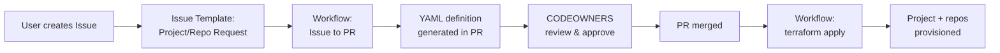

# Target Architecture Specification (DRAFT)

> **Status:** Draft v0.2 — for discussion and feedback
>
> **Scope:** Redesign of the DevOps Landing Zone to support real-world organizations, multi-repo projects, Bring Your Own VNet, GitOps-driven onboarding, and consistent governance across GitHub and Azure DevOps.

---

## Table of Contents

1. [Motivation & Problem Summary](#1-motivation--problem-summary)
2. [Target Hierarchy & Vocabulary](#2-target-hierarchy--vocabulary)
3. [Bootstrap & State Management (Two-Tier)](#3-bootstrap--state-management-two-tier)
4. [Module & Directory Structure (Target)](#4-module--directory-structure-target)
5. [Organization-Level Landing Zone (`devops/lz`)](#5-organization-level-landing-zone-devopslz)
6. [Project Definition & Multi-Repo Model](#6-project-definition--multi-repo-model)
7. [GitHub vs Azure DevOps — Structural Differences & Abstraction](#7-github-vs-azure-devops--structural-differences--abstraction)
8. [Bring Your Own VNet (BYO VNet)](#8-bring-your-own-vnet-byo-vnet)
9. [Organization-Level Governance (GitHub & Azure DevOps)](#9-organization-level-governance-github--azure-devops)
10. [GitOps-Driven Project & Repository Onboarding](#10-gitops-driven-project--repository-onboarding)
11. [Naming, State & Collision Resistance](#11-naming-state--collision-resistance)
12. [Migration Path from Current Design](#12-migration-path-from-current-design)
13. [Decision Log (Resolved Questions)](#13-decision-log-resolved-questions)
14. [Remaining Issues & Follow-up Notes](#14-remaining-issues--follow-up-notes)

---

## 1. Motivation & Problem Summary

### Current state

| Area                       | Today                                                                | Gap                                                                                                                |
| -------------------------- | -------------------------------------------------------------------- | ------------------------------------------------------------------------------------------------------------------ |
| **Bootstrap**              | Single bootstrap creates Storage Account + Key Vault for tfstate     | Bootstrap only covers tfstate storage; no separate bootstrap for platform LZ resources (identity, network, agents) |
| **Organization concept**   | GitHub org name is passed as a string; no governance boundary        | No formalized org-level resources, policies, or runner governance                                                  |
| **Project model**          | 1 project = 1 main repo + optional templates repo                    | Real projects often have multiple repos (infra, app, data, ops, shared libs)                                       |
| **GitHub vs Azure DevOps** | Separate code paths, no unified abstraction                          | GitHub lacks a "Project" concept that Azure DevOps has; no consistent governance model across both                 |
| **Network / VNet**         | Platform always creates a new VNet from address-prefix inputs        | No option to plug into an existing (enterprise-provided) VNet                                                      |
| **Portfolio onboarding**   | Each project provisioned via separate `terraform apply`              | No self-service or GitOps-driven onboarding pattern                                                                |
| **Identities**             | UAMIs created per project; subscription mapping done at project time | No clarity on whether identities/subscriptions are pre-registered at the platform level or project level           |
| **Documentation**          | Paths reference `infra/terraform/…` while code lives under `infra/…` | Confusing for adopters                                                                                             |

### Goals

1. Define a clear **Organization → Platform LZ → Project → Repository Set → Environments** hierarchy.
2. Introduce a **two-tier bootstrap** model: one for tfstate infrastructure, one for platform LZ resources.
3. Allow a project to own **multiple repositories** with different profiles, while keeping single-repo as a valid option.
4. Design a **unified abstraction layer** that accommodates both GitHub (no Project concept) and Azure DevOps (Org → Project → Repos).
5. Support **"Bring Your Own VNet"** alongside the existing platform-managed VNet.
6. Strengthen **organization-level governance** for both GitHub and Azure DevOps.
7. Provide a **GitOps-driven project/repository onboarding** pattern (issue → PR → provisioning).
8. Clarify the **identity and subscription mapping** strategy.
9. Provide a simple migration guide for V1 users to adopt the redesigned V2 architecture.

---

## 2. Target Hierarchy & Vocabulary

```text
┌────────────────────────────────────────────────────────────────────┐
│  Organization (GitHub Org / Azure DevOps Org)                     │
│                                                                    │
│  ┌──────────────────────────────────────────────────────────────┐  │
│  │  Bootstrap  (infra/_bootstrap)                              │  │
│  │  • Storage Account (tfstate container for all layers)       │  │
│  │  • Key Vault (secrets for VCS PATs, etc.)                   │  │
│  │  • Terraform state: local file → then migrated to azurerm   │  │
│  └──────────────────────────────────────────────────────────────┘  │
│                                        ▼ (tfstate → azurerm)       │
│  ┌──────────────────────────────────────────────────────────────┐  │
│  │  Platform Landing Zone  (devops/lz)                         │  │
│  │  • Platform bootstrap: create Azure resources for the org   │  │
│  │    – Shared identity RG (UAMIs)                             │  │
│  │    – Shared agents RG (ACR, ACA env, Log Analytics)         │  │
│  │    – Network RG  (platform-managed VNet OR hub resources)   │  │
│  │    – DevBox Dev Center                                      │  │
│  │  • VCS governance:                                          │  │
│  │    – GitHub: Org-level rulesets, runner groups, teams        │  │
│  │    – Azure DevOps: Org-level agent pools; branch policies    │  │
│  │      are applied at project level                            │  │
│  │  • Tfstate key: "devops-lz.terraform.tfstate"               │  │
│  └──────────────────────────────────────────────────────────────┘  │
│                                        ▼ (remote_state)            │
│  ┌── Project A (GitHub) ─────────────────────────────────────────┐ │
│  │  DevOps LZ "Project" = logical grouping                       │ │
│  │  (GitHub: repos in a flat org │ ADO: repos inside ADO Project)│ │
│  │  repositories = [                                             │ │
│  │    { name="project-a-infra",  profile="infra"  },             │ │
│  │    { name="project-a-app",    profile="app"    },             │ │
│  │  ]                                                            │ │
│  │  network_mode = "platform"                                    │ │
│  │  subscriptions = { features, dev, staging, prod }             │ │
│  │  identities (UAMI per env × job — created at project time)   │ │
│  │  runners (ACA jobs or ACI)                                    │ │
│  │  DevBox project pool                                          │ │
│  │  Tfstate key: "projects/project-a.terraform.tfstate"          │ │
│  └───────────────────────────────────────────────────────────────┘ │
│                                                                    │
│  ┌── Project B (Azure DevOps) ───────────────────────────────────┐ │
│  │  DevOps LZ "Project" = Azure DevOps Project boundary          │ │
│  │  project_name = "project-b"                                   │ │
│  │  repositories = [                                             │ │
│  │    { name="project-b-infra", profile="infra" },               │ │
│  │  ]                                                            │ │
│  │  network_mode = "byo"                                         │ │
│  │  byo_vnet = { vnet_id, private_endpoint_subnet_id, ... }      │ │
│  │  subscriptions = { dev, prod }                                │ │
│  └───────────────────────────────────────────────────────────────┘ │
└────────────────────────────────────────────────────────────────────┘
```

### Key terms

| Term                      | Definition                                                                                                                                                                                                                                                                                                  |
| ------------------------- | ----------------------------------------------------------------------------------------------------------------------------------------------------------------------------------------------------------------------------------------------------------------------------------------------------------- |
| **Organization**          | The top-level governance boundary — maps to a GitHub Organization or Azure DevOps Organization. Owns shared infrastructure and policies.                                                                                                                                                                    |
| **Bootstrap**             | The foundational `_bootstrap` layer that creates the Storage Account (for tfstate) and Key Vault (for secrets). Runs once, produces a `bootstrap.config.json` consumed by all subsequent layers.                                                                                                            |
| **Platform Landing Zone** | The shared infrastructure layer (`devops/lz`) provisioned once per organization. Creates Azure resource groups (identity, agents, network, DevBox) and VCS governance resources. Its own tfstate is stored in the bootstrap Storage Account. This is the "organizational bootstrap" for platform resources. |
| **Project**               | A logical grouping of repositories, environments, identities, and runner jobs that together deliver one product or workload. In GitHub, a project is a naming-convention-based grouping of repos within the flat org. In Azure DevOps, a project maps to an actual Azure DevOps Project container.          |
| **Repository Set**        | The ordered list of Git repositories that belong to a project. Each repo has a **profile** that determines its CI/CD workflow shape.                                                                                                                                                                        |
| **Repository Profile**    | A template that defines the branch strategy, workflow files, environments, and identity needs for a class of repository (e.g., `infra`, `app`, `library`). Profiles are a **recommendation** — users can place infra and app code in a single repo if they prefer.                                          |
| **Environment**           | A deployment target — maps 1:1 to an Azure subscription and a GitHub Actions Environment (or Azure DevOps Environment) with OIDC-federated UAMI.                                                                                                                                                            |
| **Network Mode**          | How the project connects to Azure networking: `platform` (use the LZ-managed VNet) or `byo` (Bring Your Own VNet).                                                                                                                                                                                          |

---

## 3. Bootstrap & State Management (Two-Tier)

### 3.1 Problem

The current `_bootstrap` layer creates a Storage Account and Key Vault for managing Terraform state files. However, the Platform Landing Zone (`devops/lz`) creates significant Azure infrastructure (identity RG, agents RG, network RG, Dev Center) that also needs its own managed state.

Today these are implicitly two separate concerns:

1. **Tier 0 — Tfstate Bootstrap** (`_bootstrap`): Creates the storage infrastructure to hold all Terraform state files.
2. **Tier 1 — Platform LZ Bootstrap** (`devops/lz`): Creates organizational Azure resources (the "platform bootstrap") whose state is stored in the Tier 0 storage.

This two-tier relationship should be made explicit.

### 3.2 Two-tier model

```text
┌─────────────────────────────────────────────────────────────────┐
│ Tier 0: Tfstate Bootstrap  (infra/_bootstrap)                   │
│                                                                 │
│  terraform apply (local state → then migrate to azurerm)        │
│  Creates:                                                       │
│    • Resource Group for bootstrap                               │
│    • Storage Account + "tfstate" container                      │
│    • Key Vault (for PATs and secrets)                           │
│  Outputs:                                                       │
│    • bootstrap.config.json (storage_account_name, etc.)         │
│    • devops.azurerm.tfbackend (backend config template)         │
│                                                                 │
│  State key: "bootstrap.terraform.tfstate"                       │
├─────────────────────────────────────────────────────────────────┤
│ Tier 1: Platform Landing Zone  (devops/lz)                      │
│                                                                 │
│  terraform init -backend-config=devops.azurerm.tfbackend        │
│  terraform apply                                                │
│  Creates:                                                       │
│    • Identity RG + UAMIs for container runs                     │
│    • Agents RG + ACR + ACA Environment + Log Analytics          │
│    • Network RG + VNet + subnets + DNS zones + NAT GW           │
│    • DevBox Dev Center + definitions                            │
│    • VCS governance (GitHub rulesets, ADO policies, etc.)        │
│  Outputs:                                                       │
│    • devops_agents, devops_identity, devops_network,            │
│      devops_devbox, container_specs, options, org_governance     │
│                                                                 │
│  State key: "devops-lz.terraform.tfstate"                       │
│  Reads: bootstrap.config.json from Tier 0                       │
├─────────────────────────────────────────────────────────────────┤
│ Tier 2: Projects  (devops/project_github or project_azuredevops)│
│                                                                 │
│  terraform init -backend-config=...                             │
│  terraform apply                                                │
│  Reads: remote_state of Tier 1 (devops/lz)                     │
│                                                                 │
│  State key: "projects/<project_name>.terraform.tfstate"         │
└─────────────────────────────────────────────────────────────────┘
```

### 3.3 What stays the same

- The `_bootstrap` module (`infra/_bootstrap`) is unchanged. It already creates exactly the right resources.
- The LZ (`devops/lz`) already reads `bootstrap.config.json` and stores its state in the bootstrap Storage Account.
- Projects already read LZ outputs via `terraform_remote_state`.

### 3.4 What changes

The **conceptual documentation** should make the two-tier relationship explicit:

1. **Tier 0** = `_bootstrap` — creates the "state management infrastructure" (Storage + Key Vault). This is the only layer that starts with local state and optionally migrates to azurerm.

2. **Tier 1** = `devops/lz` — acts as the "platform bootstrap" for organizational Azure resources. It is the first consumer of the Tier 0 storage. Its tfstate key should follow a well-known convention: `devops-lz.terraform.tfstate`.

3. **Tier 2** = `devops/project_*` — per-project resources. Each project's tfstate key follows: `projects/<project_name>.terraform.tfstate`.

All three tiers store their state in the **same** Storage Account (created in Tier 0). The Key Vault in Tier 0 holds secrets consumed by Tier 1 and Tier 2.

> **Note:** There is no need to create a second bootstrap module. The existing `_bootstrap` already serves as Tier 0. The key clarification is that `devops/lz` is Tier 1 — i.e., the **organizational platform bootstrap** — not just "another consumer." This distinction matters for operational runbooks: Tier 0 should be applied very rarely (essentially once), while Tier 1 is applied when the organization's platform configuration changes.

---

## 4. Module & Directory Structure (Target)

```text
infra/
├── _bootstrap/                         # Tier 0: Tfstate storage + Key Vault
├── _setup_subscriptions/               # (unchanged) resource provider registration
├── devops/
│   ├── lz/                             # Tier 1: Organization-level Platform LZ
│   │   ├── _variables.tf
│   │   ├── _variables.network.tf
│   │   ├── _variables.vcs.github.tf
│   │   ├── _variables.vcs.azuredevops.tf
│   │   ├── _variables.governance.tf    # ← NEW: org-level policies & rulesets (GitHub + ADO)
│   │   ├── _outputs.tf
│   │   ├── network.vnet.tf             # platform-managed VNet (unchanged)
│   │   ├── governance.github.tf        # ← NEW: GitHub org-level rulesets, runner groups
│   │   ├── governance.azuredevops.tf   # ← NEW: Azure DevOps org-level policies
│   │   └── ...
│   │
│   ├── project_github/                 # Tier 2: Per-project resources (GitHub)
│   │   ├── _variables.tf               # CHANGED: add repositories list, network_mode
│   │   ├── _variables.network.tf       # ← NEW: BYO VNet inputs
│   │   ├── _variables.repositories.tf  # ← NEW: multi-repo definition
│   │   ├── github.tf                   # CHANGED: iterate over repositories
│   │   ├── github.workflow.tf          # CHANGED: per-repo workflow generation
│   │   ├── uami.tf                     # CHANGED: per-repo × per-env identities
│   │   ├── uami.federation.tf
│   │   ├── network.tf                  # ← NEW: BYO VNet data lookups & validation
│   │   └── ...
│   │
│   └── project_azuredevops/            # Tier 2: Per-project resources (Azure DevOps)
│       ├── _variables.tf               # CHANGED: add repositories list, network_mode
│       ├── _variables.repositories.tf  # ← NEW: multi-repo definition
│       └── ...                         # (mirrors project_github where applicable)
│
└── modules/
    ├── github/                         # CHANGED: accept list of repositories
    │   ├── repo.tf                     # (for_each over repositories)
    │   ├── repo.templates.tf           # (unchanged; still one templates repo per project)
    │   └── ...
    ├── azure_devops/                   # CHANGED: accept list of repositories
    │   ├── repo.main.tf                # CHANGED: for_each over repositories
    │   └── ...
    ├── github_workflows/               # CHANGED: generate per-profile workflows
    │   ├── _variables.tf               # add repository_profiles input
    │   └── ...
    ├── vnet/                           # (unchanged)
    └── ...                             # (other modules unchanged)
```

Additionally, the **GitOps governance repository** (for issue-driven project/repository onboarding) lives as a **separate repo** in the GitOps governance organization, set up independently as a **template repository** (not provisioned via Terraform). This repo contains **both** the project definitions (YAML) **and** the IaC modules (`project_github`, `project_azuredevops`) needed to provision them. This ensures the GitOps repo is self-contained — it does not depend on cloning the DevOps Landing Zone repo at apply time.

```text
<org>/<gitops-governance-repo>/         # Separate repo for GitOps onboarding
├── .github/
│   ├── CODEOWNERS                      # Defines approval teams per project area
│   ├── ISSUE_TEMPLATE/
│   │   └── project-request.yaml        # Issue template for new project requests
│   └── workflows/
│       ├── project-request-to-pr.yaml  # Converts issues to PRs with YAML definitions
│       └── project-create.yaml         # On PR merge: runs terraform apply for projects
│
├── projects/                           # Project definitions (source of truth)
│   ├── contoso-ecommerce.yaml          # Project definition (repos, subs, network, etc.)
│   ├── contoso-payments.yaml
│   └── ...
│
├── infra/                              # IaC modules for project provisioning
│   ├── project_github/                 # Terraform root module for GitHub projects
│   │   ├── _variables.tf
│   │   ├── _variables.repositories.tf
│   │   ├── _variables.network.tf
│   │   ├── github.tf
│   │   ├── uami.tf
│   │   └── ...
│   ├── project_azuredevops/            # Terraform root module for Azure DevOps projects
│   │   ├── _variables.tf
│   │   ├── _variables.repositories.tf
│   │   └── ...
│   └── modules/                        # Shared Terraform modules
│       ├── github/
│       ├── azure_devops/
│       ├── github_workflows/
│       └── ...
│
└── README.md
```

> **Note:** The `infra/` directory in the GitOps governance repo contains the **same** `project_github`, `project_azuredevops`, and shared modules from the DevOps Landing Zone repo. Organizations can keep them in sync via:
>
> - **Git submodule**: referencing the DevOps Landing Zone repo as a submodule under `infra/`.
> - **Terraform module registry**: publishing modules to a private registry and referencing them by version.
> - **Direct copy with version pinning**: copying the modules and tracking the upstream version in a `VERSION` file.
>
> The recommended approach is **Git submodule** or **Terraform module registry** for traceability.

---

## 5. Organization-Level Landing Zone (`devops/lz`)

### 5.1 Role: Platform Bootstrap (Tier 1)

The Landing Zone serves as the **organizational platform bootstrap**. It is the first Terraform layer applied after Tier 0 (`_bootstrap`), and it creates all shared Azure and VCS resources that projects depend on.

Operationally:

- **Tier 0** (`_bootstrap`) is applied once and very rarely updated.
- **Tier 1** (`devops/lz`) is applied whenever the organization's platform configuration changes (e.g., new subnets, new DevBox definitions, governance policy changes).
- Both tiers store their state in the same Storage Account, under different state keys.

### 5.2 What stays the same

- Bootstrap resources (Storage Account, Key Vault)
- Identity resource group (shared across projects)
- Agents resource group (ACR, ACA environment, Log Analytics)
- Network resource group and platform-managed VNet creation
- Dev Center and DevBox definitions
- Container image build tasks

### 5.3 What changes

#### 5.3.1 Governance outputs (NEW)

The LZ will expose organizational governance settings that projects inherit:

```hcl
# New file: devops/lz/_variables.governance.tf

variable "org_default_branch_rules" {
  description = "Default branch protection rules applied to all project repositories"
  type = object({
    require_pull_request   = optional(bool, true)
    required_review_count  = optional(number, 1)
    require_status_checks  = optional(bool, true)
    dismiss_stale_reviews  = optional(bool, true)
    require_code_owners    = optional(bool, false)
  })
  default = {}
}

variable "org_runner_group_defaults" {
  description = "Default runner group configuration for the organization"
  type = object({
    visibility             = optional(string, "selected")
    allows_public_repos    = optional(bool, false)
  })
  default = {}
}

variable "org_repository_defaults" {
  description = "Default settings for all repositories in the organization"
  type = object({
    default_visibility            = optional(string, "private")
    delete_branch_on_merge        = optional(bool, true)
    allow_squash_merge            = optional(bool, true)
    allow_merge_commit            = optional(bool, true)
    allow_rebase_merge            = optional(bool, false)
    vulnerability_alerts_enabled  = optional(bool, true)
  })
  default = {}
}
```

#### 5.3.2 New outputs for project consumption

```hcl
# Additions to devops/lz/_outputs.tf

output "org_governance" {
  value = {
    default_branch_rules    = var.org_default_branch_rules
    runner_group_defaults   = var.org_runner_group_defaults
    repository_defaults     = var.org_repository_defaults
  }
  description = "Organization-level governance defaults inherited by projects"
}

output "network_mode_info" {
  value = {
    platform_vnet_id                = length(module.vnet) > 0 ? module.vnet[0].output.vnet_id : null
    platform_vnet_name              = length(module.vnet) > 0 ? local.vnet_name : null
    platform_vnet_resource_group    = local.enable_network_resources ? local.network_resource_group_name : null
    private_endpoint_subnet_id  = local.private_endpoint_subnet_id
    aca_subnet_id               = local.container_app_subnet_id
    aci_subnet_id               = local.container_instance_subnet_id
    devbox_subnet_id            = local.devbox_subnet_id
    private_dns_zone_ids            = { for index, z in azurerm_private_dns_zone.this : index => z.id }
  }
  description = "Network information for projects using platform or BYO networking"
}
```

---

## 6. Project Definition & Multi-Repo Model

### 6.1 Design philosophy: Separation is a recommendation, not a mandate

Repository profiles (`infra`, `app`, `library`, `docs`) are **recommended patterns** that map to different CI/CD workflow shapes. They are not a mandate to split every project into multiple repos.

**A single repository containing both infra and app code is fully supported.** In that case, the user assigns the `infra` profile (which includes the most comprehensive branch/environment strategy) and the single repo gets the full `validate → plan → apply` pipeline. The multi-repo pattern is offered for teams who prefer separation of concerns, independent release cadences, or fine-grained RBAC.

| Scenario                        | Configuration                                            | Result                                                               |
| ------------------------------- | -------------------------------------------------------- | -------------------------------------------------------------------- |
| Single repo (current behavior)  | `repositories = []` or single entry with profile `infra` | Identical to today                                                   |
| Separated infra + app           | Two entries: `profile = "infra"` + `profile = "app"`     | Separate workflow shapes, optionally separate UAMIs                  |
| Monorepo with multiple concerns | Single entry with profile `infra`                        | One repo gets the full pipeline; internal structure is user's choice |

### 6.2 Current design (single repo)

```hcl
# Today
project_name = "my-project"
# → creates 1 repo: "my-project"
# → creates 1 templates repo: "my-project-templates" (optional)
```

### 6.3 Target design (multi-repo)

```hcl
# New variable: _variables.repositories.tf

variable "repositories" {
  description = "List of repositories for this project"
  type = list(object({
    name        = string
    profile     = string          # "infra" | "app" | "library" | "docs"
    description = optional(string, "")
    visibility  = optional(string) # null → inherit org default
    settings    = optional(object({
      allow_merge_commit     = optional(bool)
      allow_squash_merge     = optional(bool)
      allow_rebase_merge     = optional(bool)
      delete_branch_on_merge = optional(bool)
      has_issues             = optional(bool, true)
      has_projects           = optional(bool, true)
      vulnerability_alerts   = optional(bool, true)
    }))
    branch_overrides = optional(map(object({
      required_review_count = optional(number)
      require_code_owners   = optional(bool)
    })))
    environments = optional(list(string))  # subset of project environments; null → all
  }))

  # Backward-compatible default: if empty, fall back to single-repo behavior
  default = []

  validation {
    condition = length(var.repositories) == 0 || length(var.repositories) == length(distinct([for r in var.repositories : r.name]))
    error_message = "Repository names must be unique within a project."
  }
}
```

#### Backward compatibility

When `repositories = []` (default), the module falls back to the current single-repo behavior using `project_name` as the repository name. This ensures zero breaking changes for existing users.

```hcl
# In _locals.tf

locals {
  # If repositories list is provided, use it; otherwise fall back to current behavior
  _repositories = length(var.repositories) > 0 ? var.repositories : [
    {
      name               = local._project_name
      profile            = "infra"
      description        = local._project_name
      visibility         = null
      settings           = null
      branch_overrides   = null
      environments       = null
    }
  ]
}
```

### 6.4 Repository profiles

Profiles define the **workflow shape** for a repository. They are defined in the `github_workflows` module and control which CI/CD workflows and branch strategies are generated.

| Profile   | Branches                               | CI Workflow               | CD Workflow                | Environments                                       |
| --------- | -------------------------------------- | ------------------------- | -------------------------- | -------------------------------------------------- |
| `infra`   | `features/*`, `dev`, `staging`, `main` | `validate` + `plan` on PR | `plan` + `apply` on push   | `features`, `development`, `staging`, `production` |
| `app`     | `features/*`, `dev`, `staging`, `main` | `build` + `test` on PR    | `build` + `deploy` on push | `development`, `staging`, `production`             |
| `library` | `features/*`, `main`                   | `build` + `test` on PR    | `publish` on tag           | —                                                  |
| `docs`    | `main`                                 | —                         | —                          | —                                                  |

> **Note:** The `docs` profile generates **no CI/CD workflows**. It creates the repository with default branch protection only. This profile is intended for documentation-only repos (wikis, ADRs, runbooks) that don't need build or deployment pipelines.

### 6.5 Identity (UAMI) allocation strategy

#### Where identities are created

UAMIs are **created at project deployment time** (Tier 2), not pre-registered at the Platform LZ level. The Platform LZ (Tier 1) only provides the **identity resource group** where UAMIs are placed.

The subscription-to-environment mapping is defined in each project's `terraform.tfvars` via the `subscriptions` variable. The Platform LZ does **not** maintain a global subscription registry. Each project declares which Azure subscriptions it needs for its environments, and the project module creates UAMIs and federated identity credentials accordingly.

```text
Platform LZ (Tier 1)                Project (Tier 2)
┌─────────────────────┐             ┌──────────────────────────────┐
│ Creates:            │             │ Reads:                       │
│ • identity RG       │────────────►│ • identity RG name from LZ   │
│   (empty at first)  │             │                              │
│                     │             │ Creates:                     │
│                     │             │ • UAMI per env × job type    │
│                     │             │ • Federated identity creds   │
│                     │             │ • Role assignments on subs   │
│                     │             │                              │
│                     │             │ Subscription map comes from: │
│                     │             │ • project's terraform.tfvars │
└─────────────────────┘             └──────────────────────────────┘
```

#### Shared vs per-repository identities

Today: one UAMI per environment × job type (plan/apply) per project.

Target: one UAMI per environment × job type (plan/apply) **per repository** (or shared per project if the user opts in).

```hcl
variable "shared_identities" {
  description = "Whether to share UAMI across all repositories in the project (true) or create per-repository identities (false)"
  type        = bool
  default     = true   # backward compatible
}
```

When `shared_identities = true`: behavior is identical to today — one set of UAMIs covers all repos in the project.

When `shared_identities = false`: each repository gets its own set of UAMIs, enabling fine-grained RBAC (e.g., the `infra` repo has `Contributor`, the `app` repo has only `AcrPush` + `Web Apps Contributor`).

#### UAMI naming

UAMIs use a mixed naming pattern that keeps project and repo human-readable while hashing env/job details:

```
uami-<project>-<repo>-<hash>          # per-repo identities (shared_identities = false)
uami-<project>-<hash>                 # shared identities (shared_identities = true)
```

See [Section 11.3](#113-uami-naming-convention) for the full naming convention, hash derivation, and examples.

### 6.6 Sample `terraform.tfvars` — multi-repo project

```hcl
# terraform.tfvars — Project "contoso-ecommerce"

target_subscription_id = "00000000-0000-0000-0000-000000000000"
project_name           = "contoso-ecommerce"
location               = "japaneast"

tags = {
  appTag     = "contoso-ecommerce"
  envTag     = "prod"
  projectTag = "devops"
  purposeTag = "alz"
}

# Multiple repositories for this project
repositories = [
  {
    name    = "contoso-ecommerce-infra"
    profile = "infra"
    description = "Azure infrastructure for the Contoso e-commerce platform"
  },
  {
    name    = "contoso-ecommerce-api"
    profile = "app"
    description = "Backend API services"
  },
  {
    name    = "contoso-ecommerce-web"
    profile = "app"
    description = "Frontend web application"
    environments = ["development", "staging", "production"]  # no features env
  },
  {
    name    = "contoso-ecommerce-shared"
    profile = "library"
    description = "Shared libraries and utilities"
  },
]

subscriptions = {
  "features" = {
    id = "11111111-1111-1111-1111-111111111111"
  },
  "development" = {
    id = "22222222-2222-2222-2222-222222222222"
  },
  "staging" = {
    id = "33333333-3333-3333-3333-333333333333"
  },
  "production" = {
    id = "44444444-4444-4444-4444-444444444444"
  },
}

# Network mode
network_mode = "platform"  # use LZ-managed VNet

# Runner options
use_templates_repository = true
use_self_hosted_runners  = true
self_hosted_runners_type = "aca"
```

### 6.7 Sample `terraform.tfvars` — subset environments (dev + prod only)

```hcl
# terraform.tfvars — Project with only development and production environments

target_subscription_id = "00000000-0000-0000-0000-000000000000"
project_name           = "contoso-internal-tool"
location               = "japaneast"

tags = {
  appTag     = "contoso-internal-tool"
  envTag     = "prod"
  projectTag = "devops"
}

# Single repository (backward-compatible; repositories = [] uses project_name as repo name)

# Only two environments — no features or staging
subscriptions = {
  "development" = {
    id = "22222222-2222-2222-2222-222222222222"
  },
  "production" = {
    id = "44444444-4444-4444-4444-444444444444"
  },
}

network_mode = "platform"
use_self_hosted_runners = true
self_hosted_runners_type = "aca"
```

> **Note:** When `subscriptions` contains only a subset of environments, the module creates only the corresponding GitHub Actions Environments, UAMIs, and federated identity credentials. Branches and branch rules for missing environments (e.g., `features/*`, `staging`) are not created.

---

## 7. GitHub vs Azure DevOps — Structural Differences & Abstraction

### 7.1 The structural mismatch

GitHub and Azure DevOps have fundamentally different organizational hierarchies:

```text
GitHub                              Azure DevOps
──────                              ──────────────
Organization                        Organization
├── Repository A                    ├── Project X
├── Repository B                    │   ├── Repository A
├── Repository C                    │   ├── Repository B
├── Teams (org-wide)                │   ├── Pipelines
├── Runner Groups (org-wide)        │   ├── Environments
├── Org Rulesets (org-wide)         │   ├── Service Connections
└── Environments (per-repo)         │   ├── Agent Pools (project-scoped)
                                    │   └── Teams/Groups (project-scoped)
                                    ├── Project Y
                                    │   └── ...
                                    └── Org-level Agent Pools
```

Key differences:

| Aspect                  | GitHub                                          | Azure DevOps                                                      |
| ----------------------- | ----------------------------------------------- | ----------------------------------------------------------------- |
| **"Project" concept**   | No native project; repos are flat under the org | First-class `Project` container with its own security boundary    |
| **Environments**        | Defined per repository                          | Defined per project                                               |
| **Pipelines**           | Defined in repo (GitHub Actions workflows)      | Defined in project, pointing to repo files                        |
| **Teams/permissions**   | Org-wide teams with per-repo access             | Project-scoped teams + org-level groups                           |
| **Agent/Runner pools**  | Org-level runner groups                         | Both org-level and project-scoped pools                           |
| **Branch protection**   | Per-repo rulesets OR org-level rulesets         | Per-repo branch policies within a project                         |
| **Service Connections** | N/A (OIDC federation per environment)           | Project-scoped service connections (workload identity federation) |

### 7.2 The abstraction: DevOps LZ "Project"

The DevOps Landing Zone introduces a **logical "Project"** concept that maps differently to each VCS platform:

```text
DevOps LZ Project                    GitHub Mapping                Azure DevOps Mapping
──────────────────                    ──────────────                ────────────────────
project_name = "contoso-ecommerce"    Naming convention:            ADO Project:
                                      repos prefixed with           "contoso-ecommerce"
                                      "contoso-ecommerce-*"

repositories = [                      GitHub repos:                 ADO repos inside project:
  { name="...-infra", ... },          contoso-ecommerce-infra       contoso-ecommerce-infra
  { name="...-app",   ... },          contoso-ecommerce-app         contoso-ecommerce-app
]

environments = {                      GitHub Environments            ADO Environments:
  development, staging, production    (per repo, with env prefix)    (per project)
}

identities = {                        OIDC federation                Workload identity federation
  UAMI per env × job                  (per environment)              (via service connections)
}
```

### 7.3 Unified interface design

Both `project_github` and `project_azuredevops` modules share the same **input interface** for project-level configuration:

```hcl
# Shared input interface (both project_github and project_azuredevops)

variable "project_name"    { ... }   # → GitHub: naming prefix  │ ADO: project name
variable "repositories"    { ... }   # → GitHub: org-level repos │ ADO: project-scoped repos
variable "subscriptions"   { ... }   # → Both: Azure subscription per environment
variable "network_mode"    { ... }   # → Both: platform or byo
variable "byo_vnet"        { ... }   # → Both: BYO VNet config
variable "shared_identities" { ... } # → Both: shared vs per-repo UAMIs
```

Platform-specific variables are additive:

```hcl
# GitHub-specific
variable "use_runner_group"          { ... }
variable "use_templates_repository"  { ... }

# Azure DevOps-specific
variable "create_project"            { ... }   # create or reference existing ADO project
variable "use_separate_repo_for_pipeline_templates" { ... }
```

### 7.4 Governance consistency

For governance to be consistent across both platforms, the Platform LZ defines **platform-agnostic governance defaults** that are then mapped to platform-specific resources:

| DevOps LZ Governance Setting   | GitHub Implementation                          | Azure DevOps Implementation                                 |
| ------------------------------ | ---------------------------------------------- | ----------------------------------------------------------- |
| `require_pull_request = true`  | Org ruleset: `pull_request` block              | Branch policy: `azuredevops_branch_policy_min_reviewers`    |
| `required_review_count = 1`    | Org ruleset: `required_approving_review_count` | Branch policy: `minimum_reviewer_count`                     |
| `dismiss_stale_reviews = true` | Org ruleset: `dismiss_stale_reviews_on_push`   | (Not directly available; approximated via policy settings)  |
| `require_status_checks = true` | Org ruleset: `required_status_checks`          | Branch policy: `azuredevops_branch_policy_build_validation` |
| `runner_group / agent_pool`    | `github_actions_runner_group`                  | `azuredevops_agent_pool` (org-level)                        |

This mapping is implemented in separate files (`governance.github.tf` and `governance.azuredevops.tf`) within the LZ module, driven by the same governance variables.

---

## 8. Bring Your Own VNet (BYO VNet)

### 8.1 Problem

Today the Landing Zone always creates a fresh VNet with all required subnets. Enterprise customers often:

- Have a **hub-and-spoke** topology managed by a central networking team.
- Need DevOps resources to land in a **pre-provisioned spoke VNet** with corporate firewall rules, DNS forwarding, and peering already configured.
- Cannot use arbitrary address spaces.

### 8.2 Design

Add a `network_mode` variable that selects between two modes:

| Mode       | Description                                                      | Who creates VNet?          | Who provides subnet IDs?        |
| ---------- | ---------------------------------------------------------------- | -------------------------- | ------------------------------- |
| `platform` | Current behavior (default). The LZ creates and manages the VNet. | `devops/lz` module         | `devops/lz` outputs             |
| `byo`      | Enterprise-provided VNet. User supplies existing subnet IDs.     | External (networking team) | User input at **project level** |

### 8.3 Landing Zone changes (`devops/lz`)

No changes needed at the LZ level for the BYO mode itself — the LZ continues to create its platform VNet when `enable_private_network = true`. BYO is a **project-level** decision.

However, the LZ should export its private DNS zone IDs so BYO projects can link their VNet to the same DNS zones:

```hcl
# Already partially present in _outputs.tf:
output "devops_network" {
  value = {
    ...
    private_dns_zone_ids = { for index, z in azurerm_private_dns_zone.this : index => z.id }
    ...
  }
}
```

### 8.4 Project-level changes (`devops/project_github`)

```hcl
# New file: _variables.network.tf

variable "network_mode" {
  description = "Network mode for the project: 'platform' (use LZ-managed VNet) or 'byo' (Bring Your Own VNet)"
  type        = string
  default     = "platform"

  validation {
    condition     = contains(["platform", "byo"], var.network_mode)
    error_message = "network_mode must be 'platform' or 'byo'."
  }
}

variable "byo_vnet" {
  description = "BYO VNet configuration. Required when network_mode = 'byo'."
  type = object({
    vnet_id                          = string
    vnet_resource_group_name         = string
    private_endpoint_subnet_id       = optional(string)
    container_app_subnet_id          = optional(string)
    container_instance_subnet_id     = optional(string)
    devbox_subnet_id                 = optional(string)
    link_to_platform_private_dns     = optional(bool, true)
  })
  default = null

  validation {
    condition = (
      var.network_mode == "platform" ? var.byo_vnet == null :
      var.byo_vnet != null
    )
    error_message = "byo_vnet must be provided when network_mode is 'byo' and must be null when network_mode is 'platform'."
  }
}
```

#### BYO VNet subnet prerequisite validations

When `network_mode = "byo"`, the project module validates that:

1. If `use_self_hosted_runners = true` and `self_hosted_runners_type = "aca"`, then `byo_vnet.container_app_subnet_id` must be provided, and the subnet must have the `Microsoft.App/environments` delegation.
2. If `use_self_hosted_runners = true` and `self_hosted_runners_type = "aci"`, then `byo_vnet.container_instance_subnet_id` must be provided, and the subnet must have the `Microsoft.ContainerInstance/containerGroups` delegation.
3. If `use_devbox = true`, then `byo_vnet.devbox_subnet_id` must be provided.

These checks should be implemented as **enforceable Terraform validations/preconditions** (not documentation-only rules), by reading the BYO subnet configuration and asserting required delegations:

```hcl
data "azurerm_subnet" "byo_aca" {
  count = var.network_mode == "byo" && var.use_self_hosted_runners && var.self_hosted_runners_type == "aca" ? 1 : 0
  id    = var.byo_vnet.container_app_subnet_id
}

resource "terraform_data" "validate_byo_subnets" {
  lifecycle {
    precondition {
      condition = (
        var.network_mode != "byo" ||
        !var.use_self_hosted_runners ||
        var.self_hosted_runners_type != "aca" ||
        contains(
          flatten([for d in data.azurerm_subnet.byo_aca[0].delegation : [for s in d.service_delegation : s.name]]),
          "Microsoft.App/environments"
        )
      )
      error_message = "BYO ACA subnet must include Microsoft.App/environments delegation."
    }
  }
}
```

Apply the same pattern for ACI (`Microsoft.ContainerInstance/containerGroups`) and DevBox subnet presence checks.

```hcl
# New file: network.tf (in project_github)

locals {
  # Resolve subnet IDs based on network mode
  effective_private_endpoint_subnet_id = (
    var.network_mode == "byo"
    ? var.byo_vnet.private_endpoint_subnet_id
    # Note: private_endpoint_subnet_id is a new field added to the LZ devops_network output
    : try(local._devops_outputs.devops_network.private_endpoint_subnet_id, null)
  )

  effective_aca_subnet_id = (
    var.network_mode == "byo"
    ? var.byo_vnet.container_app_subnet_id
    : local.container_app_environment_id != null ? local._devops_outputs.devops_network.aca_subnet_id : null
  )

  effective_aci_subnet_id = (
    var.network_mode == "byo"
    ? var.byo_vnet.container_instance_subnet_id
    : local.container_instance_subnet_id
  )

  effective_devbox_subnet_id = (
    var.network_mode == "byo"
    ? var.byo_vnet.devbox_subnet_id
    : local._devops_outputs.devops_devbox.devbox_subnet_id
  )
}

# Optionally link BYO VNet to platform private DNS zones
resource "azurerm_private_dns_zone_virtual_network_link" "byo" {
  for_each = (
    var.network_mode == "byo" && var.byo_vnet.link_to_platform_private_dns
    ? local._devops_outputs.devops_network.private_dns_zone_ids
    : {}
  )

  name                  = "link-${var.project_name}-${each.key}"
  resource_group_name   = local._devops_outputs.devops_network.resource_group_name
  private_dns_zone_name = each.key
  virtual_network_id    = var.byo_vnet.vnet_id
  registration_enabled  = false
}
```

### 8.5 Sample `terraform.tfvars` — BYO VNet project

```hcl
# terraform.tfvars — Project "contoso-payments" with BYO VNet

target_subscription_id = "00000000-0000-0000-0000-000000000000"
project_name           = "contoso-payments"
location               = "japaneast"

tags = {
  appTag     = "contoso-payments"
  envTag     = "prod"
  projectTag = "devops"
  purposeTag = "alz"
}

repositories = [
  {
    name    = "contoso-payments-infra"
    profile = "infra"
  },
  {
    name    = "contoso-payments-svc"
    profile = "app"
  },
]

subscriptions = {
  "development" = { id = "aaaaaaaa-aaaa-aaaa-aaaa-aaaaaaaaaaaa" },
  "production"  = { id = "bbbbbbbb-bbbb-bbbb-bbbb-bbbbbbbbbbbb" },
}

# Bring Your Own VNet
network_mode = "byo"
byo_vnet = {
  vnet_id                      = "/subscriptions/.../resourceGroups/rg-network/providers/Microsoft.Network/virtualNetworks/vnet-spoke-payments"
  vnet_resource_group_name     = "rg-network"
  private_endpoint_subnet_id   = "/subscriptions/.../subnets/snet-pe"
  container_app_subnet_id      = "/subscriptions/.../subnets/snet-aca"
  link_to_platform_private_dns = true
}

use_self_hosted_runners  = true
self_hosted_runners_type = "aca"
use_devbox               = false
```

### 8.6 Architecture Diagram — BYO VNet Flow

```text
┌─────────────────────────────────────────────────────────────────┐
│ Azure — Enterprise Hub-Spoke Network                            │
│                                                                 │
│  ┌─────────────┐      peering      ┌─────────────────────────┐ │
│  │  Hub VNet    │◄────────────────► │  Spoke VNet             │ │
│  │  (Firewall,  │                   │  (BYO — contoso-pays)   │ │
│  │   DNS, VPN)  │                   │  ┌──────────────────┐   │ │
│  └─────────────┘                    │  │ snet-pe          │   │ │
│                                     │  │ snet-aca         │   │ │
│       peering                       │  │ snet-aci         │   │ │
│  ┌─────────────┐                    │  └──────────────────┘   │ │
│  │  Platform LZ │                   └─────────────────────────┘ │
│  │  VNet        │                                               │
│  │  (managed by │      DNS zone links                           │
│  │   devops/lz) │◄──────────────── (linked at project level)    │
│  └─────────────┘                                                │
└─────────────────────────────────────────────────────────────────┘
```

### 8.7 Repo-level BYO VNet — analysis

**Question:** Could different repositories within the same project use different BYO VNets?

**Answer:** Repo-level BYO VNet is **not practical** in the current architecture. The network mode should remain a **project-level** decision.

| Concern                                     | Why repo-level BYO VNet is impractical                                                                                                                                                                    |
| ------------------------------------------- | --------------------------------------------------------------------------------------------------------------------------------------------------------------------------------------------------------- |
| **Runner infrastructure is project-scoped** | Self-hosted runners (ACA jobs, ACI containers) are created per project and shared across all repos in the project. A runner cannot exist in two different VNets simultaneously.                           |
| **Private endpoints are shared**            | The private endpoint to the tfstate Storage Account is project-scoped. It lives in one subnet and is used by all repos' workflows.                                                                        |
| **State management**                        | All repos in a project share the same Terraform backend (storage account + container). Splitting VNets per repo would require separate state backends, which defeats the purpose of the project grouping. |
| **Complexity vs. value**                    | Per-repo VNets would require a `for_each` over repos with different network configs, separate ACA environments per repo, and per-repo DNS zone links — significant complexity for a rare use case.        |

**If repos truly need different networks, they likely belong in different projects.** The project boundary is the right level for network isolation. A team that needs repo A in VNet X and repo B in VNet Y should define two separate projects, each with its own `network_mode` and `byo_vnet` configuration.

> **Note:** This does not limit where the _application_ deploys — application-level networking (where the app runs) is handled by the application's own Terraform/IaC, not by the DevOps Landing Zone. The BYO VNet here governs only the _CI/CD infrastructure_ (runners, private endpoints, DevBox).

---

## 9. Organization-Level Governance (GitHub & Azure DevOps)

### 9.1 Current gaps

- Branch protection rules are only defined at the project level inside `github_workflows`.
- Runner groups are created per project only if `use_runner_group = true`.
- No org-level repository settings baseline.
- **No Azure DevOps governance is managed at all** — ADO policies/pools are configured manually.

### 9.2 Target: Platform-agnostic governance variables

The LZ defines governance settings that are **platform-agnostic** and then mapped to both GitHub and Azure DevOps:

```hcl
# devops/lz/_variables.governance.tf

variable "org_default_branch_rules" {
  description = "Default branch protection rules applied to all project repositories (GitHub + Azure DevOps)"
  type = object({
    require_pull_request   = optional(bool, true)
    required_review_count  = optional(number, 1)
    require_status_checks  = optional(bool, true)
    dismiss_stale_reviews  = optional(bool, true)
    require_code_owners    = optional(bool, false)
  })
  default = {}
}

variable "org_repository_defaults" {
  description = "Default settings for all repositories in the organization"
  type = object({
    default_visibility            = optional(string, "private")
    delete_branch_on_merge        = optional(bool, true)
    allow_squash_merge            = optional(bool, true)
    allow_merge_commit            = optional(bool, true)
    allow_rebase_merge            = optional(bool, false)
    vulnerability_alerts_enabled  = optional(bool, true)
  })
  default = {}
}
```

### 9.3 GitHub governance implementation

```hcl
# devops/lz/governance.github.tf

resource "github_organization_ruleset" "baseline" {
  count       = var.enable_github ? 1 : 0
  name        = "org-baseline"
  target      = "branch"
  enforcement = "active"

  conditions {
    ref_name {
      include = ["~DEFAULT_BRANCH"]
      exclude = []
    }
  }

  rules {
    deletion         = true
    non_fast_forward = true

    pull_request {
      dismiss_stale_reviews_on_push     = var.org_default_branch_rules.dismiss_stale_reviews
      require_code_owner_review         = var.org_default_branch_rules.require_code_owners
      required_approving_review_count   = var.org_default_branch_rules.required_review_count
      required_review_thread_resolution = true
    }
  }

  bypass_actors {
    actor_id    = 0   # Organization admin
    actor_type  = "OrganizationAdmin"
    bypass_mode = "pull_request"  # admins must use PRs but can bypass in emergencies
  }
}

variable "org_runner_groups" {
  description = "Runner groups to create at the GitHub organization level"
  type = map(object({
    visibility          = optional(string, "selected")
    allows_public_repos = optional(bool, false)
  }))
  default = {}
}

resource "github_actions_runner_group" "org" {
  for_each                   = var.enable_github ? var.org_runner_groups : {}
  name                       = each.key
  visibility                 = each.value.visibility
  allows_public_repositories = each.value.allows_public_repos
}
```

### 9.4 Azure DevOps governance implementation

Azure DevOps governance maps to different resource types, but addresses the same policy intent:

```hcl
# devops/lz/governance.azuredevops.tf

# Org-level agent pools (equivalent to GitHub runner groups)
variable "org_agent_pools" {
  description = "Agent pools to create at the Azure DevOps organization level"
  type = map(object({
    auto_provision = optional(bool, false)
    auto_update    = optional(bool, true)
  }))
  default = {}
}

resource "azuredevops_agent_pool" "org" {
  for_each       = var.enable_azuredevops ? var.org_agent_pools : {}
  name           = each.key
  auto_provision = each.value.auto_provision
  auto_update    = each.value.auto_update
}

# Note: Azure DevOps branch policies are project-scoped, not org-scoped.
# The org_default_branch_rules are applied at the PROJECT level during
# project_azuredevops module execution, where they map to:
#   - azuredevops_branch_policy_min_reviewers
#   - azuredevops_branch_policy_build_validation
#   - azuredevops_branch_policy_auto_reviewers (for CODEOWNERS equivalent)
```

### 9.5 Governance parity matrix

| Governance Intent                  | GitHub (Org-level)                         | Azure DevOps (Org-level)       | Azure DevOps (Project-level)                 |
| ---------------------------------- | ------------------------------------------ | ------------------------------ | -------------------------------------------- |
| **Require PRs for default branch** | `github_organization_ruleset`              | N/A                            | `azuredevops_branch_policy_min_reviewers`    |
| **Min review count**               | Ruleset: `required_approving_review_count` | N/A                            | Branch policy: `minimum_reviewer_count`      |
| **Dismiss stale reviews**          | Ruleset: `dismiss_stale_reviews_on_push`   | N/A                            | (Not directly supported)                     |
| **Require status checks**          | Ruleset: `required_status_checks`          | N/A                            | `azuredevops_branch_policy_build_validation` |
| **Agent/Runner pools**             | `github_actions_runner_group` (org)        | `azuredevops_agent_pool` (org) | `azuredevops_agent_queue` (project)          |
| **Repository defaults**            | Org-level settings via API                 | N/A                            | Project-level settings                       |

> **Key architectural difference:** GitHub allows org-level rulesets that cascade to all repos. Azure DevOps does not have org-level branch policies — they must be applied per-project. The DevOps LZ handles this by applying the `org_default_branch_rules` at project creation time in the `project_azuredevops` module.

---

## 10. GitOps-Driven Project & Repository Onboarding

### 10.1 Problem

Today, onboarding a new project requires:

1. Copy `terraform.tfvars.sample` → `terraform.tfvars`
2. Fill in all values manually
3. Run `terraform init` + `terraform apply`

For organizations with many projects (10+), this is error-prone and hard to audit. There is no self-service mechanism and no approval workflow.

### 10.2 Target: Issue-driven GitOps workflow

Inspired by [github-gitops-samples](https://github.com/shigeyf/github-gitops-samples), the onboarding model uses a **GitOps governance repository** with an issue → PR → merge → provision pipeline:

**Workflow steps (text description):**

1. User creates an Issue using the project/repository request template.
2. A GitHub Actions workflow parses the issue and generates a YAML project definition file.
3. The workflow creates a Pull Request containing the YAML file.
4. CODEOWNERS-designated approvers review and approve the PR (this is the approval gate).
5. The PR is merged to the main branch.
6. A provisioning workflow detects the new YAML file and runs `terraform plan` + `terraform apply`.
7. The project and its repositories are provisioned.



### 10.3 GitOps governance repository structure

The GitOps governance repo is **set up independently** (not created by Terraform) as a **template repository** that organizations clone. It is hosted in the **GitOps governance organization** in GitHub Enterprise alongside the platform LZ repo. Creating GitHub repos via Terraform is complex and fragile — the template repo approach is simpler and more reliable.

The governance repo holds project definitions, the workflows that provision them, **and the IaC modules** (`project_github`, `project_azuredevops`, shared modules) that the workflows execute. This makes the GitOps repo **self-contained** — it does not need to clone the DevOps Landing Zone repo at provisioning time.

```text
# GitHub Enterprise organization layout:
<governance-org>/
├── devops-landing-zone/           # Platform LZ IaC repo (Tier 0 + Tier 1)
└── devops-gitops/                 # GitOps governance repo (project IaC, template repo)
```

```text
<org>/devops-gitops/                    # GitOps governance repository
├── .github/
│   ├── CODEOWNERS                      # Approval teams per project area
│   │   # Example:
│   │   # /.github/ @org/gitops-admins
│   │   # /projects/team-a/ @org/team-a-leads
│   │   # /projects/team-b/ @org/team-b-leads
│   │
│   ├── ISSUE_TEMPLATE/
│   │   ├── config.yml
│   │   └── project-request.yaml        # Issue template for new project requests
│   │
│   └── workflows/
│       ├── project-request-to-pr.yaml  # Parses issue → generates YAML → creates PR
│       └── project-create.yaml         # On PR merge → terraform init/apply
│
├── projects/                           # Project definitions (source of truth)
│   ├── contoso-ecommerce.yaml
│   ├── contoso-payments.yaml
│   └── contoso-analytics.yaml
│
├── infra/                              # IaC for project provisioning
│   ├── project_github/                 # Terraform root module: GitHub projects
│   │   ├── _variables.tf
│   │   ├── _variables.repositories.tf
│   │   ├── _variables.network.tf
│   │   ├── github.tf
│   │   ├── github.workflow.tf
│   │   ├── uami.tf
│   │   ├── uami.federation.tf
│   │   ├── network.tf
│   │   └── ...
│   │
│   ├── project_azuredevops/            # Terraform root module: Azure DevOps projects
│   │   ├── _variables.tf
│   │   ├── _variables.repositories.tf
│   │   └── ...
│   │
│   └── modules/                        # Shared Terraform modules
│       ├── github/                     # GitHub repo/team/environment resources
│       ├── azure_devops/               # ADO project/repo/pipeline resources
│       ├── github_workflows/           # Workflow file generation
│       └── ...
│
└── README.md
```

> **Keeping IaC in sync with DevOps Landing Zone:**
> The `infra/` directory contains the same `project_github`, `project_azuredevops`, and shared modules from the DevOps Landing Zone repo. Organizations should keep them in sync via one of:
>
> - **Git submodule**: `git submodule add <DevOps-Landing-Zone-repo> infra` — the GitOps repo references a pinned commit of the upstream.
> - **Terraform module registry**: Publish modules to a private Terraform registry and reference them by version in the root modules.
> - **Direct copy with version tracking**: Copy the modules and track the upstream version in a `VERSION` file.
>
> The **recommended** approach is Git submodule or Terraform module registry for traceability and reproducibility.

### 10.4 Project definition format (YAML)

Each project is defined by a YAML file in the `projects/` directory. This file serves as the **declarative source of truth** for the project's configuration:

```yaml
# projects/contoso-ecommerce.yaml
project_name: contoso-ecommerce
location: japaneast
vcs_platform: github # "github" or "azuredevops"
network_mode: platform

tags:
  appTag: contoso-ecommerce
  envTag: prod

repositories:
  - name: contoso-ecommerce-infra
    profile: infra
    description: 'Azure infrastructure for Contoso e-commerce'
  - name: contoso-ecommerce-api
    profile: app
    description: 'Backend API services'
  - name: contoso-ecommerce-web
    profile: app
    description: 'Frontend web application'
    environments: [development, staging, production]

subscriptions:
  features:
    id: '11111111-1111-1111-1111-111111111111'
  development:
    id: '22222222-2222-2222-2222-222222222222'
  staging:
    id: '33333333-3333-3333-3333-333333333333'
  production:
    id: '44444444-4444-4444-4444-444444444444'

runners:
  use_self_hosted_runners: true
  self_hosted_runners_type: aca
```

### 10.5 Issue template for project requests

```yaml
# .github/ISSUE_TEMPLATE/project-request.yaml
name: Project Creation Request
description: Request the creation of a new DevOps Landing Zone project.
title: '[New Project]: '
labels: ['gitops-project-request']
body:
  - type: input
    id: project-name
    attributes:
      label: Project Name
      placeholder: contoso-ecommerce
    validations:
      required: true

  - type: dropdown
    id: vcs-platform
    attributes:
      label: VCS Platform
      options:
        - github
        - azuredevops
    validations:
      required: true

  - type: dropdown
    id: network-mode
    attributes:
      label: Network Mode
      options:
        - platform
        - byo
    validations:
      required: true

  - type: textarea
    id: repositories
    attributes:
      label: Repositories
      description: 'One per line: name:profile:description'
      placeholder: |
        contoso-ecommerce-infra:infra:Azure infrastructure
        contoso-ecommerce-api:app:Backend API services
    validations:
      required: true

  - type: textarea
    id: subscriptions
    attributes:
      label: Azure Subscriptions
      description: 'One per line: environment:subscription-id'
      placeholder: |
        development:22222222-2222-2222-2222-222222222222
        production:44444444-4444-4444-4444-444444444444
    validations:
      required: true
```

### 10.6 Provisioning workflow

On PR merge, the `project-create.yaml` workflow:

1. Detects new/changed YAML files in `projects/`.
2. For each new or changed project definition:
   a. Converts the YAML to Terraform `tfvars` format.
   b. Runs `terraform init` with the appropriate backend config (state key: `projects/<project_name>.terraform.tfstate`).
   c. Runs `terraform plan` and stores plan output in workflow logs/artifacts for audit.
   d. Runs `terraform apply` using the self-hosted runner in the platform VNet (for private network access to the tfstate storage).

> **Validation note:** Because this workflow runs on `push` to `main`, PR comments are not available in this job context. If plan feedback must be posted on PRs, add a separate `pull_request` validation workflow that runs `plan` before merge.

```yaml
# .github/workflows/project-create.yaml (simplified)
name: Provision DevOps Projects
on:
  push:
    branches: [main]
    paths: ['projects/**']

jobs:
  detect-changes:
    runs-on: ubuntu-latest
    outputs:
      files: ${{ steps.changed.outputs.files }}
    steps:
      - uses: actions/checkout@v4
        with: { fetch-depth: 0 }
      - id: changed
        run: |
          FILES=$(git diff --name-status ${{ github.event.before }} ${{ github.sha }} \
            | awk '$1~/[AM]/ && $2 ~ /^projects\/.*\.yaml$/ {print $2}' \
            | jq -R -s -c 'split("\n") | map(select(length > 0))')
          echo "files=$FILES" >> "$GITHUB_OUTPUT"

  provision:
    needs: detect-changes
    if: needs.detect-changes.outputs.files != '[]'
    runs-on: [self-hosted, devops-lz] # runs on platform runner
    strategy:
      fail-fast: false
      matrix:
        file: ${{ fromJson(needs.detect-changes.outputs.files) }}
    steps:
      - uses: actions/checkout@v4
      - name: Convert YAML to tfvars and apply
        run: |
          PROJECT_NAME=$(yq '.project_name' ${{ matrix.file }})
          VCS_PLATFORM=$(yq '.vcs_platform' ${{ matrix.file }})
          # ... convert YAML to terraform.tfvars and write to tfvars file
          # The IaC modules live inside this repo under infra/
          cd infra/project_${VCS_PLATFORM}
          terraform init -backend-config="key=projects/${PROJECT_NAME}.terraform.tfstate"
          terraform plan -out=tfplan
          # Note: The PR review/approval (CODEOWNERS) serves as the approval gate.
          # Auto-approve is safe here because the plan was already reviewed via PR.
          terraform apply tfplan
```

### 10.7 Adding repositories to an existing project

To add a new repository to an existing project, a user:

1. Creates an issue using a "Repository Addition Request" template (or directly edits the YAML).
2. The workflow generates a PR that adds the new repo entry to the project's YAML file.
3. CODEOWNERS review and approve.
4. On merge, `terraform apply` runs incrementally — it creates only the new repo and its associated resources.

This is **incremental** — Terraform's `for_each` over `repositories` ensures only new repos are provisioned while existing ones remain untouched.

### 10.8 Relationship to existing manual workflow

The GitOps onboarding is **additive and optional**. The current manual workflow (`terraform.tfvars` + `terraform apply`) continues to work. Organizations can choose:

| Approach                        | When to use                                                 |
| ------------------------------- | ----------------------------------------------------------- |
| **Manual** (`terraform.tfvars`) | Small teams, initial setup, one-off projects                |
| **GitOps** (issue → PR → apply) | Enterprise, many projects, audit trail needed, self-service |

> **Note:** The project YAML definitions in the GitOps repo are the **source of truth** when GitOps is used. They are the equivalent of `terraform.tfvars` but with a review/approval workflow built in.

---

## 11. Naming, State & Collision Resistance

### 11.1 Current naming

Resources use a random 4-character suffix (`rand_id`) to avoid collisions. The naming pattern is:

```
<resource_type>-<project_name>-devops-<region_short>-<rand_id>
```

### 11.2 Improvements

1. **Portfolio-safe naming**: Add a configurable `org_prefix` (from LZ `naming_suffix`) to all resource names so that multiple DevOps Landing Zones in the same tenant don't collide:

   ```
   <resource_type>-<org_prefix>-<project_name>-<region_short>-<rand_id>
   ```

2. **Tfstate key convention**: Standardize the backend key format:

   ```
   projects/<project_name>.terraform.tfstate
   ```

   This keeps project states organized under a known prefix in the blob container.

3. **Repository naming convention**: Default repository names follow `<project_name>-<repo_role>`:

   ```
   contoso-ecommerce-infra
   contoso-ecommerce-api
   contoso-ecommerce-templates
   ```

   Users can override names in the `repositories` variable.

4. **State key stability guardrail**: Use an immutable `project_id` (slug/UUID-like token) for backend keys, and keep `project_name` human-readable/display-only:

   ```text
   projects/<project_id>.terraform.tfstate
   ```

   - `project_id` is set once at project creation and must not change.
   - If display name changes, no backend key change is required.
   - If a legacy project must change backend key format, perform explicit `terraform init -migrate-state` as a controlled operation.

### 11.3 UAMI naming convention

Per-repo UAMI names use a **mixed** approach that balances readability and Azure naming limits (128 chars max):

```
uami-<project>-<repo>-<hash>
```

| Segment     | Source                                               | Purpose                                                                    |
| ----------- | ---------------------------------------------------- | -------------------------------------------------------------------------- |
| `uami-`     | Fixed prefix                                         | Resource type identifier                                                   |
| `<project>` | `var.project_name`                                   | Human-readable project identification                                      |
| `<repo>`    | Repository name from `repositories` list             | Human-readable repo identification                                         |
| `<hash>`    | `substr(sha256("<env>-<job_type>-<rand_id>"), 0, 8)` | Collision-resistant suffix encoding environment, job type, and random seed |

**Key design decisions:**

- **Project and repo are human-readable**: When browsing UAMIs in the Azure portal or CLI, operators can immediately identify which project and repository a UAMI belongs to.
- **Env and job type are hashed**: The environment (dev/staging/prod) and job type (plan/apply) don't need to be visible in the name — they are encoded in the hash. Operators can look up the mapping via Terraform state or resource tags.
- **Hash provides collision resistance**: The 8-character hex hash (from SHA-256) gives ~4 billion combinations per project-repo pair, which is more than sufficient.
- **Tags carry full metadata**: Each UAMI should be tagged with `environment`, `job_type`, `project`, and `repo` for full traceability independent of the name.

**Example names:**

```
uami-contoso-ecom-infra-a3f7b2c1        # project=contoso-ecom, repo=infra, env=prod/apply
uami-contoso-ecom-infra-e9d4c8f0        # project=contoso-ecom, repo=infra, env=dev/plan
uami-contoso-ecom-api-7b2e1a9d          # project=contoso-ecom, repo=api, env=prod/apply
```

**When `shared_identities = true`** (backward-compatible mode), the `<repo>` segment is omitted:

```
uami-<project>-<hash>
```

**Terraform implementation sketch:**

```hcl
locals {
  uami_names = {
    for key in local.identity_keys : key => (
      var.shared_identities
      ? "uami-${var.project_name}-${substr(sha256("${key}-${local.rand_id}"), 0, 8)}"
      : "uami-${var.project_name}-${local.repo_name_by_key[key]}-${substr(sha256("${key}-${local.rand_id}"), 0, 8)}"
    )
  }
}
```

---

## 12. Migration Path from Current Design

### 12.1 Backward compatibility guarantees

| Feature                     | Current behavior | New behavior                                   | Breaking? |
| --------------------------- | ---------------- | ---------------------------------------------- | --------- |
| `repositories = []`         | N/A              | Falls back to single-repo using `project_name` | No        |
| `network_mode = "platform"` | Implicit         | Explicit default                               | No        |
| `byo_vnet = null`           | N/A              | Ignored when `network_mode = "platform"`       | No        |
| `shared_identities = true`  | Implicit         | Explicit default, same UAMI-per-env behavior   | No        |
| LZ governance outputs       | N/A              | New outputs; projects can ignore them          | No        |

### 12.2 Suggested migration steps

1. **Phase 1 — Non-breaking additions:**
   - Add `repositories` variable with default `[]`.
   - Add `network_mode` / `byo_vnet` variables with defaults.
   - Add governance variables and outputs to LZ (GitHub + Azure DevOps).
   - Document two-tier bootstrap model in Getting Started guide.
   - No existing tfvars files need to change.

2. **Phase 2 — Module refactoring:**
   - Refactor `modules/github` to iterate over a list of repositories.
   - Refactor `modules/github_workflows` to generate per-profile workflows.
   - Refactor `modules/azure_devops` for multi-repo support.
   - Add governance.github.tf and governance.azuredevops.tf to LZ.
   - Existing single-repo projects continue to work via the fallback in `_locals.tf`.

3. **Phase 3 — GitOps onboarding:**
   - Create the GitOps governance repository template.
   - Add issue templates for project and repository requests.
   - Add provisioning workflows (issue-to-PR, project-create).
   - Document the GitOps onboarding workflow.

4. **Phase 4 — Documentation & examples:**
   - Add multi-repo example tfvars.
   - Add BYO VNet example tfvars.
   - Add architecture diagrams for both modes.
   - Add GitHub vs Azure DevOps comparison guide.
   - Fix path references (`infra/terraform/…` → `infra/…`).

---

## 13. Decision Log (Resolved Questions)

| #   | Question                                                                                                                    | Options                                                             | Recommendation                                                                                                                                                                                                                                                                                                                                                                                                                                |
| --- | --------------------------------------------------------------------------------------------------------------------------- | ------------------------------------------------------------------- | --------------------------------------------------------------------------------------------------------------------------------------------------------------------------------------------------------------------------------------------------------------------------------------------------------------------------------------------------------------------------------------------------------------------------------------------- |
| 1   | Should the GitOps governance repo be created as part of the Platform LZ (Tier 1), or set up independently?                  | Part of LZ / Independent / Template repo                            | **✅ Decided:** Set up independently as a **template repository**. Creating a GitHub repo via Terraform is complex and fragile. The GitOps governance organization in GitHub Enterprise hosts both the **platform LZ repo** (LZ IaC) and the **GitOps governance repo** (project IaC). The governance repo must include `project_github`/`project_azuredevops` IaC modules (via git submodule or registry reference) so it is self-contained. |
| 2   | Should BYO VNet be supported at the **LZ level** (the LZ itself uses an external VNet) or only at the **project level**?    | LZ-level BYO / Project-level BYO / Both                             | **✅ Decided:** Start with **project-level BYO VNet**. LZ-level BYO is a larger change and can be added later. Repo-level BYO VNet (different VNets per repo within a project) is **not practical** — see Section 8.7 for analysis.                                                                                                                                                                                                           |
| 3   | How should per-repo identities be named to stay within Azure naming limits?                                                 | `uami-<project>-<repo>-<env>-<job>-<rand>` / Hash-based short names | **✅ Decided:** Mixed approach — `uami-<project>-<repo>-<hash>`. Project and repo names remain human-readable for identification; `<hash>` is a short hash derived from env + job type + random seed. No need for env/job to appear in the name — they are encoded in the hash for collision resistance while keeping the name within Azure's 128-char limit. See Section 11.3 for details.                                                   |
| 4   | Should repository profiles be extensible by users or fixed?                                                                 | Fixed set / User-defined profiles via HCL                           | **✅ Decided:** Start with a **fixed set** (`infra`, `app`, `library`, `docs`); allow user-defined extension later. The fixed set covers the vast majority of use cases. See Section 6.1 for profile definitions and design philosophy.                                                                                                                                                                                                       |
| 5   | Should the org-level ruleset be enforced or advisory?                                                                       | `active` / `evaluate` (audit-only)                                  | **✅ Decided:** Default to **`active`** (enforced) with bypass for org admins. Advisory mode (`evaluate`) can be used during rollout but the default should enforce branch protection. See Section 9.3 (`enforcement = "active"`, bypass for `OrganizationAdmin`).                                                                                                                                                                            |
| 6   | Should BYO VNet projects share the platform ACA Environment or create their own?                                            | Shared / Per-project / Configurable                                 | **✅ Decided:** **Per-project ACA Environment** in the BYO VNet. Sharing the platform ACA Environment is not possible when the project uses a different VNet — ACA Environment requires subnet delegation in the project's VNet. See Section 8.4 for network resolution logic.                                                                                                                                                                |
| 7   | How to handle projects that need only a subset of environments (e.g., just dev + prod)?                                     | Allow `subscriptions` to be a subset / Require all 4                | **✅ Decided:** **Allow subset** — only create environments for the subscriptions provided. The module creates GitHub Actions Environments, UAMIs, and federated identity credentials only for the environments present in `subscriptions`. See Section 6.7 for a sample `terraform.tfvars` with dev + prod only.                                                                                                                             |
| 8   | For Azure DevOps, should the DevOps LZ always create a new ADO Project, or support referencing an existing one?             | Always create / Reference existing / Both                           | **✅ Decided:** **Both** — the `create_project` variable already exists in the `azure_devops` module. When `create_project = false`, the module references an existing ADO project by name. See Section 7.3 for the variable definition.                                                                                                                                                                                                      |
| 9   | Should the GitOps provisioning workflow use GitHub-hosted runners or self-hosted runners?                                   | GitHub-hosted / Self-hosted / Configurable                          | **✅ Decided:** **Self-hosted runners** (required for private network access to tfstate storage and Azure resources behind private endpoints). The provisioning workflow uses `runs-on: [self-hosted, devops-lz]`. See Section 10.6 for the workflow definition.                                                                                                                                                                              |
| 10  | How should Azure DevOps branch policies (project-scoped) be kept in sync with GitHub org-level rulesets when both are used? | Manual / Shared governance variables / Drift detection              | **✅ Decided:** **Shared governance variables** in the Platform LZ (`org_default_branch_rules`), applied by each project module at project creation time. GitHub uses org-level rulesets; Azure DevOps applies the same rules as project-level branch policies. See Section 9.5 for the governance parity matrix.                                                                                                                             |

---

> **Next steps:** All open questions are resolved. Proceed with Phase 1 implementation (non-breaking variable additions).

---

## 14. Remaining Issues & Follow-up Notes

The items below were identified during architecture and best-practice review. They are intentionally documented as follow-ups and are not blockers for Phase 1 variable additions.

1. **Apply concurrency protection (architecture follow-up):**
   - Add workflow/job `concurrency` keyed by project name (or tfstate key) to prevent overlapping applies to the same state file.
   - Example intent: one in-flight apply per `projects/<project_name>.terraform.tfstate`.

2. **Drift detection (architecture follow-up):**
   - Add scheduled reconciliation (`terraform plan -detailed-exitcode`) against committed project definitions.
   - Raise issue/alert when drift is detected.

3. **Failure handling and rollback runbook (architecture follow-up):**
   - Document partial-failure handling, retry behavior, and operator steps for safe recovery.
   - Include lock handling and state consistency checks.

4. **Action pinning (best-practice follow-up):**
   - Pin critical GitHub Actions by full commit SHA for supply-chain hardening.
   - Keep an update policy for rotating pinned SHAs.

5. **Production deployment guardrails (best-practice follow-up):**
   - Use environment protection/manual approvals for production applies, in addition to CODEOWNERS review.
   - Document emergency bypass and audit requirements.
