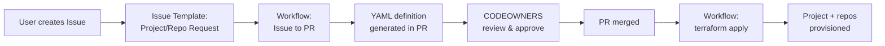

[English](./ADR-007-gitops-onboarding.md) | [日本語](./ADR-007-gitops-onboarding.ja.md)

# ADR-007: GitOps-Driven Project and Repository Onboarding

> **Status:** Accepted
> **Context:** [Target Architecture Spec](../Target-Architecture-Spec.md)

## Summary

New projects and repositories are onboarded via a GitOps governance repository using an issue → PR → merge → `terraform apply` pipeline. The governance repo is a self-contained template repository that includes both project definitions (YAML) and the IaC modules needed to provision them.

---

> **Note:** This section describes the GitOps onboarding workflow for the target architecture.

### 10.1 Problem

Today, onboarding a new project requires:

1. Copy `terraform.tfvars.sample` → `terraform.tfvars`
2. Fill in all values manually
3. Run `terraform init` + `terraform apply`

For organizations with many projects (10+), this is error-prone and hard to audit. There is no self-service mechanism and no approval workflow.

### 10.2 Target: Issue-driven GitOps workflow

Inspired by [github-gitops-samples](https://github.com/shigeyf/github-gitops-samples), the onboarding model uses a **GitOps governance repository** with an issue → PR → merge → provision pipeline:

**Workflow steps (text description):**

1. User creates an Issue using the project/repository request template.
2. A GitHub Actions workflow parses the issue and generates a YAML project definition file.
3. The workflow creates a Pull Request containing the YAML file.
4. CODEOWNERS-designated approvers review and approve the PR (this is the approval gate).
5. The PR is merged to the main branch.
6. A provisioning workflow detects the new YAML file and runs `terraform plan` + `terraform apply`.
7. The project and its repositories are provisioned.



### 10.3 GitOps governance repository structure

The GitOps governance repo is **set up independently** (not created by Terraform) as a **template repository** that organizations clone. It is hosted in the **GitOps governance organization** in GitHub Enterprise alongside the platform LZ repo. Creating GitHub repos via Terraform is complex and fragile — the template repo approach is simpler and more reliable.

The governance repo holds project definitions, the workflows that provision them, **and the IaC modules** (`project_github`, `project_azuredevops`, shared modules) that the workflows execute. This makes the GitOps repo **self-contained** — it does not need to clone the DevOps Landing Zone repo at provisioning time.

```text
# GitHub Enterprise organization layout:
<governance-org>/
├── devops-landing-zone/           # Platform LZ IaC repo (Layer 0 + Layer 1)
└── devops-gitops/                 # GitOps governance repo (project IaC, template repo)
```

```text
<org>/devops-gitops/                    # GitOps governance repository
├── .github/
│   ├── CODEOWNERS                      # Approval teams per project area
│   │   # Example:
│   │   # /.github/ @org/gitops-admins
│   │   # /projects/team-a/ @org/team-a-leads
│   │   # /projects/team-b/ @org/team-b-leads
│   │
│   ├── ISSUE_TEMPLATE/
│   │   ├── config.yml
│   │   └── project-request.yaml        # Issue template for new project requests
│   │
│   └── workflows/
│       ├── project-request-to-pr.yaml  # Parses issue → generates YAML → creates PR
│       └── project-create.yaml         # On PR merge → terraform init/apply
│
├── projects/                           # Project definitions (source of truth)
│   ├── contoso-ecommerce.yaml
│   ├── contoso-payments.yaml
│   └── contoso-analytics.yaml
│
├── infra/                              # IaC for project provisioning
│   ├── project_github/                 # Terraform root module: GitHub projects
│   │   ├── _variables.tf
│   │   ├── _variables.repositories.tf
│   │   ├── _variables.network.tf
│   │   ├── github.tf
│   │   ├── github.workflow.tf
│   │   ├── uami.tf
│   │   ├── uami.federation.tf
│   │   ├── network.tf
│   │   └── ...
│   │
│   ├── project_azuredevops/            # Terraform root module: Azure DevOps projects
│   │   ├── _variables.tf
│   │   ├── _variables.repositories.tf
│   │   └── ...
│   │
│   └── modules/                        # Shared Terraform modules
│       ├── github/                     # GitHub repo/team/environment resources
│       ├── azure_devops/               # ADO project/repo/pipeline resources
│       ├── github_workflows/           # Workflow file generation
│       └── ...
│
└── README.md
```

> **Keeping IaC in sync with DevOps Landing Zone:**
> The `infra/` directory contains the same `project_github`, `project_azuredevops`, and shared modules from the DevOps Landing Zone repo. Organizations should keep them in sync via one of:
>
> - **Git submodule**: `git submodule add <DevOps-Landing-Zone-repo> infra` — the GitOps repo references a pinned commit of the upstream.
> - **Terraform module registry**: Publish modules to a private Terraform registry and reference them by version in the root modules.
> - **Direct copy with version tracking**: Copy the modules and track the upstream version in a `VERSION` file.
>
> The **recommended** approach is Git submodule or Terraform module registry for traceability and reproducibility.

### 10.4 Project definition format (YAML)

Each project is defined by a YAML file in the `projects/` directory. This file serves as the **declarative source of truth** for the project's configuration:

```yaml
# projects/contoso-ecommerce.yaml
project_name: contoso-ecommerce
location: japaneast
vcs_platform: github # "github" or "azuredevops"
network_mode: platform

tags:
  appTag: contoso-ecommerce
  envTag: prod

repositories:
  - name: contoso-ecommerce-infra
    profile: infra
    description: 'Azure infrastructure for Contoso e-commerce'
  - name: contoso-ecommerce-api
    profile: app
    description: 'Backend API services'
  - name: contoso-ecommerce-web
    profile: app
    description: 'Frontend web application'
    environments: [development, staging, production]

subscriptions:
  features:
    id: '11111111-1111-1111-1111-111111111111'
  development:
    id: '22222222-2222-2222-2222-222222222222'
  staging:
    id: '33333333-3333-3333-3333-333333333333'
  production:
    id: '44444444-4444-4444-4444-444444444444'

runners:
  use_self_hosted_runners: true
  self_hosted_runners_type: aca
```

### 10.5 Issue template for project requests

```yaml
# .github/ISSUE_TEMPLATE/project-request.yaml
name: Project Creation Request
description: Request the creation of a new DevOps Landing Zone project.
title: '[New Project]: '
labels: ['gitops-project-request']
body:
  - type: input
    id: project-name
    attributes:
      label: Project Name
      placeholder: contoso-ecommerce
    validations:
      required: true

  - type: dropdown
    id: vcs-platform
    attributes:
      label: VCS Platform
      options:
        - github
        - azuredevops
    validations:
      required: true

  - type: dropdown
    id: network-mode
    attributes:
      label: Network Mode
      options:
        - platform
        - byo
    validations:
      required: true

  - type: textarea
    id: repositories
    attributes:
      label: Repositories
      description: 'One per line: name:profile:description'
      placeholder: |
        contoso-ecommerce-infra:infra:Azure infrastructure
        contoso-ecommerce-api:app:Backend API services
    validations:
      required: true

  - type: textarea
    id: subscriptions
    attributes:
      label: Azure Subscriptions
      description: 'One per line: environment:subscription-id'
      placeholder: |
        development:22222222-2222-2222-2222-222222222222
        production:44444444-4444-4444-4444-444444444444
    validations:
      required: true
```

### 10.6 Provisioning workflow

On PR merge, the `project-create.yaml` workflow:

1. Detects new/changed YAML files in `projects/`.
2. For each new or changed project definition:
   a. Converts the YAML to Terraform `tfvars` format.
   b. Runs `terraform init` with the appropriate backend config (state key: `projects/<project_name>.terraform.tfstate`).
   c. Runs `terraform plan` and stores plan output in workflow logs/artifacts for audit.
   d. Runs `terraform apply` using the self-hosted runner in the platform VNet (for private network access to the tfstate storage).

> **Validation note:** Because this workflow runs on `push` to `main`, PR comments are not available in this job context. If plan feedback must be posted on PRs, add a separate `pull_request` validation workflow that runs `plan` before merge.

```yaml
# .github/workflows/project-create.yaml (simplified)
name: Provision DevOps Projects
on:
  push:
    branches: [main]
    paths: ['projects/**']

jobs:
  detect-changes:
    runs-on: ubuntu-latest
    outputs:
      files: ${{ steps.changed.outputs.files }}
    steps:
      - uses: actions/checkout@v4
        with: { fetch-depth: 0 }
      - id: changed
        run: |
          FILES=$(git diff --name-status ${{ github.event.before }} ${{ github.sha }} \
            | awk '$1~/[AM]/ && $2 ~ /^projects\/.*\.yaml$/ {print $2}' \
            | jq -R -s -c 'split("\n") | map(select(length > 0))')
          echo "files=$FILES" >> "$GITHUB_OUTPUT"

  provision:
    needs: detect-changes
    if: needs.detect-changes.outputs.files != '[]'
    runs-on: [self-hosted, devops-lz] # runs on platform runner
    strategy:
      fail-fast: false
      matrix:
        file: ${{ fromJson(needs.detect-changes.outputs.files) }}
    steps:
      - uses: actions/checkout@v4
      - name: Convert YAML to tfvars and apply
        run: |
          PROJECT_NAME=$(yq '.project_name' ${{ matrix.file }})
          VCS_PLATFORM=$(yq '.vcs_platform' ${{ matrix.file }})
          # ... convert YAML to terraform.tfvars and write to tfvars file
          # The IaC modules live inside this repo under infra/
          cd infra/project_${VCS_PLATFORM}
          terraform init -backend-config="key=projects/${PROJECT_NAME}.terraform.tfstate"
          terraform plan -out=tfplan
          # Note: The PR review/approval (CODEOWNERS) serves as the approval gate.
          # Auto-approve is safe here because the plan was already reviewed via PR.
          terraform apply tfplan
```

### 10.7 Adding repositories to an existing project

To add a new repository to an existing project, a user:

1. Creates an issue using a "Repository Addition Request" template (or directly edits the YAML).
2. The workflow generates a PR that adds the new repo entry to the project's YAML file.
3. CODEOWNERS review and approve.
4. On merge, `terraform apply` runs incrementally — it creates only the new repo and its associated resources.

This is **incremental** — Terraform's `for_each` over `repositories` ensures only new repos are provisioned while existing ones remain untouched.

### 10.8 Relationship to existing manual workflow

The GitOps onboarding is **additive and optional**. The current manual workflow (`terraform.tfvars` + `terraform apply`) continues to work. Organizations can choose:

| Approach                        | When to use                                                 |
| ------------------------------- | ----------------------------------------------------------- |
| **Manual** (`terraform.tfvars`) | Small teams, initial setup, one-off projects                |
| **GitOps** (issue → PR → apply) | Enterprise, many projects, audit trail needed, self-service |

> **Note:** The project YAML definitions in the GitOps repo are the **source of truth** when GitOps is used. They are the equivalent of `terraform.tfvars` but with a review/approval workflow built in.

---

## Related Decisions

- [ADR-003: Project Definition and Multi-Repository Model](./ADR-003-project-multi-repo-model.md)
